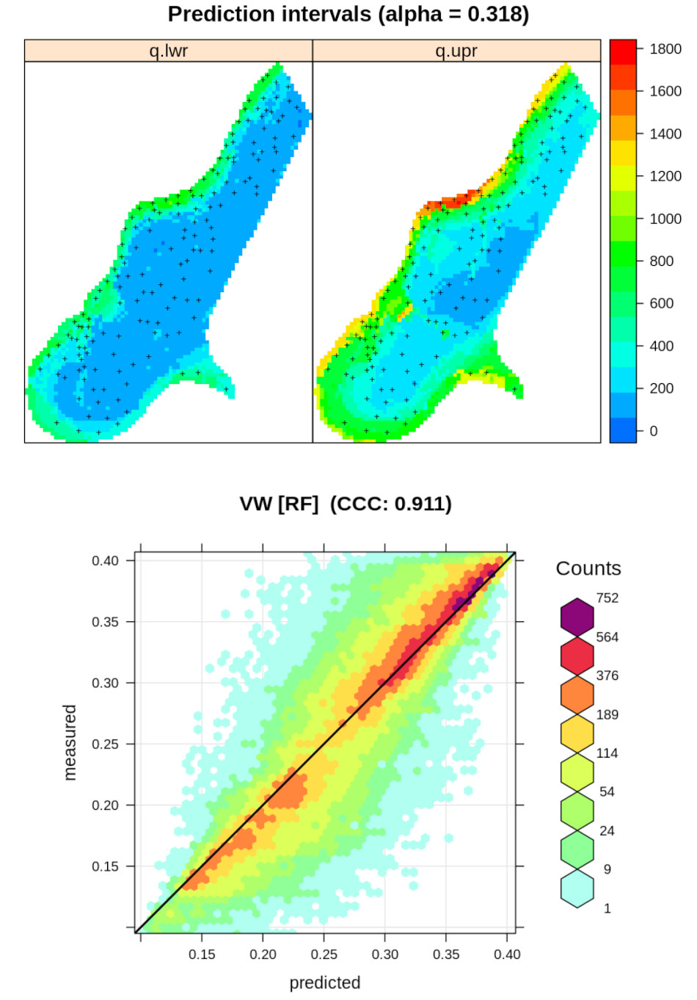

# Introduction {.unnumbered}

## Ensemble Machine Learning {.unnumbered}

[](https://doi.org/10.5281/zenodo.5894878)

[{.cover width="250"}](https://opengeohub.github.io/spatial-prediction-eml/) This [Rmarkdown tutorial](https://opengeohub.github.io/spatial-prediction-eml/) provides practical instructions, illustrated with sample 
dataset, on how to use Ensemble Machine Learning to generate predictions (maps) from 
2D, 3D, 2D+T (spatiotemporal) training (point) datasets. We show functionality to do 
automated benchmarking for spatial/spatiotemporal prediction problems, and for which 
we use primarily the mlr framework and spatial packages terra, rgdal and similar..

Ensembles are predictive models that combine predictions from two or more learners 
[@seni2010ensemble; @zhang2012ensemble]. The specific benefits of using Ensemble learners are:

- **Performance**: they can help improve the average prediction performance over any individual contributing learner in the ensemble.
- **Robustness**: they can help reduce extrapolation / overshooting effects of individual learners.
- **Unbiasness**: they can help determine a model-free estimate of prediction errors.

Even the most flexible and best performing learners such as Random Forest or neural 
networks always carry a bias in the sense that the fitting produces recognizable 
patterns and these are limited by the properties of the algorithm. In the case of 
ensembles, the modeling algorithm becomes secondary, and even though the improvements 
in accuracy are often minor as compared to the best individual learner, there is 
a good chance that the final EML model will be less prone to overshooting and 
extrapolation problems.

There are in principle three ways to apply ensembles [@zhang2012ensemble]:

- _bagging_: learn in parallel, then combine using some deterministic principle (e.g. weighted averaging),
- _boosting_: learn sequentially in an adaptive way, then combine using some deterministic principle,
- _stacking_: learn in parallel, then fit a meta-model to predict ensemble estimates,

The _“meta-model”_ is an additional model that basically combines all individual 
or _“base learners”_. In this tutorial we focus only on the stacking approach to Ensemble ML.

There are several packages in R that implement Ensemble ML, for example:

- [SuperLearner](https://cran.r-project.org/web/packages/SuperLearner/vignettes/Guide-to-SuperLearner.html) package,
- [caretEnsemble](https://cran.r-project.org/web/packages/caretEnsemble/vignettes/caretEnsemble-intro.html) package,
- [h2o.stackedEnsemble](http://docs.h2o.ai/h2o-tutorials/latest-stable/tutorials/ensembles-stacking/index.html) package,
- [mlr](https://mlr.mlr-org.com/reference/makeStackedLearner.html) and [mlr3](https://mlr3gallery.mlr-org.com/posts/2020-04-27-tuning-stacking/) packages,

Ensemble ML is also available in Python through the [scikit-learn](https://scikit-learn.org/stable/modules/ensemble.html) library.

In this tutorial we focus primarily on using the [mlr package](https://mlr.mlr-org.com/), 
i.e. a wrapper functions to mlr implemented in the landmap package.

## Using geographical distances to improve spatial interpolation {.unnumbered}

Machine Learning was for long time been considered suboptimal for spatial 
interpolation problems, in comparison to classical geostatistical techniques 
such as kriging, because it basically ignores spatial dependence structure in 
the data. To incorporate spatial dependence structures in machine learning, one 
can now add the so-called "geographical features": buffer distance, oblique 
distances, and/or distances in the watershed, as features. This has shown to 
improve prediction performance and produce maps that visually appear as they 
have been produced by kriging [@hengl2018random].

Use of geographical as features in machine learning for spatial predictions is explained in detail in:

- Behrens, T., Schmidt, K., Viscarra Rossel, R. A., Gries, P., Scholten, T., & MacMillan, R. A. (2018). [Spatial modelling with Euclidean distance fields and machine learning](https://doi.org/10.1111/ejss.12687). European journal of soil science, 69(5), 757-770.
- Hengl, T., Nussbaum, M., Wright, M. N., Heuvelink, G. B., & Gräler, B. (2018). [Random forest as a generic framework for predictive modeling of spatial and spatio-temporal variables](https://doi.org/10.7717/peerj.5518). PeerJ, 6, e5518. <https://doi.org/10.7717/peerj.5518>  
- Møller, A. B., Beucher, A. M., Pouladi, N., and Greve, M. H. (2020). [Oblique geographic coordinates as covariates for digital soil mapping](https://doi.org/10.5194/soil-6-269-2020). SOIL, 6, 269–289, https://doi.org/10.5194/soil-6-269-2020
- Sekulić, A., Kilibarda, M., Heuvelink, G.B., Nikolić, M., Bajat, B. (2020). [Random Forest Spatial Interpolation](https://doi.org/10.3390/rs12101687). Remote Sens. 12, 1687. <https://doi.org/10.3390/rs12101687>  

In the case the number of covariates / features becomes large, and assuming the 
covariates are diverse, and that the points are equally spread in an area of 
interest, there is probably no need for using geographical distances in model 
training because unique combinations of features become so large that they can 
be used to represent _geographical position_ [@hengl2018random].

## Installing the landmap package {.unnumbered}

To install the most recent landmap package from Github use:


```r
library(devtools)
install_github("envirometrix/landmap")
```

## Important literature {.unnumbered}

For an introduction to Spatial Data Science and Machine Learning with R we 
recommend studying first:

- Becker, M. et al.: **[“mlr3 book”](https://mlr3book.mlr-org.com/)**;  
- Bivand, R., Pebesma, E. and Gómez-Rubio, V.: **[“Applied Spatial Data Analysis with R”](https://asdar-book.org/)**;  
- Irizarry, R.A.: **[“Introduction to Data Science: Data Analysis and Prediction Algorithms with R”](https://rafalab.github.io/dsbook/)**;  
- Kuhn, M.: **[“The caret package”](https://topepo.github.io/caret/)**;  
- Molnar, C.: **[“Interpretable Machine Learning: A Guide for Making Black Box Models Explainable”](https://christophm.github.io/interpretable-ml-book/)**;  
- Lovelace, R., Nowosad, J. and Muenchow, J.: **[“Geocomputation with R”](https://geocompr.robinlovelace.net/)**;  

For an introduction to **Predictive Soil Mapping** using R refer to <https://soilmapper.org>.

Machine Learning in **python** with resampling can be best implemented via the 
[scikit-learn library](https://scikit-learn.org/stable/), which matches in 
functionality what is available via the mlr package in R.

## License {.unnumbered}

[](http://creativecommons.org/licenses/by-sa/4.0/)

This work is licensed under a [Creative Commons Attribution-ShareAlike 4.0 International License](http://creativecommons.org/licenses/by-sa/4.0/).


## Acknowledgements {.unnumbered}

 This tutorial is based on the **[“R for Data Science”](https://r4ds.had.co.nz/)** 
book by Hadley Wickham and contributors.

**[OpenLandMap](https://openlandmap.org)** is a collaborative effort and many people 
have contributed data, software, fixes and improvements via pull request. 

[OpenGeoHub](https://opengeohub.org) is an independent not-for-profit research 
foundation promoting Open Source and Open Data solutions. These tools were developed 
primarily for the need of the Geo-harmonizer project and to enable creation of 
next-generation environmental layers for continental Europe [@witjes2021spatiotemporal; @Bonannella2022].
**[EnvirometriX Ltd.](https://envirometrix.nl)** is the commercial branch of the group 
responsible for designing soil sampling designs for the **[AgriCapture](https://agricaptureco2.eu/)** 
and similar soil monitoring projects.

[](https://opengeohub.org)

**[OpenDataScience.eu](https://opendatascience.eu/)** project is co-financed by the European Union (**[CEF Telecom project 2018-EU-IA-0095](https://ec.europa.eu/inea/en/connecting-europe-facility/cef-telecom/2018-eu-ia-0095)**).
