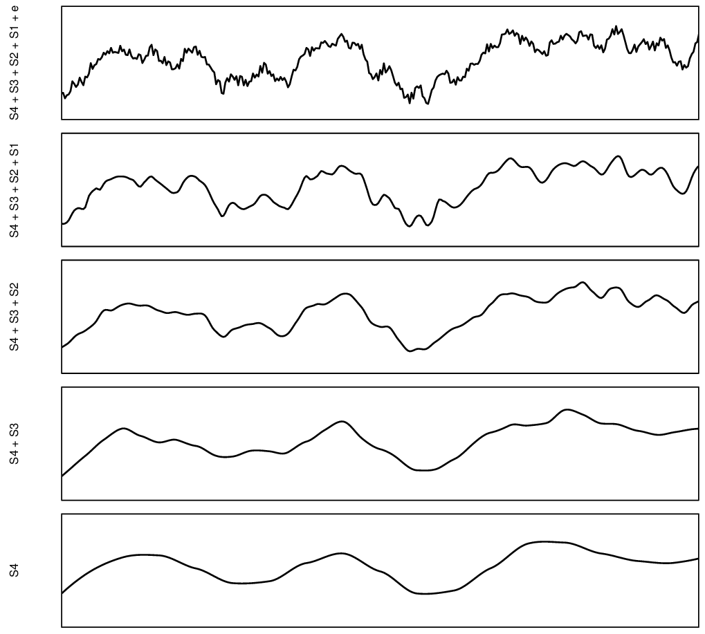
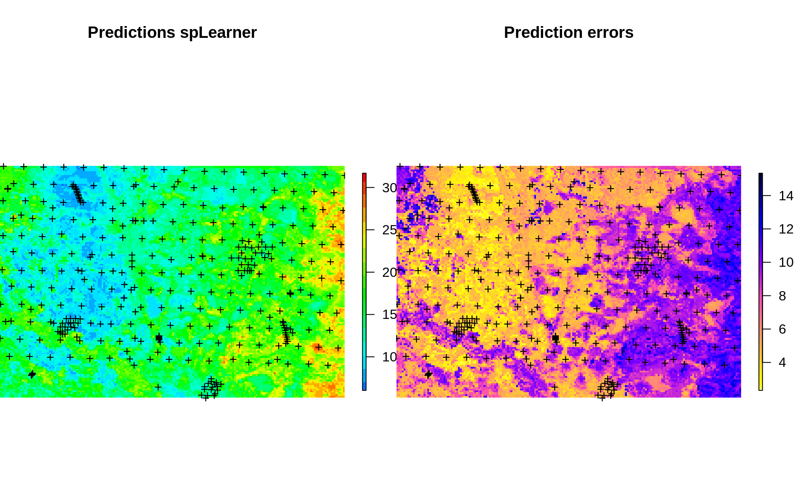
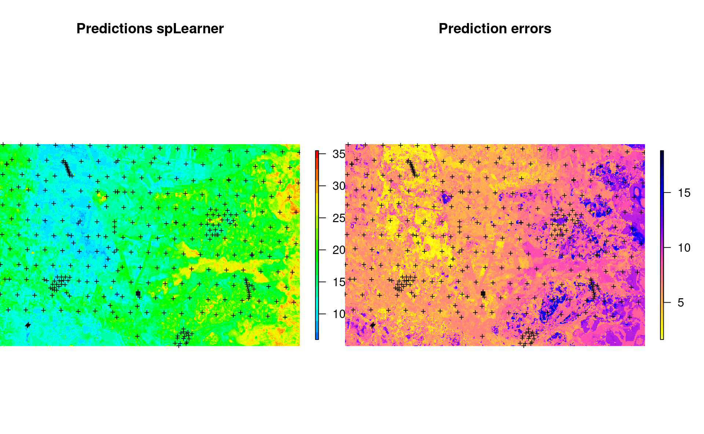
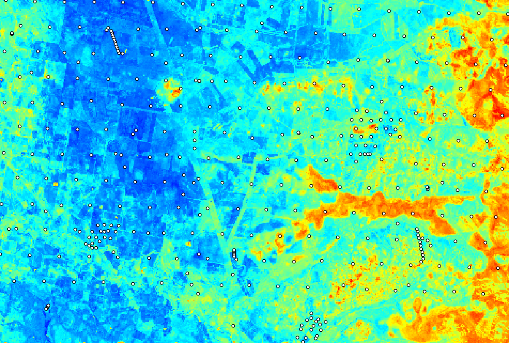
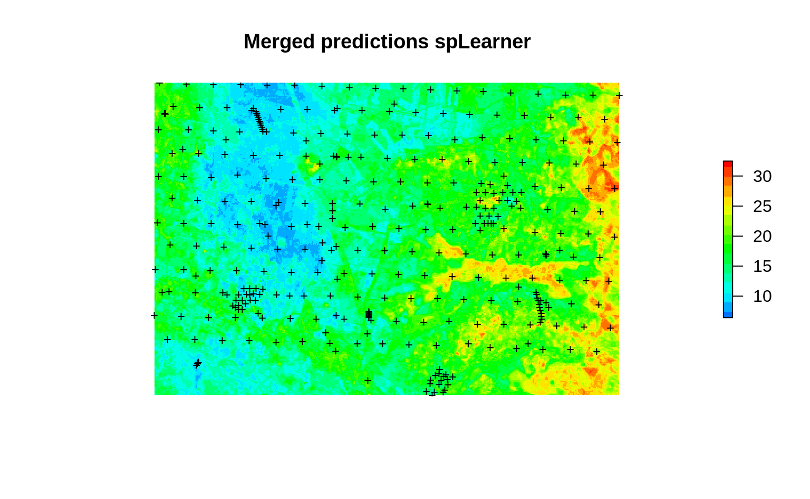

# Multi-scale spatial prediction models

::: {.rmdnote}
You are reading the work-in-progress Spatial and spatiotemporal interpolation using Ensemble Machine Learning. This chapter is currently currently draft version, a peer-review publication is pending. You can find the polished first edition at <https://opengeohub.github.io/spatial-prediction-eml/>.
:::


## Rationale for multiscale models

In the previous examples we have shown how to fit spatial and spatiotemporal models 
to generate predictions using multiple covariate layers. In practice spatial layers 
used for predictive mapping could come and different spatial scales i.e. they could 
be represent different part of spatial variation. There are at least two scales of 
spatial variation [@hengl2021african]:

- **Coarse scale** e.g. representing effects of planetary climate;
- **Fine scale** e.g. representing meso-relief and local conditions;

In fact, we can imagine that spatial variation can probably be decomposed into different 
scale components, as illustrated in plot below.

<div class="figure" style="text-align: center">

<p class="caption">(\#fig:space-time-cube)Decomposition of a signal of spatial variation into four components plus noise. Based on McBratney (1998).</p>
</div>

The idea of modeling soil spatial variation at different scales can be traced back to the work of @McBratney1998.
That also suggests that we could produce predictions models of different components 
of variation, then sum the components to produce ensemble prediction. The rationale 
for this, in the case of large datasets, is that we can (a) significantly reduce size 
of the data, (b) separate and better focus modeling based on the component of variation.

## Fitting and predicting with multiscale models

In the next example we use EML to make spatial predictions using data-set with 
two sets of covariates basically at different resolutions 250-m and 100-m. For 
this we use the Edgeroi data-set [@malone2009mapping] used commonly in the soil 
science to demonstrate 3D soil mapping of soil organic carbon (g/kg) based on 
samples taken from diagnostic soil horizons (multiple depth intervals):
  

```r
data(edgeroi)
edgeroi.sp <- edgeroi$sites
coordinates(edgeroi.sp) <- ~ LONGDA94 + LATGDA94
proj4string(edgeroi.sp) <- CRS("+proj=longlat +ellps=GRS80 +towgs84=0,0,0,0,0,0,0 +no_defs")
edgeroi.sp <- spTransform(edgeroi.sp, CRS("+init=epsg:28355"))
out.file = paste(getwd(), "output/edgeroi/edgeroi_training_points.gpkg", sep="/")
#if(!file.exists("out.file")){
#  writeOGR(edgeroi.sp, out.file, layer="edgeroi_training_points", driver = "GPKG")
#}
```

We can fit two independent EML's using the two sets of covariates and then 
produce final predictions by combining them. We will refer to the two models as 
coarse and fine-scale models. The fine-scale models will often be much larger 
datasets and require serious computing capacity.

## Coarse-scale model

First we use the 250-m resolution covariates:


```r
load("input/edgeroi.grids.rda")
gridded(edgeroi.grids) <- ~x+y
proj4string(edgeroi.grids) <- CRS("+init=epsg:28355")
ov2 <- over(edgeroi.sp, edgeroi.grids)
ov2$SOURCEID <- edgeroi.sp$SOURCEID
ov2$x = edgeroi.sp@coords[,1]
ov2$y = edgeroi.sp@coords[,2]
```

This is a 3D soil data set, so we also use the horizon `DEPTH` to explain distribution of SOC in soil: 


```r
source("PSM_functions.R")
h2 <- hor2xyd(edgeroi$horizons)
## regression matrix:
rm2 <- plyr::join_all(dfs = list(edgeroi$sites, h2, ov2))
#> Joining by: SOURCEID
#> Joining by: SOURCEID
formulaStringP2 <- ORCDRC ~ DEMSRT5+TWISRT5+EV1MOD5+EV2MOD5+EV3MOD5+DEPTH
rmP2 <- rm2[complete.cases(rm2[,all.vars(formulaStringP2)]),]
str(rmP2[,all.vars(formulaStringP2)])
#> 'data.frame':	4972 obs. of  7 variables:
#>  $ ORCDRC : num  8.5 7.3 5 4.7 4.7 ...
#>  $ DEMSRT5: num  198 198 198 198 198 198 185 185 185 185 ...
#>  $ TWISRT5: num  19.5 19.5 19.5 19.5 19.5 19.5 19.2 19.2 19.2 19.2 ...
#>  $ EV1MOD5: num  1.14 1.14 1.14 1.14 1.14 1.14 -4.7 -4.7 -4.7 -4.7 ...
#>  $ EV2MOD5: num  1.62 1.62 1.62 1.62 1.62 1.62 3.46 3.46 3.46 3.46 ...
#>  $ EV3MOD5: num  -5.74 -5.74 -5.74 -5.74 -5.74 -5.74 0.01 0.01 0.01 0.01 ...
#>  $ DEPTH  : num  11.5 17.5 26 55 80 ...
```

We can now fit an EML directly by using the derived regression matrix:


```r
if(!exists("m.oc")){
  m.oc = train.spLearner.matrix(rmP2, formulaStringP2, edgeroi.grids, 
                        parallel=FALSE, cov.model="nugget", cell.size=1000)
}
#> as.geodata: 4655 replicated data locations found. 
#>  Consider using jitterDupCoords() for jittering replicated locations. 
#> WARNING: there are data at coincident or very closed locations, some of the geoR's functions may not work.
#>  Use function dup.coords() to locate duplicated coordinates.
#>  Consider using jitterDupCoords() for jittering replicated locations 
#> # weights:  25
#> initial  value 253895.808438 
#> iter  10 value 131424.395513
#> iter  20 value 92375.545449
#> iter  30 value 88023.497878
#> iter  40 value 78161.622563
#> iter  50 value 71869.588437
#> iter  60 value 69482.655270
#> iter  70 value 68642.175713
#> iter  80 value 68405.024865
#> iter  90 value 68402.034341
#> final  value 68402.000242 
#> converged
#> # weights:  25
#> initial  value 254790.970425 
#> final  value 136782.219163 
#> converged
#> # weights:  25
#> initial  value 285010.126650 
#> final  value 135478.529982 
#> converged
#> # weights:  25
#> initial  value 253832.562811 
#> final  value 137484.280876 
#> converged
#> # weights:  25
#> initial  value 254385.881547 
#> iter  10 value 98551.221418
#> iter  20 value 94579.214923
#> iter  30 value 93473.664614
#> iter  40 value 93169.177514
#> iter  50 value 93139.660457
#> iter  60 value 93111.617240
#> iter  70 value 93111.256287
#> iter  80 value 93109.156591
#> iter  90 value 93099.925818
#> iter 100 value 93021.880998
#> final  value 93021.880998 
#> stopped after 100 iterations
#> # weights:  25
#> initial  value 233465.782262 
#> final  value 134647.206038 
#> converged
#> # weights:  25
#> initial  value 246624.689888 
#> final  value 138702.343415 
#> converged
#> # weights:  25
#> initial  value 241227.341802 
#> final  value 138599.168021 
#> converged
#> # weights:  25
#> initial  value 245735.599010 
#> final  value 131152.446689 
#> converged
#> # weights:  25
#> initial  value 258267.657849 
#> iter  10 value 97368.003255
#> iter  20 value 91058.331259
#> iter  30 value 88735.472097
#> iter  40 value 78495.790097
#> iter  50 value 72384.348608
#> iter  60 value 69221.579541
#> iter  70 value 68248.107158
#> iter  80 value 68073.306877
#> iter  80 value 68073.306456
#> iter  90 value 68072.812887
#> iter  90 value 68072.812254
#> final  value 68072.784171 
#> converged
#> # weights:  25
#> initial  value 268786.613045 
#> iter  10 value 128937.282143
#> iter  20 value 105536.706972
#> iter  30 value 100970.717402
#> iter  40 value 89676.958144
#> iter  50 value 80499.715395
#> iter  60 value 76269.748745
#> iter  70 value 74645.990665
#> iter  80 value 74429.114194
#> iter  90 value 74041.488710
#> iter 100 value 73877.378810
#> final  value 73877.378810 
#> stopped after 100 iterations
```

The **geoR** package here reports problems as the data set is 3D and hence there are spatial 
duplicates. We can ignore this problem and use the pre-defined cell size of 1-km 
for spatial blocking, although in theory one can also fit 3D variograms and then 
determine blocking parameter using training data. 

The results show that the EML model is significant:


```r
summary(m.oc@spModel$learner.model$super.model$learner.model)
#> 
#> Call:
#> stats::lm(formula = f, data = d)
#> 
#> Residuals:
#>     Min      1Q  Median      3Q     Max 
#> -17.668  -0.984  -0.066   0.711  64.291 
#> 
#> Coefficients:
#>               Estimate Std. Error t value Pr(>|t|)    
#> (Intercept)    0.11730    0.18365   0.639  0.52302    
#> regr.ranger    1.12706    0.02474  45.553  < 2e-16 ***
#> regr.xgboost  -0.37833    0.07448  -5.080 3.92e-07 ***
#> regr.nnet     -0.04227    0.02399  -1.762  0.07808 .  
#> regr.ksvm      0.08299    0.02900   2.861  0.00423 ** 
#> regr.cvglmnet -0.05140    0.03879  -1.325  0.18525    
#> ---
#> Signif. codes:  0 '***' 0.001 '**' 0.01 '*' 0.05 '.' 0.1 ' ' 1
#> 
#> Residual standard error: 3.06 on 4966 degrees of freedom
#> Multiple R-squared:  0.6938,	Adjusted R-squared:  0.6935 
#> F-statistic:  2250 on 5 and 4966 DF,  p-value: < 2.2e-16
```

We can now predict values at e.g. 5-cm depth by adding a dummy spatial layer with all fixed values:


```r
out.tif = "output/edgeroi/pred_oc_250m.tif"
edgeroi.grids$DEPTH <- 5
if(!exists("edgeroi.oc")){
  edgeroi.oc = predict(m.oc, edgeroi.grids[,m.oc@spModel$features])
}
#> Predicting values using 'getStackedBaseLearnerPredictions'...TRUE
#> Deriving model errors using forestError package...TRUE
if(!file.exists(out.tif)){
  writeGDAL(edgeroi.oc$pred["response"], out.tif, 
            options = c("COMPRESS=DEFLATE"))
  writeGDAL(edgeroi.oc$pred["model.error"], "output/edgeroi/pred_oc_250m_pe.tif", 
            options = c("COMPRESS=DEFLATE"))
}
```

which shows the following:

<div class="figure" style="text-align: center">

<p class="caption">(\#fig:map-oc250m)Predicted SOC content using 250-m covariates.</p>
</div>

The average prediction error in the map is somewhat higher than the average error from the model fitting:


```r
summary(edgeroi.oc$pred$model.error)
#>    Min. 1st Qu.  Median    Mean 3rd Qu.    Max. 
#>   2.323   4.710   6.340   6.929   9.257  15.338
```

This is because we are predicting the top-soil SOC, which is exponentially higher at the soil surface and hence average model errors for top soil should be slightly larger than the mean error for the whole soil.

## Fine-scale model

We can now fit the fine-scale model independently from the coarse-scale model 
using the 100-m resolution covariates. In this case the 100-m covariates are 
based on Landsat 8 and gamma radiometrics images (see `?edgeroi` for more details): 


```r
edgeroi.grids100 = readRDS("input/edgeroi.grids.100m.rds")
#gridded(edgeroi.grids100) <- ~x+y
#proj4string(edgeroi.grids100) <- CRS("+init=epsg:28355")
ovF <- over(edgeroi.sp, edgeroi.grids100)
ovF$SOURCEID <- edgeroi.sp$SOURCEID
ovF$x = edgeroi.sp@coords[,1]
ovF$y = edgeroi.sp@coords[,2]
rmF <- plyr::join_all(dfs = list(edgeroi$sites, h2, ovF))
#> Joining by: SOURCEID
#> Joining by: SOURCEID
formulaStringPF <- ORCDRC ~ MVBSRT6+TI1LAN6+TI2LAN6+PCKGAD6+RUTGAD6+PCTGAD6+DEPTH
rmPF <- rmF[complete.cases(rmF[,all.vars(formulaStringPF)]),]
str(rmPF[,all.vars(formulaStringPF)])
#> 'data.frame':	5001 obs. of  8 variables:
#>  $ ORCDRC : num  8.5 7.3 5 4.7 4.7 ...
#>  $ MVBSRT6: num  5.97 5.97 5.97 5.97 5.97 5.97 6.7 6.7 6.7 6.7 ...
#>  $ TI1LAN6: num  31.8 31.8 31.8 31.8 31.8 31.8 14.3 14.3 14.3 14.3 ...
#>  $ TI2LAN6: num  32.9 32.9 32.9 32.9 32.9 32.9 22.1 22.1 22.1 22.1 ...
#>  $ PCKGAD6: num  1.39 1.39 1.39 1.39 1.39 1.39 1.06 1.06 1.06 1.06 ...
#>  $ RUTGAD6: num  0.14 0.14 0.14 0.14 0.14 0.14 0.16 0.16 0.16 0.16 ...
#>  $ PCTGAD6: num  7.82 7.82 7.82 7.82 7.82 7.82 6.48 6.48 6.48 6.48 ...
#>  $ DEPTH  : num  11.5 17.5 26 55 80 ...
```

We fit the 2nd fine-scale model:


```r
if(!exists("m.ocF")){
  m.ocF = train.spLearner.matrix(rmPF, formulaStringPF, edgeroi.grids100, 
                        parallel=FALSE, cov.model="nugget", cell.size=1000)
}
#> as.geodata: 4655 replicated data locations found. 
#>  Consider using jitterDupCoords() for jittering replicated locations. 
#> WARNING: there are data at coincident or very closed locations, some of the geoR's functions may not work.
#>  Use function dup.coords() to locate duplicated coordinates.
#>  Consider using jitterDupCoords() for jittering replicated locations 
#> # weights:  28
#> initial  value 259952.010839 
#> iter  10 value 101252.397395
#> iter  20 value 92849.746212
#> iter  30 value 84138.890538
#> iter  40 value 81171.674547
#> iter  50 value 80244.316068
#> iter  60 value 79942.793909
#> iter  70 value 79368.296567
#> iter  80 value 78323.201957
#> iter  90 value 77181.404075
#> iter 100 value 76708.190347
#> final  value 76708.190347 
#> stopped after 100 iterations
#> # weights:  28
#> initial  value 226902.901029 
#> iter  10 value 134520.116202
#> iter  20 value 106665.533239
#> iter  30 value 100456.523529
#> iter  40 value 94907.032527
#> iter  50 value 94598.860459
#> iter  60 value 94311.934401
#> iter  70 value 93110.357174
#> iter  80 value 92843.643684
#> iter  90 value 92584.240506
#> iter 100 value 92181.626754
#> final  value 92181.626754 
#> stopped after 100 iterations
#> # weights:  28
#> initial  value 234725.323531 
#> iter  10 value 99738.688037
#> iter  20 value 95202.777671
#> iter  30 value 93332.714310
#> iter  40 value 84502.258499
#> iter  50 value 81245.631274
#> iter  60 value 80530.199169
#> iter  70 value 79322.812977
#> iter  80 value 78753.418715
#> iter  90 value 78202.739233
#> iter 100 value 76867.515069
#> final  value 76867.515069 
#> stopped after 100 iterations
#> # weights:  28
#> initial  value 264624.170952 
#> iter  10 value 101566.765280
#> iter  20 value 93105.271953
#> iter  30 value 79221.563953
#> iter  40 value 75437.096559
#> iter  50 value 74819.981899
#> iter  60 value 74258.787761
#> iter  70 value 72481.383976
#> iter  80 value 71415.613349
#> iter  90 value 69310.427661
#> iter 100 value 66134.495814
#> final  value 66134.495814 
#> stopped after 100 iterations
#> # weights:  28
#> initial  value 269334.603789 
#> iter  10 value 114589.803267
#> iter  20 value 98585.812766
#> iter  30 value 95611.345448
#> iter  40 value 94119.323815
#> iter  50 value 92069.210575
#> iter  60 value 90209.532038
#> iter  70 value 86238.674926
#> iter  80 value 82014.171622
#> iter  90 value 78106.825699
#> iter 100 value 76099.552544
#> final  value 76099.552544 
#> stopped after 100 iterations
#> # weights:  28
#> initial  value 259884.878897 
#> iter  10 value 103726.379375
#> iter  20 value 94570.752266
#> iter  30 value 76708.677450
#> iter  40 value 73787.991288
#> iter  50 value 73126.652279
#> iter  60 value 72979.797218
#> iter  70 value 72965.952547
#> iter  80 value 72468.280591
#> iter  90 value 72359.464672
#> iter 100 value 71873.895760
#> final  value 71873.895760 
#> stopped after 100 iterations
#> # weights:  28
#> initial  value 285193.065615 
#> iter  10 value 102340.204856
#> iter  20 value 89532.696472
#> iter  30 value 83391.890007
#> iter  40 value 79203.819730
#> iter  50 value 75520.520094
#> iter  60 value 71641.894828
#> iter  70 value 66583.248718
#> iter  80 value 64316.930097
#> iter  90 value 64067.020769
#> iter 100 value 63723.399424
#> final  value 63723.399424 
#> stopped after 100 iterations
#> # weights:  28
#> initial  value 209074.598360 
#> iter  10 value 92158.672417
#> iter  20 value 88477.518932
#> iter  30 value 83611.323463
#> iter  40 value 80398.938707
#> iter  50 value 75639.793693
#> iter  60 value 72497.710902
#> iter  70 value 68574.884188
#> iter  80 value 66515.331380
#> iter  90 value 64170.821850
#> iter 100 value 63336.087094
#> final  value 63336.087094 
#> stopped after 100 iterations
#> # weights:  28
#> initial  value 264913.914581 
#> iter  10 value 90799.203779
#> iter  20 value 83326.307020
#> iter  30 value 71495.281328
#> iter  40 value 66078.704046
#> iter  50 value 64850.594409
#> iter  60 value 64005.390526
#> iter  70 value 63563.194716
#> iter  80 value 62770.259605
#> iter  90 value 62084.800044
#> iter 100 value 60518.371937
#> final  value 60518.371937 
#> stopped after 100 iterations
#> # weights:  28
#> initial  value 254133.236100 
#> iter  10 value 117010.387846
#> iter  20 value 96496.685965
#> iter  30 value 81754.875719
#> iter  40 value 80702.591180
#> iter  50 value 79637.660106
#> iter  60 value 77195.047203
#> iter  70 value 74660.187056
#> iter  80 value 70931.471910
#> iter  90 value 69014.578845
#> iter 100 value 68409.495245
#> final  value 68409.495245 
#> stopped after 100 iterations
#> # weights:  28
#> initial  value 325116.468080 
#> iter  10 value 120203.210463
#> iter  20 value 115964.153279
#> iter  30 value 90105.298970
#> iter  40 value 79437.548718
#> iter  50 value 70168.831437
#> iter  60 value 69050.767980
#> iter  70 value 68627.297281
#> iter  80 value 68156.983626
#> iter  90 value 67374.568621
#> iter 100 value 67164.637038
#> final  value 67164.637038 
#> stopped after 100 iterations
summary(m.ocF@spModel$learner.model$super.model$learner.model)
#> 
#> Call:
#> stats::lm(formula = f, data = d)
#> 
#> Residuals:
#>     Min      1Q  Median      3Q     Max 
#> -19.222  -0.952  -0.047   0.726  61.162 
#> 
#> Coefficients:
#>               Estimate Std. Error t value Pr(>|t|)    
#> (Intercept)   -0.47135    0.11510  -4.095 4.29e-05 ***
#> regr.ranger    1.10204    0.02467  44.667  < 2e-16 ***
#> regr.xgboost   0.03329    0.07566   0.440    0.660    
#> regr.nnet      0.03135    0.02196   1.428    0.153    
#> regr.ksvm     -0.02556    0.02965  -0.862    0.389    
#> regr.cvglmnet -0.03575    0.02887  -1.238    0.216    
#> ---
#> Signif. codes:  0 '***' 0.001 '**' 0.01 '*' 0.05 '.' 0.1 ' ' 1
#> 
#> Residual standard error: 2.967 on 4995 degrees of freedom
#> Multiple R-squared:  0.7146,	Adjusted R-squared:  0.7143 
#> F-statistic:  2501 on 5 and 4995 DF,  p-value: < 2.2e-16
```

which shows that the 100-m resolution covariates help make even more accurate 
predictions with R-square about 0.7. We can also make predictions at 5-cm depth 
by using (note: this takes almost 6x more time to compute predictions than for 
250-m resolution data):


```r
edgeroi.grids100$DEPTH <- 5
sel.grid = complete.cases(edgeroi.grids100@data[,m.ocF@spModel$features])
if(!exists("edgeroi.ocF")){
  edgeroi.ocF = predict(m.ocF, edgeroi.grids100[sel.grid, m.ocF@spModel$features])
}
#> Predicting values using 'getStackedBaseLearnerPredictions'...TRUE
#> Deriving model errors using forestError package...TRUE
out.tif = "output/edgeroi/pred_oc_100m.tif"
if(!file.exists(out.tif)){
  writeGDAL(edgeroi.ocF$pred["response"], out.tif, options = c("COMPRESS=DEFLATE"))
  writeGDAL(edgeroi.ocF$pred["model.error"], "output/edgeroi/pred_oc_100m_pe.tif", options = c("COMPRESS=DEFLATE"))
}
```

which shows the following:

<div class="figure" style="text-align: center">

<p class="caption">(\#fig:map-oc100m)Predicted SOC content using 100-m covariates.</p>
</div>

## Merging multi-scale predictions

If we compare the coarse scale and fine scale predictions we see:

<div class="figure" style="text-align: center">

<p class="caption">(\#fig:two-scale)Coarse-scale and fine-scale predictions of soil organic carbon at 5-cm depth for the Edgeroi study area.</p>
</div>

Overall there is a match between general patterns but there are also differences locally. This is to expect as the two models are fitted independently using completely different covariates. We can merge the two predictions and produce the final ensemble prediction by using the following principles:

- User prediction errors per pixel as weights so that more accurate predictions get higher weights,  
- Derive propagated error using the pooled variance based on individual predictions and errors,  

Before we run this operation, we need to downscale the maps to the same grid, best using Cubic-splines in GDAL:


```r
edgeroi.grids100@bbox
#>       min     max
#> x  741400  789000
#> y 6646000 6678100
outD.file = "output/edgeroi/pred_oc_250m_100m.tif"
if(!file.exists(outD.file)){
  system(paste0('gdalwarp output/edgeroi/pred_oc_250m.tif ', outD.file,  
         ' -r \"cubicspline\" -te 741400 6646000 789000 6678100 -tr 100 100 -overwrite'))
  system(paste0('gdalwarp output/edgeroi/pred_oc_250m_pe.tif output/edgeroi/pred_oc_250m_100m_pe.tif',
         ' -r \"cubicspline\" -te 741400 6646000 789000 6678100 -tr 100 100 -overwrite'))
}
```

We can now read the downscaled predictions, and merge them using the prediction errors as weights (weighted average per pixel): 


```r
sel.pix = edgeroi.ocF$pred@grid.index
edgeroi.ocF$pred$responseC = readGDAL("output/edgeroi/pred_oc_250m_100m.tif")$band1[sel.pix]
#> output/edgeroi/pred_oc_250m_100m.tif has GDAL driver GTiff 
#> and has 321 rows and 476 columns
edgeroi.ocF$pred$model.errorC = readGDAL("output/edgeroi/pred_oc_250m_100m_pe.tif")$band1[sel.pix]
#> output/edgeroi/pred_oc_250m_100m_pe.tif has GDAL driver GTiff 
#> and has 321 rows and 476 columns
X = comp.var(edgeroi.ocF$pred@data, r1="response", r2="responseC", v1="model.error", v2="model.errorC")
edgeroi.ocF$pred$responseF = X$response
out.tif = "output/edgeroi/pred_oc_100m_merged.tif"
if(!file.exists(out.tif)){
  writeGDAL(edgeroi.ocF$pred["responseF"], out.tif, options = c("COMPRESS=DEFLATE"))
}
```

The final map of predictions is a combination of the two independently produced predictions [@hengl2021african]:


```r
plot(raster(edgeroi.ocF$pred["responseF"]), col=R_pal[["rainbow_75"]][4:20],
  main="Merged predictions spLearner", axes=FALSE, box=FALSE)
points(edgeroi.sp, pch="+", cex=.8)
```

<div class="figure" style="text-align: center">

<p class="caption">(\#fig:map-2scale)Merged predictions (coarse+fine scale) of SOC content at 100-m.</p>
</div>

To merge the prediction errors, we use the pooled variance formula [@rudmin2010calculating]:


```r
comp.var
#> function (x, r1, r2, v1, v2) 
#> {
#>     r = rowSums(x[, c(r1, r2)] * 1/(x[, c(v1, v2)]^2))/rowSums(1/(x[, 
#>         c(v1, v2)]^2))
#>     v = sqrt(rowMeans(x[, c(r1, r2)]^2 + x[, c(v1, v2)]^2) - 
#>         rowMeans(x[, c(r1, r2)])^2)
#>     return(data.frame(response = r, stdev = v))
#> }
#> <bytecode: 0x390c9348>
edgeroi.ocF$pred$model.errorF = X$stdev
out.tif = "output/edgeroi/pred_oc_100m_merged_pe.tif"
if(!file.exists(out.tif)){
  writeGDAL(edgeroi.ocF$pred["model.errorF"], out.tif, options = c("COMPRESS=DEFLATE"))
}
```

So in summary, merging multi-scale predictions is a straight forward process, 
but it assumes that the reliable prediction errors are available for both coarse and fine scale predictions. 
The pooled variance might show higher errors where predictions between independent 
models differ significantly and this is correct. The 2-scale Ensemble Machine 
Learning method of Predictive Soil Mapping was used for example to produce 
predictions of [soil properties and nutrients of Africa](https://www.isda-africa.com/isdasoil/) [@hengl2021african].
