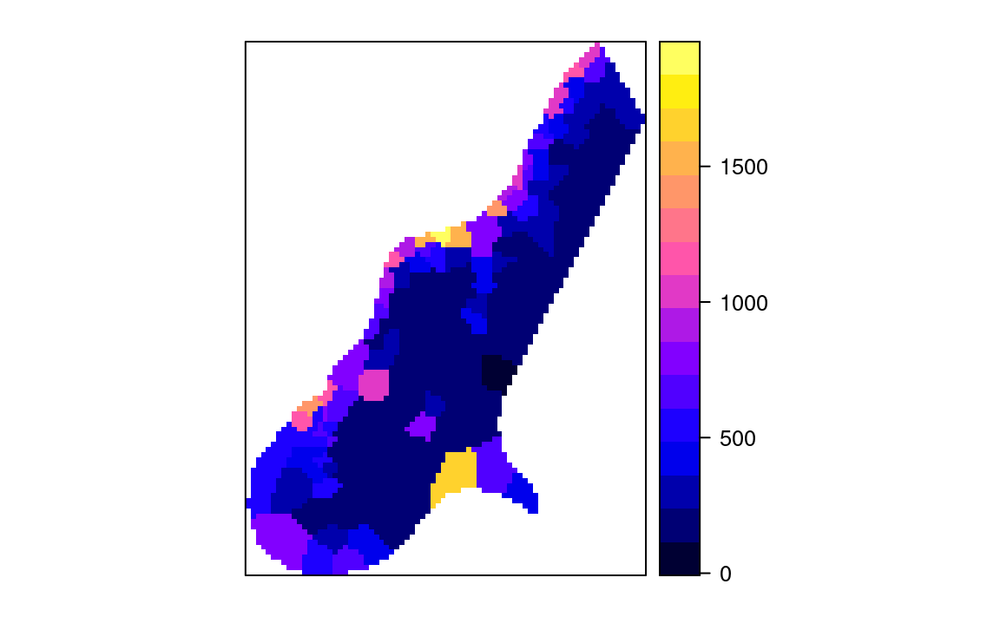
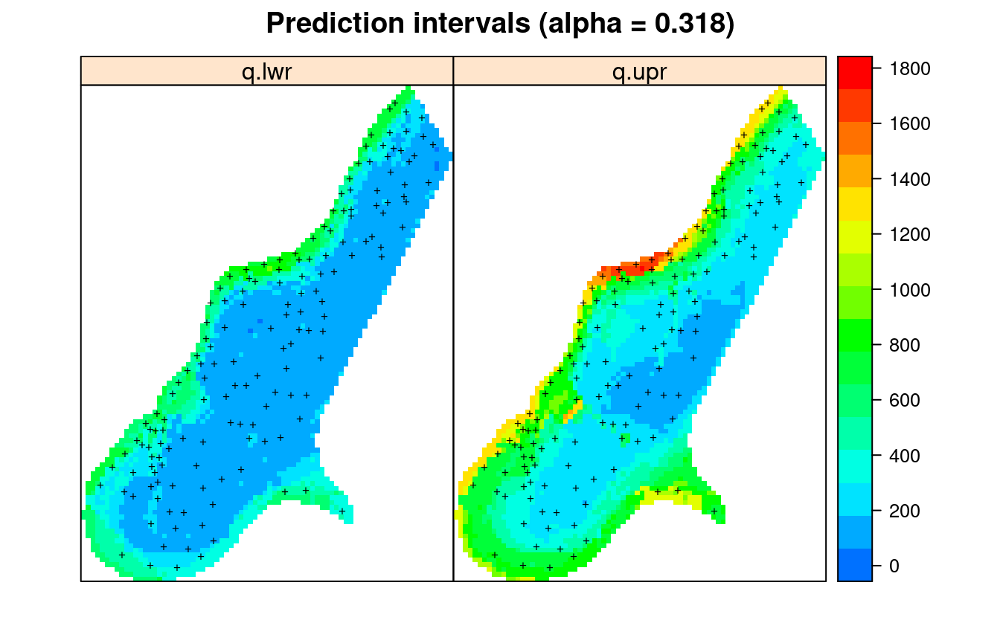
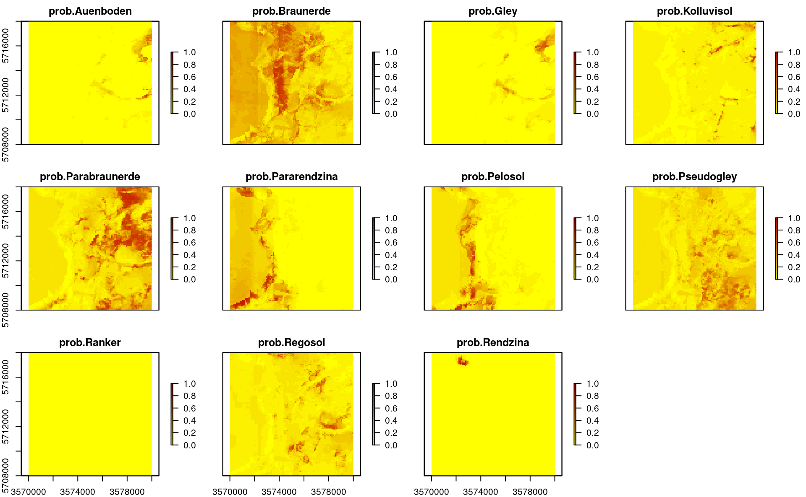

# Spatial interpolation using Ensemble ML

::: {.rmdnote}
You are reading the work-in-progress Spatial and spatiotemporal interpolation using Ensemble Machine Learning. This chapter is currently draft version, a peer-review publication is pending. You can find the polished first edition at <https://opengeohub.github.io/spatial-prediction-eml/>.
:::


## Spatial interpolation using ML and buffer distances to points

A relatively simple approach to interpolate values from point data using e.g. 
Random Forest is to use **buffer distances** to all points as covariates. We can 
here use the meuse dataset for testing [@hengl2018random]:


```r
library(rgdal)
library(ranger)
library(raster)
library(plotKML)
demo(meuse, echo=FALSE)
grid.dist0 <- landmap::buffer.dist(meuse["zinc"], meuse.grid[1], 
                                   classes=as.factor(1:nrow(meuse)))
```

This creates 155 gridded maps i.e. one map per training point. These maps of 
distances can now be used to predict some target variable by running:


```r
dn0 <- paste(names(grid.dist0), collapse="+")
fm0 <- as.formula(paste("zinc ~ ", dn0))
ov.zinc <- over(meuse["zinc"], grid.dist0)
rm.zinc <- cbind(meuse@data["zinc"], ov.zinc)
m.zinc <- ranger(fm0, rm.zinc, num.trees=150, seed=1)
m.zinc
#> Ranger result
#> 
#> Call:
#>  ranger(fm0, rm.zinc, num.trees = 150, seed = 1) 
#> 
#> Type:                             Regression 
#> Number of trees:                  150 
#> Sample size:                      155 
#> Number of independent variables:  155 
#> Mtry:                             12 
#> Target node size:                 5 
#> Variable importance mode:         none 
#> Splitrule:                        variance 
#> OOB prediction error (MSE):       67501.48 
#> R squared (OOB):                  0.4990359
```

Using this model we can generate and plot predictions using:


```r
op <- par(oma=c(0,0,0,1), mar=c(0,0,4,3))
zinc.rfd <- predict(m.zinc, grid.dist0@data)$predictions
meuse.grid$zinc.rfd = zinc.rfd
plot(raster(meuse.grid["zinc.rfd"]), col=R_pal[["rainbow_75"]][4:20],
         main="Predictions RF on buffer distances", axes=FALSE, box=FALSE)
points(meuse, pch="+", cex=.8)
par(op)
```

<div class="figure" style="text-align: center">

<p class="caption">(\#fig:map-buff)Values of Zinc predicted using only RF on buffer distances.</p>
</div>

The resulting predictions produce patterns very much similar to what we would 
produce if we have used ordinary kriging or similar. Note however that for RFsp 
model: (1) we did not have to fit any variogram, (2) the model is in essence _over-
parameterized_ with basically more covariates than training points.

## Spatial interpolation using ML and geographical distances to neighbors

Deriving buffer distances for all points is obviously not suitable for very 
large point datasets. @sekulic2020random describe an alternative, a more scalable 
method that uses closest neighbors (and their values) as covariates to predict
target variable. This can be implemented using the `meteo` package:


```r
library(meteo)
#> Warning: replacing previous import 'caret::MAE' by 'DescTools::MAE' when loading
#> 'meteo'
#> Warning: replacing previous import 'caret::RMSE' by 'DescTools::RMSE' when
#> loading 'meteo'
nearest_obs <- meteo::near.obs(locations = meuse.grid, 
                               locations.x.y = c("x","y"), 
                               observations = meuse, observations.x.y=c("x","y"), 
                               zcol = "zinc", n.obs = 10, rm.dupl = TRUE)
#> Warning in if (class(knn1$nn.idx) != "integer") {: the condition has length > 1
#> and only the first element will be used
str(nearest_obs)
#> 'data.frame':	3103 obs. of  20 variables:
#>  $ dist1 : num  168.2 112 139.9 172 56.4 ...
#>  $ dist2 : num  204 165 164 173 127 ...
#>  $ dist3 : num  239 183 210 230 139 ...
#>  $ dist4 : num  282 268 246 241 265 ...
#>  $ dist5 : num  370 331 330 335 297 ...
#>  $ dist6 : num  407 355 370 380 306 ...
#>  $ dist7 : num  429 406 391 388 390 ...
#>  $ dist8 : num  504 448 473 472 393 ...
#>  $ dist9 : num  523 476 484 496 429 ...
#>  $ dist10: num  524 480 488 497 431 ...
#>  $ obs1  : num  1022 1022 1022 640 1022 ...
#>  $ obs2  : num  640 640 640 1022 1141 ...
#>  $ obs3  : num  1141 1141 1141 257 640 ...
#>  $ obs4  : num  257 257 257 1141 257 ...
#>  $ obs5  : num  346 346 346 346 346 346 346 346 346 346 ...
#>  $ obs6  : num  406 406 406 269 406 406 406 269 257 406 ...
#>  $ obs7  : num  269 269 269 406 269 ...
#>  $ obs8  : num  1096 1096 1096 281 1096 ...
#>  $ obs9  : num  347 347 347 347 504 347 347 279 269 504 ...
#>  $ obs10 : num  281 504 281 279 347 504 279 347 347 347 ...
```

which produces 20 grids showing assigned values from 1st to 10th 
neighbor and distances. We can plot values based on the first neighbor, 
which corresponds to using e.g. [Voronoi polygons](https://r-spatial.github.io/sf/reference/geos_unary.html):


```r
meuse.gridF = meuse.grid
meuse.gridF@data = nearest_obs
spplot(meuse.gridF[11])
```

<div class="figure" style="text-align: center">

<p class="caption">(\#fig:map-ob1)Values of first neighbor for meuse dataset.</p>
</div>

Next, we can estimate the same values for training points, but this time
we remove any duplicates using `rm.dupl = TRUE`:


```r
## training points
nearest_obs.dev <- meteo::near.obs(locations = meuse, 
                                   locations.x.y = c("x","y"), 
                                   observations = meuse, 
                                   observations.x.y=c("x","y"), 
                                   zcol = "zinc", n.obs = 10, rm.dupl = TRUE)
#> Warning in if (class(knn1$nn.idx) != "integer") {: the condition has length > 1
#> and only the first element will be used
meuse@data <- cbind(meuse@data, nearest_obs.dev)
```

Finally, we can fit a model to predict values purely based on spatial
autocorrelation between values (1st to 10th nearest neighbour):


```r
fm.RFSI <- as.formula(paste("zinc ~ ", paste(paste0("dist", 1:10), collapse="+"), "+", paste(paste0("obs", 1:10), collapse="+")))
fm.RFSI
#> zinc ~ dist1 + dist2 + dist3 + dist4 + dist5 + dist6 + dist7 + 
#>     dist8 + dist9 + dist10 + obs1 + obs2 + obs3 + obs4 + obs5 + 
#>     obs6 + obs7 + obs8 + obs9 + obs10
rf_RFSI <- ranger(fm.RFSI, data=meuse@data, importance = "impurity", num.trees = 85, keep.inbag = TRUE)
rf_RFSI
#> Ranger result
#> 
#> Call:
#>  ranger(fm.RFSI, data = meuse@data, importance = "impurity", num.trees = 85,      keep.inbag = TRUE) 
#> 
#> Type:                             Regression 
#> Number of trees:                  85 
#> Sample size:                      155 
#> Number of independent variables:  20 
#> Mtry:                             4 
#> Target node size:                 5 
#> Variable importance mode:         impurity 
#> Splitrule:                        variance 
#> OOB prediction error (MSE):       65997.22 
#> R squared (OOB):                  0.5101999
```

To produce predictions we can run:


```r
out = predict(rf_RFSI, meuse.gridF@data)
meuse.grid$zinc.rfsi = out$predictions
op <- par(oma=c(0,0,0,1), mar=c(0,0,4,3))
plot(raster(meuse.grid["zinc.rfsi"]), col=R_pal[["rainbow_75"]][4:20],
     main="Predictions RFSI", axes=FALSE, box=FALSE)
points(meuse, pch="+", cex=.8)
par(op)
#dev.off()
```

<div class="figure" style="text-align: center">

<p class="caption">(\#fig:map-r)Values of first neighbor for meuse dataset.</p>
</div>

In summary, based on the Figs. \@ref(fig:map-buff) and \@ref(fig:map-r), 
we can conclude that predictions produced using nearest neighbors (Fig. \@ref(fig:map-r)) show quite different patterns than 
predictions based on buffer distances (Fig. \@ref(fig:map-buff)). The method by @sekulic2020random 
(**Random Forest Spatial Interpolation**) RFSI is probably more interesting for general applications as it could be 
also added to spatiotemporal data problems. It also reflects closely idea of using 
spatial autocorrelation of values as used in kriging since both values of neighbors and 
distances to neighbors are used as covariates. On the other hand, RFSI seem to 
produce predictions that contain also short range variability (more noisy) and as 
such predictions might appear to look more like geostatistical simulations.

## Interpolation of numeric values using spatial regression

We load the packages that will be used in this tutorial:


```r
library(landmap)
library(rgdal)
library(geoR)
#> --------------------------------------------------------------
#>  Analysis of Geostatistical Data
#>  For an Introduction to geoR go to http://www.leg.ufpr.br/geoR
#>  geoR version 1.8-1 (built on 2020-02-08) is now loaded
#> --------------------------------------------------------------
library(plotKML)
library(raster)
library(glmnet)
library(xgboost)
library(kernlab)
#> 
#> Attaching package: 'kernlab'
#> The following objects are masked from 'package:raster':
#> 
#>     buffer, rotated
library(deepnet)
library(forestError)
library(mlr)
```

For testing we use meuse data set. We can fit a 2D model to interpolate zinc 
concentration based on sampling points, distance to the river and flooding frequency 
maps by using:


```r
demo(meuse, echo=FALSE)
m <- train.spLearner(meuse["zinc"], covariates=meuse.grid[,c("dist","ffreq")], 
                     lambda = 1, parallel=FALSE)
#> # weights:  103
#> initial  value 51302358.935975 
#> final  value 19491244.345324 
#> converged
#> # weights:  103
#> initial  value 45220763.375836 
#> final  value 16169762.129496 
#> converged
#> # weights:  103
#> initial  value 50723533.722266 
#> final  value 18557431.400000 
#> converged
#> # weights:  103
#> initial  value 52179393.837805 
#> final  value 19673925.525180 
#> converged
#> # weights:  103
#> initial  value 48966129.905012 
#> final  value 19237393.850000 
#> converged
#> # weights:  103
#> initial  value 50327217.343373 
#> final  value 19238858.992857 
#> converged
#> # weights:  103
#> initial  value 50106999.812372 
#> final  value 19072846.949640 
#> converged
#> # weights:  103
#> initial  value 48513819.381025 
#> final  value 18339886.345324 
#> converged
#> # weights:  103
#> initial  value 48861791.596477 
#> final  value 18454493.171429 
#> converged
#> # weights:  103
#> initial  value 48476787.002316 
#> final  value 18430903.600000 
#> converged
#> # weights:  103
#> initial  value 54933965.304156 
#> final  value 20750447.509677 
#> converged
```

This runs number of steps including derivation of geographical distances [@moller2020oblique], 
derivation of principal components (to make sure all features are numeric and complete), 
fitting of variogram using the **geoR** package [@Diggle2007Springer], spatial overlay, 
training of individual learners and training of the super learner. In principle, the only 
parameter we need to set manually in the `train.spLearner` is the `lambda = 1` 
which is required to estimate variogram: in this case the target variable is 
log-normally distributed, and hence the geoR package needs the transformation 
parameter set at `lambda = 1`.  

Note that the default meta-learner in `train.spLearner` is a linear model from 
five independently fitted learners `c("regr.ranger", "regr.xgboost", "regr.ksvm", "regr.nnet", "regr.cvglmnet")`. We can check the success of training based on the 5-fold 
spatial Cross-Validation using:


```r
summary(m@spModel$learner.model$super.model$learner.model)
#> 
#> Call:
#> stats::lm(formula = f, data = d)
#> 
#> Residuals:
#>     Min      1Q  Median      3Q     Max 
#> -470.94  -97.78  -15.73   64.59 1049.38 
#> 
#> Coefficients:
#>                Estimate Std. Error t value Pr(>|t|)    
#> (Intercept)   2146.8982   968.9798   2.216 0.028234 *  
#> regr.ranger      0.6822     0.1912   3.569 0.000483 ***
#> regr.xgboost     0.5249     0.4071   1.289 0.199244    
#> regr.nnet       -4.5017     2.0482  -2.198 0.029499 *  
#> regr.ksvm        0.4241     0.2148   1.975 0.050145 .  
#> regr.cvglmnet   -0.2757     0.1648  -1.673 0.096441 .  
#> ---
#> Signif. codes:  0 '***' 0.001 '**' 0.01 '*' 0.05 '.' 0.1 ' ' 1
#> 
#> Residual standard error: 199.9 on 149 degrees of freedom
#> Multiple R-squared:  0.7132,	Adjusted R-squared:  0.7036 
#> F-statistic:  74.1 on 5 and 149 DF,  p-value: < 2.2e-16
```

Which shows that the model explains about 65% of variability in target variable 
and that `regr.ranger` learner [@wright2017ranger] is the strongest learner. Average 
mapping error RMSE = 213, hence the models is somewhat more accurate than if we 
only used buffer distances.

To predict values at all grids we use:


```r
meuse.y <- predict(m)
#> Predicting values using 'getStackedBaseLearnerPredictions'...TRUE
#> Deriving model errors using forestError package...TRUE
```

Note that, by default, we will predict two outputs:
  
- Mean prediction: i.e. the best unbiased prediction of response;  
- Prediction errors: usually predicted as lower and upper 67% quantiles (1 std.) based on the [forestError](https://cran.r-project.org/package=forestError) [@lu2021unified];   

If not otherwise specified, derivation of the prediction error (**Root Mean Square 
Prediction Error**), bias and lower and upper prediction intervals is implemented 
by default via the [forestError](https://cran.r-project.org/package=forestError) 
algorithm. The method is explained in detail in @lu2021unified.

We could also produce the prediction intervals by using the **quantreg** Random Forest 
algorithm [@meinshausen2006quantile] as implemented in the ranger package, or as 
a standard deviation of the bootstraped models, although using the method by @lu2021unified is recommended. 

To determine the prediction errors without drastically increasing computing time, 
we basically fit an independent random forest model using the five base-learners 
with setting `quantreg = TRUE`:

```
zinc ~ regr.ranger + regr.xgboost + regr.nnet + regr.ksvm + regr.cvglmnet
```

The prediction error methods are non-parameteric and users can choose any 
probability in the output via the `quantiles` argument. For example, the default 
`quantiles` are set to produce prediction intervals for the .682 range, which 
is the 1-standard-deviation range in the case of a Gaussian distribution. 
Deriving prediction errors, however, can be come computational for large number 
of features and trees in the random forest, so have in mind that EML comes with 
exponentially increased computing time.

We can plot the predictions and prediction errors next to each other by using:
  

```r
par(mfrow=c(1,2), oma=c(0,0,0,1), mar=c(0,0,4,3))
plot(raster(meuse.y$pred["response"]), col=R_pal[["rainbow_75"]][4:20],
     main="Predictions spLearner", axes=FALSE, box=FALSE)
points(meuse, pch="+", cex=.8)
plot(raster(meuse.y$pred["model.error"]), col=rev(bpy.colors()),
     main="Prediction errors", axes=FALSE, box=FALSE)
points(meuse, pch="+", cex=.8)
```

<div class="figure" style="text-align: center">

<p class="caption">(\#fig:map-zinc)Predicted zinc content based on meuse data set.</p>
</div>

This shows that the prediction errors (right plot) are the highest:
  
- where the model is getting further away from the training points (spatial extrapolation),  
- where individual points with high values can not be explained by covariates,  
- where measured values of the response variable are in general high,  

We can also plot the lower and upper prediction intervals for the .682 
probability range using:


```r
pts = list("sp.points", meuse, pch = "+", col="black")
spplot(meuse.y$pred[,c("q.lwr","q.upr")], col.regions=R_pal[["rainbow_75"]][4:20],
       sp.layout = list(pts),
       main="Prediction intervals (alpha = 0.318)")
```

<div class="figure" style="text-align: center">

<p class="caption">(\#fig:map-zinc-interval)Lower (q.lwr) and upper (q.upr) prediction intervals for zinc content based on meuse data set.</p>
</div>

## Model fine-tuning and feature selection

The function `tune.spLearner` can be used to further optimize spLearner object by: 

- fine-tuning model parameters, especially the ranger `mtry` and XGBoost parameters,  
- reduce number of features by running feature selection via the `mlr::makeFeatSelWrapper` function,  

The package landmap currently requires that two base learners used include `regr.ranger` and
`regr.xgboost`, and that there are at least 3 base learners in total. The model from above can be optimized using:


```r
m0 <- tune.spLearner(m, xg.skip=TRUE, parallel=FALSE)
```

which reports RMSE for different `mtry` and reports which features have been left and which removed. Note that we turn off the fine-tuning of XGboost using `xg.skip = TRUE` as it takes at the order of magnitude more time. In summary, in this specific case, the fine-tuned model is not much more accurate, but it comes with the less features:


```r
str(m0@spModel$features)
```

```
chr [1:11] "PC2" "PC3" "PC4" "rX_0" "rY_0" "rY_0.2" "rX_0.5" "rY_1" "rY_1.4" "rY_2.9" "rY_3.1"
```


```r
summary(m0@spModel$learner.model$super.model$learner.model)
```
```
Residuals:
    Min      1Q  Median      3Q     Max 
-404.09 -139.03  -42.05   64.69 1336.47 

Coefficients:
                Estimate Std. Error t value Pr(>|t|)   
(Intercept)   2091.87119  661.70995   3.161  0.00190 **
regr.ranger      0.14278    0.24177   0.591  0.55570   
regr.xgboost     0.92283    0.53131   1.737  0.08448 . 
regr.nnet       -4.34961    1.38703  -3.136  0.00206 **
regr.ksvm        0.66590    0.25027   2.661  0.00865 **
regr.cvglmnet   -0.08703    0.13808  -0.630  0.52944   
---
Signif. codes:  0 ‘***’ 0.001 ‘**’ 0.01 ‘*’ 0.05 ‘.’ 0.1 ‘ ’ 1

Residual standard error: 245.2 on 149 degrees of freedom
Multiple R-squared:  0.5683,	Adjusted R-squared:  0.5538 
F-statistic: 39.23 on 5 and 149 DF,  p-value: < 2.2e-16
```

Note that fine-tuning and feature selection can be quite computational and it is 
highly recommended to start with smaller subsets of data and then measure processing 
time. Note that the function `mlr::makeFeatSelWrapper` can result in errors if 
the covariates have a low variance or follow a zero-inflated distribution.
Reducing the number of features via feature selection and fine-tuning of the Random 
Forest `mtry` and XGboost parameters, however, can result in significantly higher 
prediction speed and can also help improve accuracy.

## Estimation of prediction intervals

We can also print the lower and upper [prediction interval](http://www.sthda.com/english/articles/40-regression-analysis/166-predict-in-r-model-predictions-and-confidence-intervals/) for every location using e.g.:


```r
sp::over(meuse[1,], meuse.y$pred)
#>   response model.error model.bias    q.lwr    q.upr
#> 1 999.8759    214.1839   27.39722 749.5775 1289.188
```

where `q.lwr` is the lower and `q.upr` is the 68% probability upper quantile value. This shows that the 68% probability interval for the location `x=181072, y=333611` is about 734--1241 which means that the prediction error (±1 s.d.), at that location, is about 250. Compare with the actual value sampled at that location:


```r
meuse@data[1,"zinc"]
#> [1] 1022
```

The average prediction error for the whole area is:


```r
summary(meuse.y$pred$model.error)
#>    Min. 1st Qu.  Median    Mean 3rd Qu.    Max. 
#>   44.63   77.04  167.69  159.58  215.06  480.11
```

which is somewhat lower than the RMSE derived by cross-validation, but this is 
also because most of the predicted values are in fact low (skewed distribution), 
and EML seems not have many problems predicting low values. 

Note also, from the example above, if we refit a model using exactly the same 
settings we might get somewhat different maps and different values. This is to 
be expected as the number of training points and covariates is low, the stacking 
is done by using (random) 5-fold Cross-validation, and hence results will always 
be slightly different. The resulting models and maps, however, should not be 
significantly different as this would indicate that the Ensemble ML is _unstable_. 
In the case of larger datasets (≫1000 points), differences between predictions 
should become less and less visible. 

## Predictions using log-transformed target variable

If the purpose of spatial prediction to make a more accurate predictions of low(er) 
values of the response, then we can train a model with the transformed variable:


```r
meuse$log.zinc = log1p(meuse$zinc)
m2 <- train.spLearner(meuse["log.zinc"], covariates=meuse.grid[,c("dist","ffreq")], parallel=FALSE)
#> # weights:  103
#> initial  value 4998.882579 
#> final  value 73.222851 
#> converged
#> # weights:  103
#> initial  value 5683.969732 
#> final  value 68.561330 
#> converged
#> # weights:  103
#> initial  value 4834.044628 
#> final  value 68.897172 
#> converged
#> # weights:  103
#> initial  value 5706.570659 
#> final  value 72.649748 
#> converged
#> # weights:  103
#> initial  value 2349.857144 
#> final  value 73.103072 
#> converged
#> # weights:  103
#> initial  value 6184.275769 
#> final  value 74.169414 
#> converged
#> # weights:  103
#> initial  value 4451.463365 
#> final  value 69.440176 
#> converged
#> # weights:  103
#> initial  value 4852.414287 
#> final  value 72.774801 
#> converged
#> # weights:  103
#> initial  value 5902.359343 
#> final  value 72.079999 
#> converged
#> # weights:  103
#> initial  value 6689.386512 
#> final  value 72.803948 
#> converged
#> # weights:  103
#> initial  value 5607.506170 
#> final  value 79.790191 
#> converged
```

The summary model will usually have a somewhat higher R-square, but the best learners should stay about the same:


```r
summary(m2@spModel$learner.model$super.model$learner.model)
#> 
#> Call:
#> stats::lm(formula = f, data = d)
#> 
#> Residuals:
#>      Min       1Q   Median       3Q      Max 
#> -1.00361 -0.18873 -0.05022  0.14092  1.41474 
#> 
#> Coefficients:
#>               Estimate Std. Error t value Pr(>|t|)    
#> (Intercept)   25.75549   10.10511   2.549 0.011822 *  
#> regr.ranger    0.74984    0.19969   3.755 0.000248 ***
#> regr.xgboost   0.31617    0.33255   0.951 0.343264    
#> regr.nnet     -4.44329    1.70769  -2.602 0.010206 *  
#> regr.ksvm      0.28476    0.19541   1.457 0.147146    
#> regr.cvglmnet -0.07384    0.15905  -0.464 0.643137    
#> ---
#> Signif. codes:  0 '***' 0.001 '**' 0.01 '*' 0.05 '.' 0.1 ' ' 1
#> 
#> Residual standard error: 0.3574 on 149 degrees of freedom
#> Multiple R-squared:  0.7615,	Adjusted R-squared:  0.7535 
#> F-statistic: 95.14 on 5 and 149 DF,  p-value: < 2.2e-16
```

We can next predict and then back-transform the values:


```r
meuse.y2 <- predict(m2)
#> Predicting values using 'getStackedBaseLearnerPredictions'...TRUE
#> Deriving model errors using forestError package...TRUE
## back-transform:
meuse.y2$pred$response.t = expm1(meuse.y2$pred$response)
```


<div class="figure" style="text-align: center">

<p class="caption">(\#fig:map-zinc2)Predicted zinc content based on meuse data set after log-transformation.</p>
</div>

The predictions (Figs. \@ref(fig:map-zinc) and \@ref(fig:map-zinc2)) show similar 
patterns but the prediction error maps are quite different in this case. Nevertheless, 
the problem areas seem to match in both maps (see Figs. \@ref(fig:map-zinc) and \@ref(fig:map-zinc2) right part).
If we compare distributions of two predictions we can also see that the predictions do not differ much:
  

```r
library(ggridges)
library(viridis)
#> Loading required package: viridisLite
library(ggplot2)
#> 
#> Attaching package: 'ggplot2'
#> The following object is masked from 'package:kernlab':
#> 
#>     alpha
zinc.df = data.frame(zinc=c(sp::over(meuse, meuse.y$pred["response"])[,1], 
                            sp::over(meuse, meuse.y2$pred["response.t"])[,1],
                            meuse$zinc
))
zinc.df$type = as.vector(sapply(c("predicted", "log.predicted", "observed"), function(i){rep(i, nrow(meuse))}))
ggplot(zinc.df, aes(x = zinc, y = type, fill = ..x..)) +
  geom_density_ridges_gradient(scale = 0.95, rel_min_height = 0.01, gradient_lwd = 1.) +
  scale_x_continuous(expand = c(0.01, 0)) +
  ## scale_x_continuous(trans='log2') +
  scale_y_discrete(expand = c(0.01, 0.01)) +
  scale_fill_viridis(name = "Zinc", option = "C") +
  labs(title = "Distributions comparison") +
  theme_ridges(font_size = 13, grid = TRUE) + theme(axis.title.y = element_blank())
#> Picking joint bandwidth of 110
```

<div class="figure" style="text-align: center">

<p class="caption">(\#fig:hist-zinc2)Difference in distributions observed and predicted.</p>
</div>

The observed very high values are somewhat smoothed out but the median value is 
about the same, hence we can conclude that the two EML models predict the target 
variable without a bias. To estimate the prediction intervals using the log-transformed 
variable we can use:


```r
x = sp::over(meuse[1,], meuse.y2$pred)
expm1(x$q.lwr); expm1(x$q.upr)
#> [1] 837.8133
#> [1] 1638.359
```

Note that the log-transformation is not needed for a non-linear learner such 
ranger and/or Xgboost, but it is often a good idea if the focus of prediction is 
to get a better accuracy for lower values [@hengl2021african]. For example, if the objective of spatial 
interpolation is to map soil nutrient deficiencies, then log-transformation is a 
good idea as it will produce slightly better accuracy for lower values. 

Another advantage of using log-transformation for log-normal variables is that 
the prediction intervals would most likely be symmetric, so that derivation of 
prediction error (±1 s.d.) can be derived by:

```
pe = (q.upr - q.lwr)/2
```

## Spatial prediction of soil types (factor-variable)

Ensemble Machine Learning can also be used to interpolate factor type variables 
e.g. soil types. This is an example with the Ebergotzen dataset available from 
the package plotKML [@hengl2015plotkml]:


```r
library(plotKML)
data(eberg_grid)
gridded(eberg_grid) <- ~x+y
proj4string(eberg_grid) <- CRS("+init=epsg:31467")
data(eberg)
coordinates(eberg) <- ~X+Y
proj4string(eberg) <- CRS("+init=epsg:31467")
summary(eberg$TAXGRSC)
#>     Auenboden     Braunerde          Gley         HMoor    Kolluvisol 
#>            71           790            86             1           186 
#>          Moor Parabraunerde  Pararendzina       Pelosol    Pseudogley 
#>             1           704           215           252           487 
#>        Ranker       Regosol      Rendzina          NA's 
#>            20           376            23           458
```

In this case the target variable is `TAXGRSC` soil types based on the German soil 
classification system. This changes the modeling problem from regression to 
classification. We recommend using the following learners here:


```r
sl.c <- c("classif.ranger", "classif.xgboost", "classif.nnTrain")
```

The model training and prediction however looks the same as for the regression:
  

```r
X <- eberg_grid[c("PRMGEO6","DEMSRT6","TWISRT6","TIRAST6")]
if(!exists("mF")){
  mF <- train.spLearner(eberg["TAXGRSC"], covariates=X, parallel=FALSE)
}
#> Converting PRMGEO6 to indicators...
#> Converting covariates to principal components...
#> Deriving oblique coordinates...TRUE
#> Subsetting observations to 79% complete cases...TRUE
#> Skipping variogram modeling...TRUE
#> Estimating block size ID for spatial Cross Validation...TRUE
#> Using learners: classif.ranger, classif.xgboost, classif.nnTrain...TRUE
#> Fitting a spatial learner using 'mlr::makeClassifTask'...TRUE
```

To generate predictions we use:
  

```r
if(!exists("TAXGRSC")){
  TAXGRSC <- predict(mF)
}
#> Predicting values using 'getStackedBaseLearnerPredictions'...TRUE
#> Deriving model errors using sd of sign. learners...TRUE
```

## Classification accuracy

By default landmap package will predict both hard classes and probabilities per class. We can check the average accuracy of classification by using:


```r
newdata = mF@vgmModel$observations@data
sel.e = complete.cases(newdata[,mF@spModel$features])
newdata = newdata[sel.e, mF@spModel$features]
pred = predict(mF@spModel, newdata=newdata)
pred$data$truth = mF@vgmModel$observations@data[sel.e, "TAXGRSC"]
print(calculateConfusionMatrix(pred))
#>                predicted
#> true            Auenboden Braunerde Gley Kolluvisol Parabraunerde Pararendzina
#>   Auenboden            34         6    0          0             5            0
#>   Braunerde             0       623    0          1            17            7
#>   Gley                  4         9   38          3             9            0
#>   Kolluvisol            0        13    1         99            17            1
#>   Parabraunerde         0        34    0          3           460            0
#>   Pararendzina          0        19    0          0             3          147
#>   Pelosol               0        11    0          1             1            2
#>   Pseudogley            0        54    2          4            24            3
#>   Ranker                0        10    0          0             6            0
#>   Regosol               0        66    0          0            10            1
#>   Rendzina              0         2    0          0             0            0
#>   -err.-                4       224    3         12            92           14
#>                predicted
#> true            Pelosol Pseudogley Ranker Regosol Rendzina -err.-
#>   Auenboden           0          3      0       0        0     14
#>   Braunerde           9          5      0       6        1     46
#>   Gley                0          5      0       0        0     30
#>   Kolluvisol          1          3      0       3        0     39
#>   Parabraunerde       2         10      0       4        0     53
#>   Pararendzina        6          1      0       0        0     29
#>   Pelosol           157          4      0       1        0     20
#>   Pseudogley          4        307      0      13        0    104
#>   Ranker              1          0      0       0        0     17
#>   Regosol             4         12      0     220        0     93
#>   Rendzina            0          0      0       0       20      2
#>   -err.-             27         43      0      27        1    447
```

which shows that about 25% of classes are miss-classified and the classification 
confusion is especially high for the `Braunerde` class. Note the result above is 
based only on the internal training. Normally one should repeat the process 
several times using 5-fold or similar (i.e. fit EML, predict errors using resampled 
values only, then repeat).

Predicted probabilities, however, are more interesting because they also show 
where EML possibly has problems and which are the transition zones between multiple classes:


```r
plot(stack(TAXGRSC$pred[grep("prob.", names(TAXGRSC$pred))]),
     col=SAGA_pal[["SG_COLORS_YELLOW_RED"]], zlim=c(0,1))
```

<div class="figure" style="text-align: center">

<p class="caption">(\#fig:map-tax)Predicted soil types based on EML.</p>
</div>

The maps show that also in this case geographical distances play a role, but 
overall, the features (DTM derivatives and parnt material) seem to be most important.

In addition to map of probabilities per class, we have also derived errors per 
probability, which in this case can be computed as the standard deviation between 
probabilities produced by individual learners (note: for classification problems 
techniques such as quantreg random forest currently do not exist):


```r
plot(stack(TAXGRSC$pred[grep("error.", names(TAXGRSC$pred))]),
     col=SAGA_pal[["SG_COLORS_YELLOW_BLUE"]], zlim=c(0,0.45))
```

<div class="figure" style="text-align: center">

<p class="caption">(\#fig:map-tax-error)Predicted errors per soil types based on s.d. between individual learners.</p>
</div>

In probability space, instead of using RMSE or similar measures, it is often 
recommended to use the measures such as the [log-loss](https://www.rdocumentation.org/packages/MLmetrics/versions/1.1.1/topics/LogLoss) which 
correctly quantifies the difference between the observed and predicted probability. 
As a rule of thumb, log-loss values above 0.35 indicate poor accuracy of predictions, 
but the threshold number for critically low log-loss also depends on the number 
of classes. In the plot above we can note that, in general, the average error in 
maps is relatively low e.g. about 0.07:


```r
summary(TAXGRSC$pred$error.Parabraunerde)
#>     Min.  1st Qu.   Median     Mean  3rd Qu.     Max. 
#> 0.001558 0.029074 0.041220 0.066121 0.064179 0.339019
```

but there are still many pixels where confusion between classes and prediction 
errors are high. Recommended strategy to improve this map is to generate [a sampling 
plan using the average prediction error](https://opengeohub.github.io/spatial-sampling-ml/) and/or Confusion Index map, then collect 
new observations & measurements and refit the prediction models.
