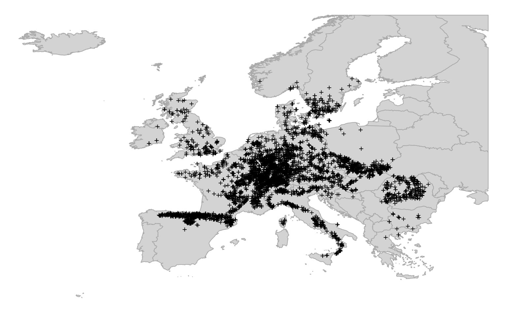

# Spatiotemporal interpolation using Ensemble ML

::: {.rmdnote}
You are reading the work-in-progress Spatial and spatiotemporal interpolation using Ensemble Machine Learning. This chapter is currently currently draft version, a peer-review publication is pending. You can find the polished first edition at <https://opengeohub.github.io/spatial-prediction-eml/>.
:::


## Spatiotemporal interpolation of daily temperatures

In previous examples we have demonstrated effects of over-fitting and 
how Ensemble ML helps decrease overfitting and extrapolation problems 
using synthetic data. We can now look at some real-life cases for example 
the daily temperatures measured for several years for Croatia described in @hengl2012spatio.
This data sets consist of two parts: (1) measurements of daily temperatures at 
meteo stations, (2) list of gridded covariates (Fig. \@ref(fig:croatia-meteo)).

<div class="figure" style="text-align: center">

<p class="caption">(\#fig:croatia-meteo)Temporal dynamics of mean-daily temperatures at sample meteorological stations. This shows seasonality effects (smoothed line) and daily oscillations.</p>
</div>

We can load the point data by using:


```r
library(rgdal)
hrmeteo = readRDS("input/hrtemp2006_meteo.rds")
str(hrmeteo)
#> List of 2
#>  $ meteo   :'data.frame':	44895 obs. of  5 variables:
#>   ..$ IDSTA : chr [1:44895] "GL001" "GL001" "GL001" "GL001" ...
#>   ..$ DATE  : chr [1:44895] "2006-1-1" "2006-1-2" "2006-1-3" "2006-1-4" ...
#>   ..$ MDTEMP: num [1:44895] 1.6 0.7 1.5 0.3 -0.1 1 0.3 -1.9 -5.4 -3.6 ...
#>   ..$ cday  : num [1:44895] 13148 13149 13150 13151 13152 ...
#>   .. ..- attr(*, "tzone")= chr ""
#>   ..$ x     : num [1:44895] NA NA NA NA NA NA NA NA NA NA ...
#>  $ stations:'data.frame':	152 obs. of  3 variables:
#>   ..$ IDSTA: chr [1:152] "GL001" "GL002" "GL003" "GL004" ...
#>   ..$ X    : num [1:152] 670760 643073 673778 752344 767729 ...
#>   ..$ Y    : num [1:152] 5083464 5086417 5052001 4726567 4717878 ...
idsta.pnts = hrmeteo$stations
coordinates(idsta.pnts) = ~ X + Y
```

This is a typical format for spatiotemporal meteorological data with locations 
of stations in one table, and measurements of daily temperatures (`MDTEMP`) in 
other. The column `cday` here is the cumulative day since 1970, which allows us 
to present time on a linear scale i.e. by using a numeric value instead of dates.

The gridded data includes: (a) static covariates (relief data), and 
(b) dynamic time-series data (MODIS LST). To load the static covariates we use:
  

```r
hrgrid1km = readRDS("input/hrgrid1km.rds")
#plot(hrgrid1km[1])
proj4string(idsta.pnts) = proj4string(hrgrid1km)
str(hrgrid1km@data)
#> 'data.frame':	238630 obs. of  4 variables:
#>  $ HRdem : int  1599 1426 1440 1764 1917 1912 1707 1550 1518 1516 ...
#>  $ HRdsea: num  93 89.6 89.8 93.6 95 ...
#>  $ Lat   : num  46.5 46.5 46.5 46.5 46.5 ...
#>  $ Lon   : num  13.2 13.2 13.2 13.2 13.2 ...
```

The dynamic time-series data is stored in a local folder (`input/LST2006HR`) as 
individual files that we can list by using:
  

```r
LST.listday <- dir("input/LST2006HR", pattern=glob2rx("LST2006_**_**.LST_Day_1km.tif"), full.names = TRUE)
LST.listnight <- dir("input/LST2006HR", pattern=glob2rx("LST2006_**_**.LST_Night_1km.tif"), full.names = TRUE)
str(LST.listday)
#>  chr [1:46] "input/LST2006HR/LST2006_01_01.LST_Day_1km.tif" ...
```

Here we see there are 46 images for year 2006 with daytime and 46 images for 
night time estimates of LST. We do not want to load all these rasters to R 
because we might experience RAM problems. We can first overlay points and see 
which variables can help with mapping daily temperatures.

For the static covariates we only have to run the overlay once:
  

```r
idsta.ov <- sp::over(idsta.pnts, hrgrid1km)
idsta.ov$IDSTA = idsta.pnts$IDSTA
str(idsta.ov)
#> 'data.frame':	152 obs. of  5 variables:
#>  $ HRdem : int  161 134 202 31 205 563 80 96 116 228 ...
#>  $ HRdsea: num  198.5 181.7 192.9 0 1.5 ...
#>  $ Lat   : num  45.9 45.9 45.6 42.7 42.6 ...
#>  $ Lon   : num  17.2 16.8 17.2 18.1 18.3 ...
#>  $ IDSTA : chr  "GL001" "GL002" "GL003" "GL004" ...
```

For the spatiotemporal data (MODIS LST time-series) we need to run overlay as in 
a spacetime cube. This means that we need to match points using `x,y,t` 
coordinates with grids covering the same `x,y,t` fields. To speed up spacetime overlay 
we use our custom function `extract_st`, which basically builds on top of the 
`terra` package. First, we need to define begin, end times for each GeoTIFF:


```r
library(terra)
#> terra version 0.8.11 (beta-release)
#> 
#> Attaching package: 'terra'
#> The following object is masked from 'package:rgdal':
#> 
#>     project
source("mlst_functions.R")
hrmeteo$meteo$x = plyr::join(hrmeteo$meteo, hrmeteo$stations, by="IDSTA")$X
hrmeteo$meteo$y = plyr::join(hrmeteo$meteo, hrmeteo$stations, by="IDSTA")$Y
## generate row ID:
hrmeteo$meteo$row.id = 1:nrow(hrmeteo$meteo)
hrmeteo$meteo$Date = as.Date(hrmeteo$meteo$DATE, format = "%Y-%m-%d")
## strip dates from filename:
begin.tif1.lst = as.Date(paste0("2006-", substr(basename(LST.listday), 9, 10), 
                                "-", substr(basename(LST.listday), 12, 13)))-4
end.tif1.lst = as.Date(paste0("2006-", substr(basename(LST.listday), 9, 10), 
                              "-", substr(basename(LST.listday), 12, 13)))+4
```

now that we know spacetime coordinates for both points and grids, we can run 
overlay in parallel to speed up computing:
  

```r
mc.cores = parallel::detectCores()
ov.pnts <- parallel::mclapply(1:length(LST.listday), function(i){ 
  extract_st(tif=LST.listday[i], hrmeteo$meteo, date="Date", 
             crs = proj4string(hrgrid1km),        
             date.tif.begin=begin.tif1.lst[i], 
             date.tif.end=end.tif1.lst[i], 
             coords=c("x","y"), variable.name="LST.day") }, 
  mc.cores=mc.cores)
ov.pnts = ov.pnts[!sapply(ov.pnts, is.null)]
ov.tifs1 = plyr::join_all(ov.pnts, by="row.id", type="full")
str(ov.tifs1)
#> 'data.frame':	44895 obs. of  2 variables:
#>  $ LST.day: num  0 0 0 0 0 0 0 0 0 0 ...
#>  $ row.id : int  1 2 3 4 5 366 367 368 369 370 ...
ov.tifs1$LST.day = ifelse(ov.tifs1$LST.day == 0, NA, ov.tifs1$LST.day)
```

In this case we also exclude the values of `LST.day` are equal to 0 as these 
are basically missing values in the GeoTIFFs. We repeat the same overlay operation 
for the night light images:
  

```r
begin.tif2.lst = as.Date(paste0("2006-", substr(basename(LST.listnight), 9, 10), 
                                "-", substr(basename(LST.listnight), 12, 13)))-4
end.tif2.lst = as.Date(paste0("2006-", substr(basename(LST.listnight), 9, 10), 
                              "-", substr(basename(LST.listnight), 12, 13)))+4
ov.pnts <- parallel::mclapply(1:length(LST.listnight), function(i){ 
  extract_st(tif=LST.listnight[i], hrmeteo$meteo, date="Date", 
             crs = proj4string(hrgrid1km),        
             date.tif.begin=begin.tif2.lst[i], 
             date.tif.end=end.tif2.lst[i], 
             coords=c("x","y"), variable.name="LST.night") }, 
  mc.cores=mc.cores)
ov.pnts = ov.pnts[!sapply(ov.pnts, is.null)]
ov.tifs2 = plyr::join_all(ov.pnts, by="row.id", type="full")
str(ov.tifs2)
#> 'data.frame':	44895 obs. of  2 variables:
#>  $ LST.night: num  13344 13344 13344 13344 13344 ...
#>  $ row.id   : int  1 2 3 4 5 366 367 368 369 370 ...
ov.tifs2$LST.night = ifelse(ov.tifs2$LST.night == 0, NA, ov.tifs2$LST.night)
```

The result of spacetime overlay is a simple long table matching exactly the meteo-data table.
We next bind results of overlay using static and dynamic covariates:


```r
hrmeteo.rm = plyr::join_all(list(hrmeteo$meteo, ov.tifs1, ov.tifs2))
#> Joining by: row.id
#> Joining by: row.id
hrmeteo.rm = plyr::join(hrmeteo.rm, idsta.ov)
#> Joining by: IDSTA
```

we also add the geometric component of temperature based on the sphere formulas:


```r
hrmeteo.rm$temp.mean <- temp.from.geom(fi=hrmeteo.rm$Lat, 
                   as.numeric(strftime(hrmeteo.rm$Date, format = "%j")), 
                   a=37.03043, b=-15.43029, elev=hrmeteo.rm$HRdem, t.grad=0.6)
```

We have now produced a **spatiotemporal regression matrix** that can be used to fit 
a prediction model for daily temperature. The model is of form:
  

```r
fm.tmp <- MDTEMP ~ temp.mean + LST.day + LST.night + HRdsea
```

We next fit an Ensemble ML using the same process described in the previous sections:


```r
library(mlr)
#> Loading required package: ParamHelpers
#> 'mlr' is in maintenance mode since July 2019. Future development
#> efforts will go into its successor 'mlr3' (<https://mlr3.mlr-org.com>).
#> 
#> Attaching package: 'mlr'
#> The following object is masked from 'package:terra':
#> 
#>     resample
lrn.rf = mlr::makeLearner("regr.ranger", num.trees=150, importance="impurity",
                          num.threads = parallel::detectCores())
lrns.st <- list(lrn.rf, mlr::makeLearner("regr.nnet"), mlr::makeLearner("regr.gamboost"))
sel = complete.cases(hrmeteo.rm[,all.vars(fm.tmp)])
hrmeteo.rm = hrmeteo.rm[sel,]
#summary(sel)
subs <- runif(nrow(hrmeteo.rm))<.2
tsk0.st <- mlr::makeRegrTask(data = hrmeteo.rm[subs,all.vars(fm.tmp)], 
                             target = "MDTEMP", blocking = as.factor(hrmeteo.rm$IDSTA[subs]))
tsk0.st
#> Supervised task: hrmeteo.rm[subs, all.vars(fm.tmp)]
#> Type: regr
#> Target: MDTEMP
#> Observations: 7573
#> Features:
#>    numerics     factors     ordered functionals 
#>           4           0           0           0 
#> Missings: FALSE
#> Has weights: FALSE
#> Has blocking: TRUE
#> Has coordinates: FALSE
```

Train model using a subset of points:


```r
init.TMP <- mlr::makeStackedLearner(lrns.st, method="stack.cv", super.learner="regr.lm", 
                                    resampling=mlr::makeResampleDesc(method="CV", blocking.cv=TRUE))
parallelMap::parallelStartSocket(parallel::detectCores())
eml.TMP = train(init.TMP, tsk0.st)
#> # weights:  19
#> initial  value 1752597.611462 
#> final  value 503633.983959 
#> converged
parallelMap::parallelStop()
```

This shows that daily temperatures can be predicted with relatively high R-square, 
although the residual values are still significant (ranging from -1.8 to 1.8 degrees):
  

```r
summary(eml.TMP$learner.model$super.model$learner.model)
#> 
#> Call:
#> stats::lm(formula = f, data = d)
#> 
#> Residuals:
#>      Min       1Q   Median       3Q      Max 
#> -16.2439  -1.8106   0.0204   1.8004  14.9611 
#> 
#> Coefficients:
#>               Estimate Std. Error t value Pr(>|t|)    
#> (Intercept)   35.06219    8.10904   4.324 1.55e-05 ***
#> regr.ranger    0.70575    0.02770  25.474  < 2e-16 ***
#> regr.nnet     -2.72276    0.62920  -4.327 1.53e-05 ***
#> regr.gamboost  0.29540    0.02799  10.553  < 2e-16 ***
#> ---
#> Signif. codes:  0 '***' 0.001 '**' 0.01 '*' 0.05 '.' 0.1 ' ' 1
#> 
#> Residual standard error: 2.888 on 7569 degrees of freedom
#> Multiple R-squared:  0.8747,	Adjusted R-squared:  0.8746 
#> F-statistic: 1.761e+04 on 3 and 7569 DF,  p-value: < 2.2e-16
```

The variable importance analysis shows that the most important variable for predicting 
daily temperatures is, in fact, the night-time MODIS LST:


```r
library(ggplot2)
xl <- as.data.frame(mlr::getFeatureImportance(eml.TMP[["learner.model"]][["base.models"]][[1]])$res)
xl$relative_importance = 100*xl$importance/sum(xl$importance)
xl = xl[order(xl$relative_importance, decreasing = TRUE),]
xl$variable = paste0(c(1:length(xl$variable)), ". ", xl$variable)
ggplot(data = xl[1:4,], aes(x = reorder(variable, relative_importance), y = relative_importance)) +
  geom_bar(fill = "steelblue",
           stat = "identity") +
  coord_flip() +
  labs(title = "Variable importance",
       x = NULL,
       y = NULL) +
  theme_bw() + theme(text = element_text(size=15))
```

<div class="figure" style="text-align: center">

<p class="caption">(\#fig:var-imptemp)Variable importance for modeling spacetime daily temperatures.</p>
</div>

We can use the **fitted spacetime EML model** to generate predictions e.g. for 
four consecutive days in August. First, we import MODIS LST for month of interest:


```r
hrpred1km = hrgrid1km
sel.tifs1 = LST.listday[grep("_08_", LST.listday)]
sel.tifs2 = LST.listnight[grep("_08_", LST.listnight)]
## read to R in parallel
x1 = as.data.frame( parallel::mclapply(sel.tifs1, 
      function(i){x <- readGDAL(i)$band1; x <- ifelse(x<1, NA, x); return(x)}, 
                                       mc.cores = mc.cores))
x2 = as.data.frame( parallel::mclapply(sel.tifs2, 
      function(i){x <- readGDAL(i)$band1; x <- ifelse(x<1, NA, x); return(x)}, 
                                       mc.cores = mc.cores))
names(x1)  <- basename(sel.tifs1); names(x2) <- basename(sel.tifs2)
```

Second, we interpolate values between 8--day periods and fill gaps in EO data 
using simple linear interpolation (MODIS images are available only every 8 days):


```r
dates.lst = as.Date("2006-08-13")+1:8
in.dates = c("2006-08-05", "2006-08-13", "2006-08-21", "2006-08-29")
in.days = as.numeric(strftime(as.Date(c(in.dates)), format = "%j"))
## interpolate values for missing dates in spacetime
library(parallel)
cl <- makeCluster(detectCores())
clusterExport(cl, c("in.days", "dates.lst"))
t1s = parallel::parApply(cl, x1, 1, 
      function(y) { try( approx(in.days, as.vector(y), xout=as.numeric(strftime(dates.lst, format = "%j")))$y ) })
t2s = parallel::parApply(cl, x2, 1, 
      function(y) { try( approx(in.days, as.vector(y), xout=as.numeric(strftime(dates.lst, format = "%j")))$y ) })
stopCluster(cl)
## remove missing pixels
x.t1s = parallel::mclapply(t1s, length, mc.cores = mc.cores)
t1s[which(!x.t1s==8)] <- list(rep(NA, 8))
t1s = do.call(rbind.data.frame, t1s)
names(t1s) = paste0("LST.day_", dates.lst)
x.t2s = parallel::mclapply(t2s, length, mc.cores = mc.cores)
t2s[which(!x.t2s==8)] <- list(rep(NA, 8))
t2s = do.call(rbind.data.frame, t2s)
names(t2s) = paste0("LST.night_", dates.lst)
```

Now we can make predictions for the target days in August 2006 by using (we run 
this operation in a loop to avoid RAM overload):


```r
for(j in paste(dates.lst)){
  out.tif = paste0("output/MDTEMP_", j, ".tif")
  if(!file.exists(out.tif)){
    hrpred1km@data[,"LST.day"] = t1s[,paste0("LST.day_", j)]
    hrpred1km@data[,"LST.night"] = t2s[,paste0("LST.night_", j)]
    hrpred1km$temp.mean = temp.from.geom(fi=hrpred1km$Lat, 
                     as.numeric(strftime(as.Date(j), format = "%j")), 
                     a=37.03043, b=-15.43029, elev=hrpred1km$HRdem, t.grad=0.6)
    sel.pix = complete.cases(hrpred1km@data[,eml.TMP$features])
    out = predict(eml.TMP, newdata=hrpred1km@data[sel.pix,eml.TMP$features])
    hrpred1km@data[,paste0("MDTEMP_", j)] = NA
    hrpred1km@data[sel.pix, make.names(paste0("MDTEMP_", j))] = out$data$response * 10
    writeGDAL(hrpred1km[make.names(paste0("MDTEMP_", j))], out.tif, mvFlag = -32768,
              type = "Int16", options = c("COMPRESS=DEFLATE"))
  } else {
    hrpred1km@data[,make.names(paste0("MDTEMP_", j))] = readGDAL(out.tif)$band1
  }
}
#> output/MDTEMP_2006-08-14.tif has GDAL driver GTiff 
#> and has 487 rows and 490 columns
#> output/MDTEMP_2006-08-15.tif has GDAL driver GTiff 
#> and has 487 rows and 490 columns
#> output/MDTEMP_2006-08-16.tif has GDAL driver GTiff 
#> and has 487 rows and 490 columns
#> output/MDTEMP_2006-08-17.tif has GDAL driver GTiff 
#> and has 487 rows and 490 columns
#> output/MDTEMP_2006-08-18.tif has GDAL driver GTiff 
#> and has 487 rows and 490 columns
#> output/MDTEMP_2006-08-19.tif has GDAL driver GTiff 
#> and has 487 rows and 490 columns
#> output/MDTEMP_2006-08-20.tif has GDAL driver GTiff 
#> and has 487 rows and 490 columns
#> output/MDTEMP_2006-08-21.tif has GDAL driver GTiff 
#> and has 487 rows and 490 columns
```

To plot these predictions we can either put predictions in the `spacetime` package 
class (see [gstat tutorial](https://cran.r-project.org/web/packages/gstat/vignettes/spatio-temporal-kriging.pdf)), or simply plot them using `sp` package:


```r
st.pts = list("sp.points", idsta.pnts, pch = "+", col="black")
spplot(hrpred1km[make.names(paste0("MDTEMP_", dates.lst[c(1,4,8)]))], 
       col.regions=plotKML::R_pal[["rainbow_75"]][4:20],
       at = seq(143, 239, length.out=17),
       sp.layout = list(st.pts),
       main="Prediction daily temperature")
#dev.off()
```

<div class="figure" style="text-align: center">

<p class="caption">(\#fig:st-plottemp)Predictions spacetime daily temperature for August 2006.</p>
</div>

In summary, this example shows how to fit spatiotemporal EML with using 
also seasonality component together with the EO data. It can hence 
be considered a *complete framework* for spatiotemporal interpolation as both static, 
dynamic covariates and latitude / elevation are used for model training.

## Spatiotemporal distribution of Fagus sylvatica

In the next example we show how to fit a spatiotemporal model 
using biological data: occurrences of [*Fagus
sylvatica*](https://www.gbif.org/species/2882316) over Europe. This is 
the domain of **Species Distribution modeling**, except in this case we 
model distribution of target species also in spacetime. The training (point) data has
been compiled for the purpose of the OpenDataScience.eu project, then 
cleaned and overlaid vs time-series of [Landsat GLAD](https://gitlab.com/geoharmonizer_inea/eumap) images and climatic 
variables [@witjes2021spatiotemporal; @Bonannella2022]. 
For more details about the data refer also to the [eumap repository](https://gitlab.com/geoharmonizer_inea/eumap).

We can load a snapshot of data by using:


```r
library(data.table)
library(mlr)
library(sp)
fs.rm = readRDS('input/fagus_sylvatica_st.rds')
occ.pnts = fs.rm[,c("Atlas_class","easting","northing")]
coordinates(occ.pnts) = ~ easting + northing
proj4string(occ.pnts) = "+init=epsg:3035"
occ.pnts = spTransform(occ.pnts, CRS("+init=epsg:4326"))
```

This is a subset of a [larger
dataset](https://doi.org/10.5281/zenodo.5818021) that
has been used to produce predictions of distribution of key forest tree
species for Europe (you can browse the data via <https://maps.opendatascience.eu>). 
The first columns of this dataset show:


```r
head(fs.rm[,1:10])
#>          id year postprocess Tile_ID easting northing Atlas_class lc1
#> 9   1499539 2015   spacetime    9689 3948500  2431500           1    
#> 38   660325 2008   spacetime    8728 3318500  2283500           1    
#> 56   660325 2002   spacetime    8728 3318500  2283500           1    
#> 68  2044229 2006   spacetime   11017 4294500  2655500           1    
#> 104  586994 2016   spacetime    8724 3204500  2309500           1    
#> 111  622055 2016   spacetime    8349 3231500  2226500           1    
#>     clm_air.temp_era5.copernicus_av_1km_200..200cm_02.01..02.28_avg_5yrs_eumap_epsg3035_v0.1.tif
#> 9                                                                                            -35
#> 38                                                                                             0
#> 56                                                                                            19
#> 68                                                                                           -35
#> 104                                                                                           31
#> 111                                                                                           -6
#>     clm_air.temp_era5.copernicus_av_1km_200..200cm_02.01..02.28_mean_eumap_epsg3035_v0.1.tif
#> 9                                                                                        -36
#> 38                                                                                        31
#> 56                                                                                        22
#> 68                                                                                       -40
#> 104                                                                                       46
#> 111                                                                                        9
```

The header columns are:

- `id`: is the unique ID of each point;  
- `year`: is the year of obsevation;  
- `postprocess`: column can have value yearly or spacetime to identify
    if the temporal reference of an observation comes from the original
    dataset or is the result of post-processing (yearly for originals,
    spacetime for post-processed points);  
- `Tile_ID`: is as extracted from the 30-km tiling system;  
- `easting`: is the easting coordinate of the observation point;  
- `northing`: is the northing coordinate of the observation point;  
- `Atlas_class`: contains name of the tree species or NULL if it's an
    absence point coming from LUCAS;  
- `lc1`: contains original LUCAS land cover classes or NULL if it's a
    presence point;  

Other columns are the EO and ecological covariates that we use for
modeling distribution of [*Fagus sylvatica*](https://www.gbif.org/species/2882316). We can plot distribution of points over EU using:


```r
library(rnaturalearth)
library(raster)
europe <- rnaturalearth::ne_countries(scale=10, continent = 'europe')
europe <- raster::crop(europe, extent(-24.8,35.2,31,68.5))
op = par(mar=c(0,0,0,0))
plot(europe, col="lightgrey", border="darkgrey", axes=FALSE)
points(occ.pnts[occ.pnts$Atlas_class==1,], pch="+", cex=.8)
par(op)
#dev.off()
```

<div class="figure" style="text-align: center">

<p class="caption">(\#fig:map-fs)Distribution of occurrence locations for Fagus Sylvatica. Each training points is also referrenced in time and hence can be used to run spacetime overlay.</p>
</div>

As in previous examples, we first define the target model formula. We
remove from model all other columns that are not used for prediction:


```r
covs = grep("id|year|postprocess|Tile_ID|easting|northing|Atlas_class|lc1", 
          colnames(fs.rm), value = TRUE, invert = TRUE)
fm.fs = stats::as.formula(paste("Atlas_class ~ ", paste(covs, collapse="+")))
fs.rm$Atlas_class = factor(fs.rm$Atlas_class)
all.vars(fm.fs)[1:5]
#> [1] "Atlas_class"                                                                                 
#> [2] "clm_air.temp_era5.copernicus_av_1km_200..200cm_02.01..02.28_avg_5yrs_eumap_epsg3035_v0.1.tif"
#> [3] "clm_air.temp_era5.copernicus_av_1km_200..200cm_02.01..02.28_mean_eumap_epsg3035_v0.1.tif"    
#> [4] "clm_air.temp_era5.copernicus_av_1km_200..200cm_02.01..02.28_std_eumap_epsg3035_v0.1.tif"     
#> [5] "clm_air.temp_era5.copernicus_av_1km_200..200cm_03.01..03.31_avg_5yrs_eumap_epsg3035_v0.1.tif"
```

To speed-up fitting of the models we have prepared a function that wraps all modeling steps:


```r
source("mlst_functions.R")
fs.rm0 = fs.rm[runif(nrow(fs.rm))<.2,]
eml.fs = train_sp_eml(data = fs.rm0, formula = fm.fs, blocking = as.factor(fs.rm$Tile_ID))
```

This fits an ensemble model of binary classification models 
(`classif.ranger`, `classif.xgboost`, `classif.glmnet`) and which basically can 
be used to predict probability of any training point being classified `0`
(not-occurring) or `1` (occurring).

The intermediate models (fine-tuned RF and XGboost) are written to local
folder `output` as RDS files. For meta-learner we use a GLM model with binomial link
function:


```r
#eml.fs = readRDS("output/EML_model.rds")
summary(eml.fs$learner.model$super.model$learner.model)
#> 
#> Call:
#> stats::glm(formula = f, family = "binomial", data = getTaskData(.task, 
#>     .subset), weights = .weights, model = FALSE)
#> 
#> Deviance Residuals: 
#>     Min       1Q   Median       3Q      Max  
#> -3.4025  -0.0917   0.0666   0.0701   3.2589  
#> 
#> Coefficients:
#>                 Estimate Std. Error z value Pr(>|z|)    
#> (Intercept)       5.6680     0.4800  11.807  < 2e-16 ***
#> classif.ranger   -8.4832     0.6452 -13.147  < 2e-16 ***
#> classif.xgboost   1.2604     1.2307   1.024    0.306    
#> classif.glmnet   -3.4816     0.5708  -6.099 1.07e-09 ***
#> ---
#> Signif. codes:  0 '***' 0.001 '**' 0.01 '*' 0.05 '.' 0.1 ' ' 1
#> 
#> (Dispersion parameter for binomial family taken to be 1)
#> 
#>     Null deviance: 8432.56  on 7472  degrees of freedom
#> Residual deviance:  700.97  on 7469  degrees of freedom
#> AIC: 708.97
#> 
#> Number of Fisher Scoring iterations: 8
```

The variable importance analysis (RF component) shows that the most
important covariates for mapping distribution of Fagus sylvatica are
landsat images (which is expected):


```r
library(ggplot2)
xl <- as.data.frame(mlr::getFeatureImportance(eml.fs[["learner.model"]][["base.models"]][[1]])$res)
xl$relative_importance = 100*xl$importance/sum(xl$importance)
xl = xl[order(xl$relative_importance, decreasing = T),]
xl$variable = paste0(c(1:182), ". ", xl$variable)
ggplot(data = xl[1:20,], aes(x = reorder(variable, relative_importance), y = relative_importance)) +
  geom_bar(fill = "steelblue",
           stat = "identity") +
  coord_flip() +
  labs(title = "Variable importance",
       x = NULL,
       y = NULL) +
  theme_bw() + theme(text = element_text(size=15))
```

<div class="figure" style="text-align: center">

<p class="caption">(\#fig:varimp-st)Variable importance for spatiotemporal model used to predict distribution of Fagus sylvatica.</p>
</div>

To produce spacetime predictions for some tiles (120-m spatial
resolution) we can run:


```r
m1 = predict_tiles(input = "9690.2015",  model = eml.fs)
#> [1] "9690 - reading the data"
#> Warning in dir.create(tmp_folder, recursive = TRUE): 'output//9690' already
#> exists
#> [1] "9690 - running predictions"
#> Warning in if (class(probability_map) == "try-error") {: the condition has
#> length > 1 and only the first element will be used
#> [1] "9690 - writing files"
m2 = predict_tiles(input = "9690.2017",  model = eml.fs)
#> [1] "9690 - reading the data"
#> Warning in dir.create(tmp_folder, recursive = TRUE): 'output//9690' already
#> exists
#> [1] "9690 - running predictions"
#> Warning in if (class(probability_map) == "try-error") {: the condition has
#> length > 1 and only the first element will be used
#> [1] "9690 - writing files"
m3 = predict_tiles(input = "9690.2019",  model = eml.fs)
#> [1] "9690 - reading the data"
#> Warning in dir.create(tmp_folder, recursive = TRUE): 'output//9690' already
#> exists
#> [1] "9690 - running predictions"
#> Warning in if (class(probability_map) == "try-error") {: the condition has
#> length > 1 and only the first element will be used
#> [1] "9690 - writing files"
m1$Prob.2015 = m1$Prob
m1$Prob.2017 = m2$Prob
m1$Prob.2019 = m3$Prob
```

We can compare predictions of the probability of occurrence of the
target species for two years next to each other by using:


```r
pts = list("sp.points", spTransform(occ.pnts[occ.pnts$Atlas_class==1,], CRS("+init=epsg:3035")), 
           pch = "+", col="black")
spplot(m1[,c("Prob.2015","Prob.2017","Prob.2019")], col.regions=rev(bpy.colors()),
  sp.layout = list(pts),
  main="Predictions Fagus Sylvatica")
#dev.off()
```

<div class="figure" style="text-align: center">

<p class="caption">(\#fig:predictions-fs)Predicted probability of occurrence for Fagus Sylvatica for three periods.</p>
</div>

In this case there seems to be no drastic changes in the distribution of
the target species through time, which is also expected because forest species distribution
change on a scale of 50 to 100 year and not on a scale of few years. 
Some changes in distribution of the species, however, can be detected nevertheless. 
These can be due to abrupt events such as pest-pandemics, fires, floods or landslides 
or clear cutting of forests of course.

We can also plot the images using the `plotKML` package so that we can open and 
visualize predictions also in Google Earth or similar:


```r
library(plotKML)
for(j in c(2015,2017,2019)){
  kml(m1, colour=m1@data[,paste0("Prob.", j)], file.name=paste0("prob.", j, ".kml"),
      raster_name = paste0("prob.", j, ".png"),
      colour_scale = SAGA_pal[["SG_COLORS_YELLOW_BLUE"]], 
      z.lim=c(0,100),
      TimeSpan.begin = as.Date(paste0(j, "-01-01")), TimeSpan.end = as.Date(paste0(j, "-12-31")))
}
```

In this case we attach to each prediction also the `TimeSpan.begin` and `TimeSpan.end` 
which means that Google Earth will recognize the temporal reference of the predictions. 
Opening predictions in Google Earth allows us to do some interpretation of produced maps and also 
analyze how much are the changes in vegetation cover connected with relief, 
proximity to urban areas, possible fire / flood events and similar.

<div class="figure" style="text-align: center">

<p class="caption">(\#fig:fagus-ge)Spacetime predictions of distribution of Fagus Sylvatica visualized as time-series data in Google Earth.</p>
</div>


## Summary notes

In this tutorial we have reviewed some aspects of spatial and
spatiotemporal data and demonstrated how to use ML, specifically
Ensemble ML, to train spatiotemporal models and produce time-series of
predictions. We have also shown, using some synthetic and real-life datasets, how
incorrectly setting up training and cross-validation can lead to
over-fitting problems. This was done to help users realize that Machine Learning, 
however trivial it might seem, is not a click-a-button process and solid knowledge 
and understanding of advanced statistics (regression, hypothesis testing, 
sampling and resampling, probability theory) is still required.

For spatiotemporal models, we recommend combining covariates that 
can represent both long-term or accumulated effects of climate, together with 
covariates that can represent daily to monthly oscillation of variables such as soil
moisture, temperatures and similar. During the design of the modeling system, 
we highly recommend **trying to understand ecology and processes behind 
variable of interest** first, then designing the modeling system to best reflect expert 
knowledge. The example with RF over-fitting data in @gasch2015spatio shows how in-depth 
understanding of the problem can help design modeling framework and prevent 
from over-fitting problems and similar. @witjes2021spatiotemporal and @Bonannella2022 describe a more comprehensive 
framework for spatiotemporal ML which can even be run on large datasets.

Where time-series EO data exists, these can be also incorporated into the 
mapping algorithm as shown with three case studies. For spacetime overlays we 
recommend using Cloud-Optimized GeoTIFFs and the `terra` package [@hijmans2019spatial] which helps speed-up overlays. Other options for efficient overlay are the `stars` and `gdalcubes` package [@appel2019demand].

Spatiotemporal datasets can be at the order of magnitude larger, hence
it is important, when implementing analysis of spatiotemporal data, to
consider **computing optimization**, which typically implies:

-   Running operations in parallel;
-   Separating fine-tuning and parameter optimization (best to run on
    subset and save computing time) from predictions,
-   Using tiling systems to run overlay, predictions and visualizations,

Finally, we recommend following these generic steps to fit spatiotemporal models:

0.  Define target of interest and design the modeling framework by understanding 
    ecology and processes behind variable of interest.  
1.  Prepare training (points) data and a data cube with all covariates
    referenced in spacetime.  
2.  Overlay points in spacetime, create a spatiotemporal
    regression-matrix.  
3.  Add seasonal components, fine-tune initial model, reduce complexity
    as much as possible, and produce production-ready spatiotemporal prediction model
    (usually using Ensemble Machine Learning).  
4.  Run mapping accuracy assessment and determine prediction uncertainty
    including the per pixel uncertainty.  
5.  Generate predictions in spacetime — create time-series of
    predictions.  
6.  (optional) Run change-detection / trend analysis and try to detect
    main drivers of positive / negative trends [@witjes2021spatiotemporal].  
7.  Deploy predictions as Cloud-Optimized GeoTIFF and produce the final
    report with mapping accuracy, variable importance.  

Ensemble ML framework we used here clearly offers many benefits, but it also comes 
at a cost of at the order of magnitude higher computational load. Also 
interpretation of such models can be a cumbersome as there a multiple 
learners plus a meta-learner, so it often becomes difficult to 
track-back individual relationship between variables. To help increase 
confidence in the produced models, we recommend studying the [Interpretable Machine
Learning](https://christophm.github.io/interpretable-ml-book/) methods
[@molnar2020interpretable], running additional model diagnostics, and
intensively plotting data in space and spacetime and feature space.

Note that the `mlr` package is discontinued, so some of the examples 
above might become unstable with time. You are advised instead to use
the new [mlr3 package](https://mlr3.mlr-org.com/).
