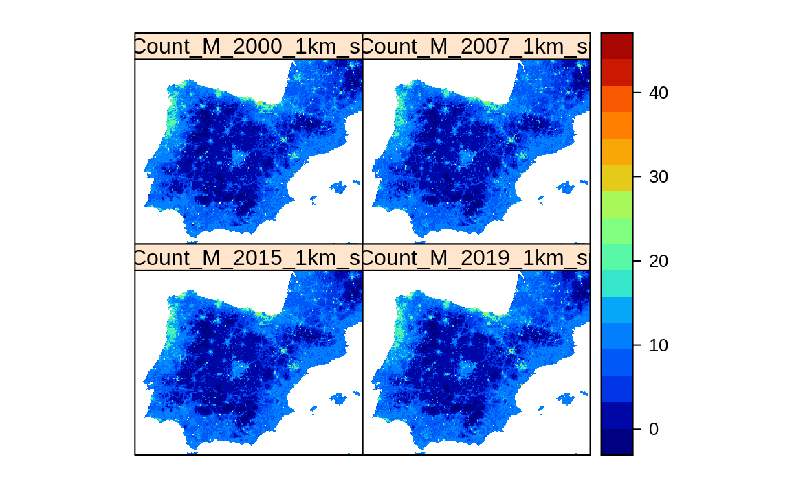

# Spatiotemporal Machine Learning for Species Distribution Modeling

::: {.rmdnote}
You are reading the work-in-progress Spatial and spatiotemporal interpolation using Ensemble Machine Learning. This chapter is currently draft version, a peer-review publication is pending. You can find the polished first edition at <https://opengeohub.github.io/spatial-prediction-eml/>.
:::


## Species Distribution Modeling

[Species Distribution Modeling](https://rspatial.org/raster/sdm/) (SDM) and/or Mapping aims 
at explaining and mapping distribution of species as a function of ecological conditions 
and/or human influence. Typical steps in SDM include [@hijmans2019spatial]:

1. Prepare locations of occurrence of a species or species density;  
2. Prepare environmental predictor variables (climate, terrain, surface water);  
3. Fit a SDM model that can be used either to predict natural habitat / Niche and/or occurrence probability;  
4. Predict habitat / occurrence probability across the region of interest (and perhaps for a future or past climate).  

Modeling species distribution is different from mapping quantitative soil properties 
and/or land surface temperature. Species data comes with specific properties that include [@martinez2018species,@fois2018using]:

- Typically occurrence-only data is available: biologists / ecologists often only record where some species was observed;  
- Species and their dynamics is complex; some species such as migratory birds change location seasonaly, some are more static;  
- Modeling distribution of species such as birds or similar animals and insects in spacetime context is highly complex;

In this chapter we provide a scalable framework for predicting either **probability of 
occurrence** and/or **species density** (number of individuals per area) using Ensemble 
ML and spatiotemporal data (time-series of images). A review of ML methods for SDM 
is available also in @zhang2017review. 

In order to be able to interpolate species distribution, probability of occurrence 
and/or density of species in space-time using Ensemble ML, we can not simply use occurrence-only data. 
Instead, we need to provide enough training data on both occurrence and absence of 
the specific species. If absence training points are not available, we can use various 
method do derive most likely locations where certain species do NOT occur i.e. are 
highly unlikely to occur due to ecological limitations such as minimum winter temperature 
minimum rainfall or similar. These are referred to as the **pseudo-absence** training points. 
Pseudo-absence points can be generated in several ways [@Iturbide2015]. 
In this tutorial we will show how to generate pseudo-absence data using the [maxlike 
package](https://github.com/rbchan/maxlike); alternatively one could also use the 
[maxent algorithm](https://github.com/johnbaums/rmaxent) or similar.

## Tiger Mosquito over Europe

The tiger mosquito ([Aedes albopictus](https://www.ecdc.europa.eu/en/disease-vectors/facts/mosquito-factsheets/aedes-albopictus)) is a vector species for many different viruses 
including those responsible for dengue fever, Zika and chikungunya. The natural habitat 
of this species was limited in the past, however, in the recent time this species has spread 
to many countries through the transport of goods and international travel e.g. shipping 
routes or similar [@benedict2007spread,@da2021will]. The R package **[dynamAedes](https://cran.r-project.org/web/packages/dynamAedes/vignettes/dynamAedes_tutorial.html)** 
contains stochastic, time-discrete and spatially-explicit population dynamical models for _Aedes sp._ 
invesive species [@da2021dynamaedes].

We can obtain occurrences of the _Aedes albopictus_ by either using the `rgbif::` 
function, or by downloading the CSV file from the [GBIF website](https://www.gbif.org/species/1651430). 
A local copy of the occurrences for Europe can be loaded by using:


```r
## occ = rgbif::occ_data(taxonKey=1651430, hasCoordinate = TRUE, year = '2000,2022')
occ = readRDS("./input/gbif_aedes_albopictus_mood.rds")
str(occ)
#> 'data.frame':	13834 obs. of  9 variables:
#>  $ occurrenceID                 : chr  "https://observation.org/observation/226030224" "https://observation.org/observation/229897504" "https://observation.org/observation/222737616" "https://observation.org/observation/221356176" ...
#>  $ scientificName               : chr  "Aedes albopictus (Skuse, 1894)" "Aedes albopictus (Skuse, 1894)" "Aedes albopictus (Skuse, 1894)" "Aedes albopictus (Skuse, 1894)" ...
#>  $ individualCount              : num  1 1 1 1 10 125 22 3 2 2 ...
#>  $ Date                         : Date, format: "2021-09-21" "2021-07-22" ...
#>  $ coordinateUncertaintyInMeters: num  43 25 356 4 NA NA NA NA NA NA ...
#>  $ decimalLongitude             : num  3.206 -0.349 4.863 -0.647 12.726 ...
#>  $ decimalLatitude              : num  42 43.3 45.8 38.1 42.1 ...
#>  $ Year                         : int  2021 2021 2021 2021 2020 2020 2020 2020 2020 2020 ...
#>  $ olc_c                        : chr  "8FH5X6G4+VF3" "8CMX8M42+Q8G" "8FQ6QVW7+M8J" "8CCX49J3+95Q" ...
```

To visualize the mosquito point data over Europe we can use e.g.:


```r
library(spacetime)
library(plotKML)
sp_ST <- STIDF(SpatialPoints(occ[,c("decimalLongitude", "decimalLatitude")], proj4string = "EPSG:4326"), 
               occ$Date, data.frame(individualCount=occ$individualCount))
data(SAGA_pal)
## plot in Google Earth:
plotKML(sp_ST, colour_scale=SAGA_pal[[1]])
```

<div class="figure" style="text-align: center">

<p class="caption">(\#fig:google-vis)Spatiotemporal visualization of the GBIF occurrence records of the Tiger mosquito.</p>
</div>

## Generating pseudo-absence data

To generate pseudo-absence data we can use the maxlike package. First, we need 
to prepare enough ecological information that can help us map habitat of the species 
using all records for Europe. In the local folder we can find:


```r
eco.tifs = list.files("./input/mood4km/static", glob2rx("*.tif$"), full.names=TRUE)
basename(eco.tifs)
#>  [1] "clm_bioclim.1_chelsa.climate_m_4km_s0..0cm_1980..2010_mood_v2.1.tif"      
#>  [2] "clm_bioclim.12_chelsa.climate_m_4km_s0..0cm_1980..2010_mood_v2.1.tif"     
#>  [3] "clm_bioclim.13_chelsa.climate_m_4km_s0..0cm_1980..2010_mood_v2.1.tif"     
#>  [4] "clm_bioclim.14_chelsa.climate_m_4km_s0..0cm_1980..2010_mood_v2.1.tif"     
#>  [5] "clm_bioclim.5_chelsa.climate_m_4km_s0..0cm_1980..2010_mood_v2.1.tif"      
#>  [6] "clm_bioclim.6_chelsa.climate_m_4km_s0..0cm_1980..2010_mood_v2.1.tif"      
#>  [7] "clm_lst_mod11a2.nighttime.m01_p50_4km_s0..0cm_2000..2021_mood_v1.2.tif"   
#>  [8] "clm_lst_mod11a2.nighttime.m03_p50_4km_s0..0cm_2000..2021_mood_v1.2.tif"   
#>  [9] "clm_lst_mod11a2.nighttime.m06_p50_4km_s0..0cm_2000..2021_mood_v1.2.tif"   
#> [10] "clm_lst_mod11a2.nighttime.m09_p50_4km_s0..0cm_2000..2021_mood_v1.2.tif"   
#> [11] "clm_snow.prob_esacci.dec_p.90_4km_s0..0cm_2000..2012_mood_v2.0.tif"       
#> [12] "clm_snow.prob_esacci.feb_p.90_4km_s0..0cm_2000..2012_mood_v2.0.tif"       
#> [13] "clm_snow.prob_esacci.jan_p.90_4km_s0..0cm_2000..2012_mood_v2.0.tif"       
#> [14] "dtm_elevation_glo90.copernicus_m_4km_s0..0cm_2019_epsg.4326_mood_v1.0.tif"
```

i.e. [CHELSA Climate Bioclim layers](https://chelsa-climate.org/bioclim/) mean 
annual air temperature, annual precipitation amount and similar, [MODIS Long-term nighttime Land Surface 
Temperatures](https://doi.org/10.5281/zenodo.1420114) for months 1, 3, 6 and 9, 
[snow probability images for winter months](https://doi.org/10.5281/zenodo.5774953) and DTM elevation model from Copernicus. 
We can load the stack of rasters to R and use principal components to reduce 
overlap between different layers:


```r
#gc()
g4km = raster::stack(eco.tifs)
g4km = as(g4km, "SpatialGridDataFrame")
cc.4km = complete.cases(g4km@data)
g4km = as(g4km, "SpatialPixelsDataFrame")
g4km = g4km[cc.4km,]
#summary(cc.4km)
## 2.2M pixels
#plot(g4km[14])
g4km.spc = landmap::spc(g4km)
```

Next, we can fit a `maxlike` model for occurrence probability using presence only data, 
and predict values at all locations:


```r
#gc()
max.fm <- stats::as.formula(paste("~", paste(names(g4km.spc@predicted[1:12]), collapse="+")))
max.ml <- maxlike::maxlike(formula=max.fm, rasters=raster::stack(g4km.spc@predicted[1:12]), points=occ.sp@coords, method="BFGS", savedata=TRUE)
#ment.ml <- dismo::maxent(raster::stack(g4km.spc@predicted[1:12]), occ.sp@coords)
## bug in "maxlike" (https://github.com/rbchan/maxlike/issues/1); need to replace this 'by hand':
max.ml$call$formula <- max.fm
## TH: this operation can be time consuming and is not recommended for large grids
max.ml.p <- predict(max.ml)
max.ml.p <- methods::as(max.ml.p, "SpatialGridDataFrame")
plot(max.ml.p)
```

<div class="figure" style="text-align: center">

<p class="caption">(\#fig:pseudo-absences)Predicted probability of occurence for Tiger mosquito based on the maxent analysis.</p>
</div>

This shows that the Tiger mosquito seems to prefer coastal areas and is mainly limited 
by the winter temperatures. The minimum temperature for survival of the mosquito adults 
is about 3-4 degrees, for eggs minimum temperature is lower but still should be > -4 degrees.

Next, we can generate a reasonable number of pseudo-absences (they should not exceed 
actual number of occurrence points) by using:


```r
max.ml.p = rgdal::writeGDAL("./output/occ.prob_aedes_albopictus.tif")
## insert 0 values for all occurrences before the date:
max.ml.p$absence = ifelse(max.ml.p$band1==100, 1, NA)
dens.var <- spatstat.geom::as.im(sp::as.image.SpatialGridDataFrame(max.ml.p["absence"]))
pnts.new <- rpoint(600, f=dens.var)
```

A single realisation of 600 pseudo-absences:

<div class="figure" style="text-align: center">

<p class="caption">(\#fig:pnts-eu)Simulated pseudo-absences based on the maxent analysis (predictions in the background).</p>
</div>

## Modeling distribution of mosquitos through time

Next we can bind the occurrences / adult counts and pseudo-absences, then overlay 
training points in spacetime to produce a spatiotemporal regression-matrix:


```r
rm.all = readRDS("./input/regmatrix_aedes_1km.rds")
dim(rm.all)
#> [1] 27034   182
```

This is now a relatively large regression matrix with basically diversity of Earth Observation 
and climatic time-series of images. We can fit an Ensemble ML model to predict spatiotemporal 
distribution of species for 2000-2021 period by using:


```r
source("mood_functions.R")
rm.all$log.Count = log1p(rm.all$individualCount)
try( x  <- train_eml(t.var="log.Count", pr.var=pr.vars, X=rm.all, rf.feature=FALSE, out.dir="./output/") )
cat_eml(t.var="log.Count", out.dir="./modelsT/", n.max = length(pr.vars)-1)
```

which shows the following:


```r
t.m <- readRDS(paste0("./output/eml.m_log.Count.rds"))
summary(t.m$learner.model$super.model$learner.model)
#> 
#> Call:
#> stats::lm(formula = f, data = d)
#> 
#> Residuals:
#>     Min      1Q  Median      3Q     Max 
#> -4.3138 -0.3393 -0.0843  0.0748  6.3857 
#> 
#> Coefficients:
#>             Estimate Std. Error t value Pr(>|t|)    
#> (Intercept)  0.02319    0.01064   2.180   0.0293 *  
#> regr.ranger  1.56557    0.01631  95.969   <2e-16 ***
#> regr.rpart  -0.02256    0.01147  -1.967   0.0492 *  
#> regr.nnet   -0.13971    0.01442  -9.691   <2e-16 ***
#> ---
#> Signif. codes:  0 '***' 0.001 '**' 0.01 '*' 0.05 '.' 0.1 ' ' 1
#> 
#> Residual standard error: 0.8566 on 25646 degrees of freedom
#> Multiple R-squared:  0.5143,	Adjusted R-squared:  0.5143 
#> F-statistic:  9053 on 3 and 25646 DF,  p-value: < 2.2e-16
```

The most important variable based on the variable importance seems to be:

- Night lights (NLT) based on ;  
- Travel time to cities and ports based on ;
- Population density based on ;

## Generating the trend maps

After we have produced predictions we can also stack them and then derive beta 
coefficient per pixel to see if some parts of Europe are showing higher increase 
in mosquito density. For this we can run:

<div class="figure" style="text-align: center">

<p class="caption">(\#fig:pred-count)Predictions of mosquito density over Europe with a zoom in on Spain.</p>
</div>


```r
#install.packages("greenbrown", repos="http://R-Forge.R-project.org")
library(greenbrown)
trendmap <- TrendRaster(spain1km, start=c(2000, 1), freq=1, breaks=1) 
## can be computationally intensive
plot(trendmap[["SlopeSEG1"]], 
     col=rev(SAGA_pal[["SG_COLORS_GREEN_GREY_RED"]]), 
     zlim=c(-1.5,1.5), main="Slope SEG1")
```

## Summary

This chapter shows how to use occurrence-only records to map distribution of target species in spacetime.
We again use Ensemble Machine Learning on training data overlaid in spacetime vs time-series 
of Night Light, vegetation, climatic images (years 2000--2021).
The training data is limited to occurrence-only records and these are neither based on 
probability sampling nor a consistent in time. Just because there are more records of the mosquito species 
for more recent years, that does not mean that the mosquito has appeared in recent years. In fact, 
if we would use year as a covariate, we would most likely introduce a bias in predictions.

The simple alternative to derive (kernel) density maps of mosquitos for Europe would be to use the `sparr::spattemp.density` 
function:


```r
st.f = occ[,c("decimalLongitude","decimalLatitude","Date","individualCount")]
st.f$individualCount = as.numeric(ifelse(is.na(st.f$individualCount), 1, st.f$individualCount))
coordinates(st.f) <- c("decimalLongitude", "decimalLatitude")
proj4string(st.f) <- CRS("+init=epsg:4326")
grid1d = readGDAL("./input/mask_5km.tif")
grid1d = as(grid1d, "SpatialPixelsDataFrame")
te = as.vector(grid1d@bbox)
#plot(grid1d)
mg_owin <- spatstat.geom::as.owin(data.frame(x = grid1d@coords[,1], y = grid1d@coords[,2], window = TRUE))
st.f_sp <- spTransform(st.f, grid1d@proj4string)
pp = ppp(x=st.f_sp@coords[,1], y=st.f_sp@coords[,2], marks=as.numeric(substr(st.f_sp$Date, 1, 4)), window = mg_owin)
## Warning messages:
#1: 41072 points were rejected as lying outside the specified window 
#2: data contain duplicated points
pp$n
## 13893
str(pp$marks)
## spacetime density ----
eu.stgrid = sparr::spattemp.density(pp, tt = pp$marks, tlim = c(2000,2022), sres=1569, verbose = TRUE)
## Calculating trivariate smooth...Done.
## Edge-correcting...Done.
## Conditioning on time...Done.
#plot(eu.stgrid, 2018)
dmap <- maptools::as.SpatialGridDataFrame.im(eu.stgrid$z[["2012"]])
summary(dmap$v*1e12)
plot(dmap)
```

The problem of this approach is that (a) it can not work with count data, (b) it 
assumes that ALL or equaly sampled occurrences of the phenomena are available. 
If this is not the case, the function `sparr::spattemp.density` would produce a biased 
estimate of the density of mosquitos.

Ensemble Machine Learning, on the other hand, can help produce unbiased estimate of 
mosquito densities over Europe for a time-series of years. The disadvantages of the using 
spatiotemporal ML are:

- We are correlating the Earth Observation data with mosquito density, but mosquitos 
are dynamic and can not be sensed from space, at least not at 1km resolution;  
- We assume that the training points are representative for various environmental conditions, while in practice less 
training data is available for physically distant areas e.g. mountains (hence censored);
- Predictions produced in this example come with relatively high errors, so the predictions should be 
used with care;
