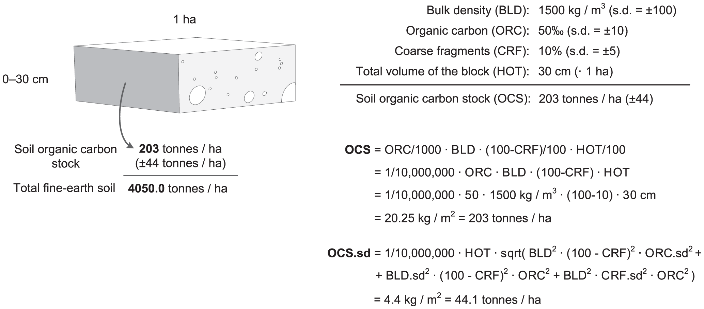
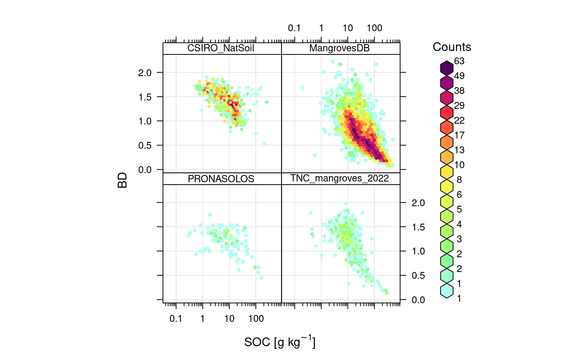
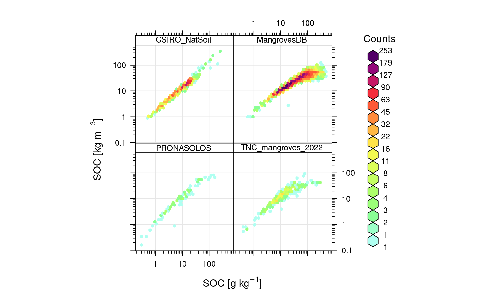
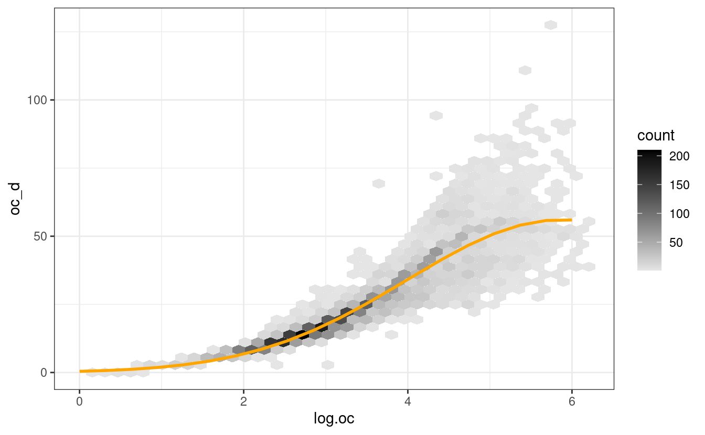
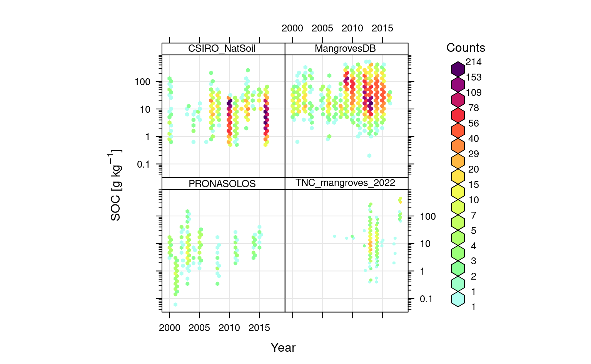
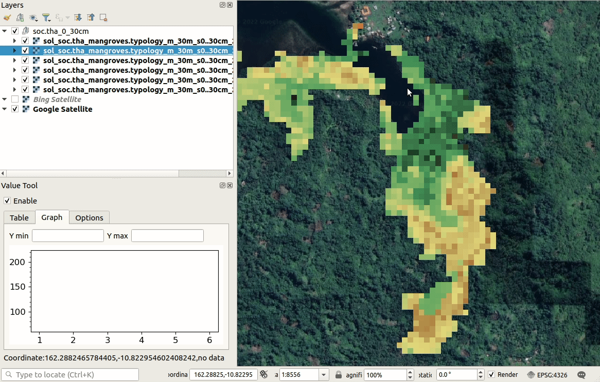
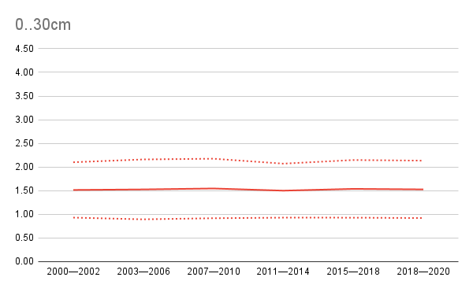

# Spatiotemporal prediction of Soil Organic Carbon

::: {.rmdnote}
You are reading the work-in-progress Spatial and spatiotemporal interpolation using Ensemble Machine Learning. This chapter is currently draft version, a peer-review publication is pending. You can find the polished first edition at <https://opengeohub.github.io/spatial-prediction-eml/>.
:::


Prepared by: [Tom Hengl](https://opengeohub.org/people/tom-hengl/) (OpenGeoHub), [Tania Maxwell](https://tania-maxwell.github.io/) (Department of Zoology, University of Cambridge) and [Leandro Parente](https://opengeohub.org/people/leandro-parente/) (OpenGeoHub)

## Soil organic carbon: global mangrove forests

[Soil organic carbon](https://www.agric.wa.gov.au/measuring-and-assessing-soils/what-soil-organic-carbon) (SOC) is one of the most important soil properties of interest for 
Earth System and Life sciences, and various environmental monitoring projects. 
Soil organic carbon is symbol of healthy soil and also if we increase carbon 
sequestration from atmosphere to soil, we could potentially could help mitigate 
global warming effects of GHG [@lal2022soil].

In this tutorial we explain how soil samples (points) can be used in combination with 
time-series of Earth Observation and climatic data to map SOC stocks and 
potentially also  changes in SOC through time. For this we use the Global 
compilation of soil organic carbon samples for world mangrove forest [@sanderman2018global], 
which we combine with other soil samples from [various project](https://opengeohub.github.io/SoilSamples/) (resulting in a 
total of +12,000 samples). We overlay the points in space 
and time vs dynamic time-series EO data and some static covariates. We then fit spatiotemporal 
Ensemble Machine Learning model and generate predictions for 30×30km tiles (about 1459 tiles with mangrove mask). 

The analysis was run for the needs of the project State of the World’s Mangroves 2022 run by 
the [Global Mangrove Alliance](https://www.mangrovealliance.org/) [@LealSpalding2022GMA]. The objectives of this work are:

- Provide best unbiased estimate of SOC stocks at 30-m spatial resolution for recent time-period (2020–2021) with uncertainty,  
- Test if predictions in @sanderman2018global can be improved by using spatiotemporal EML vs RF only,  
- Provide open access to data and computational steps and regularly update predictions using new training points, new covariates and models,  

<div class="figure" style="text-align: center">

<p class="caption">(\#fig:mangroves-map)Global predictions of SOC stock for 0–1 m for mangroves based on Sanderman et al. (2018).</p>
</div>

## Predictive mapping of soil organic carbon stocks

In principle, there are at least three (3) ways to map soil organic carbon stocks [@hengl2019predictive]:

1. Estimate SOC stocks (t/ha) then produce 2D model and predict,  
2. Model SOC density (kg/m3) in 3D, then aggregate to fixed depths,  
3. Model SOC %, bulk density and coarse fragments separately in 3D, then aggregate to SOC density and to fixed depths,  

Choice between the three is often determined by the project objectives and 
availability of data. For example, if most of point measurements are from top-soil 
as in LUCAS soil [@orgiazzi2018lucas], then probably makes most sense to estimate 
first SOC stocks in t/ha at point locations, then map 2D distribution of SOC 
stocks. If majority of data is collected at irregular depths (soil horizons) 
then it is probably more sensible to use 3D modeling. If for majority of point data 
bulk density is unknown (which is often the case), then it is probably most 
sensible to use approach #3 i.e. model SOC content (%), bulk density and coarse fragments 
independently, then combine values.

Formulas with example of how to derive SOC stocks (t/ha) [@hengl2014soilgrids1km] are shown in the scheme below.

<div class="figure" style="text-align: center">

<p class="caption">(\#fig:soc-scheme)Example of how total soil organic carbon stock (OCS) and its propagated error can be estimated for a given volume of soil using organic carbon content (ORC), bulk density (BLD), thickness of horizon (HOT), and percentage of coarse fragments (CRF). Source: https://doi.org/10.1371/journal.pone.0105992.g006</p>
</div>

## Training data

We use a compilation of soil samples analyzed in laboratory and digitized primarily from 
various literature. The original set from @sanderman2018global was extended with 
additional samples digitized from more recent literature sources by The Nature Conservancy and University of Cambridge. 
The analysis-ready data set overlaid vs time-series of EO covariates (regression-matrix) can be loaded by: 


```r
rms.df = readRDS("./input/world.mangroves_soil.carbon_rm.rds")
sel.db = rms.df$source_db %in% c("MangrovesDB","TNC_mangroves_2022","CSIRO_NatSoil","PRONASOLOS")
dim(rms.df)
#> [1] 12014   174
```

Note that, unlike the training points used in @sanderman2018global, some of the points 
also fall in non-mangrove areas. This was done on purpose to help model transition 
zones from mangroves to non-mangrove areas. 

We can start by getting acquainted with this dataset. First, we can check general 
distribution of values of SOC content (g/kg) vs soil depth: 


```r
openair::scatterPlot(rms.df[sel.db,], x = "hzn_depth", y = "oc", method = "hexbin", col = "increment", type = "source_db", log.x = TRUE, log.y = TRUE, xlab="Depth", ylab="SOC [g/kg]")
```

<div class="figure" style="text-align: center">

<p class="caption">(\#fig:soc-depth)Distribution of values for SOC in g/kg vs soil depth. Notice for many soil samples standard depths are used hence some groupings are visible.</p>
</div>

In this case clearly most of soils in mangrove forests are so-called organic soils 
where SOC content remains high with depth (compare vs CSIRO samples from Australia 
and PRONASOLOS samples from Brazil). We can quickly estimate what the average 
SOC content for world mangroves by using:


```r
sel.oc = rms.df$source_db %in% c("MangrovesDB","TNC_mangroves_2022")
mean.oc = mean(rms.df[sel.oc,"oc"], na.rm=TRUE)
mean.oc
#> [1] 56.28807
mean.hzn_depth = mean(rms.df[sel.oc,"hzn_depth"], na.rm=TRUE)
mean.hzn_depth
#> [1] 48.02937
```

Hence world soil mangrove forest have about 5.6% SOC for an average soil depth of 48-cm. 
Next we can look at the bulk density values:


```r
openair::scatterPlot(rms.df[sel.db,], y = "db_od", x = "oc", method = "hexbin", col = "increment", type = "source_db", log.x = TRUE, ylab="BD", xlab="SOC [g/kg]")
```

<div class="figure" style="text-align: center">

<p class="caption">(\#fig:soc-db)Distribution of values for SOC in g/kg vs soil bulk density.</p>
</div>

This shows that, as expected BD can be related with SOC using linear-log relationship. 
Note that most of bulk density points in @sanderman2018global (`MangrovesDB`) are based on using 
a simple pedo-transfer function to estimate BD from SOC content hence the grouping on a line. 
We can use actual SOC and BD measurements to estimate a more applicable pedo-transfer function for bulk density:


```r
m.bd.soc = lm(db_od~log1p(oc)+log1p(hzn_depth), rms.df[!rms.df$source_db %in% c("MangrovesDB"),])
summary(m.bd.soc)
#> 
#> Call:
#> lm(formula = db_od ~ log1p(oc) + log1p(hzn_depth), data = rms.df[!rms.df$source_db %in% 
#>     c("MangrovesDB"), ])
#> 
#> Residuals:
#>      Min       1Q   Median       3Q      Max 
#> -1.17797 -0.14048  0.01392  0.14586  1.20172 
#> 
#> Coefficients:
#>                   Estimate Std. Error t value Pr(>|t|)    
#> (Intercept)       2.212642   0.018520  119.47   <2e-16 ***
#> log1p(oc)        -0.293363   0.003475  -84.43   <2e-16 ***
#> log1p(hzn_depth) -0.065487   0.004382  -14.95   <2e-16 ***
#> ---
#> Signif. codes:  0 '***' 0.001 '**' 0.01 '*' 0.05 '.' 0.1 ' ' 1
#> 
#> Residual standard error: 0.2323 on 2885 degrees of freedom
#>   (3914 observations deleted due to missingness)
#> Multiple R-squared:  0.7142,	Adjusted R-squared:  0.714 
#> F-statistic:  3604 on 2 and 2885 DF,  p-value: < 2.2e-16
```

so that we can estimate bulk density for average SOC content and depth of 50-cm:


```r
mean.db_od = predict(m.bd.soc, data.frame(oc=mean.oc, hzn_depth=mean.hzn_depth))
mean.db_od
#>         1 
#> 0.7701787
```

i.e. it is about 770 kg/m-cubic. Based on these rough numbers we can estimate that the mean 
SOC density for world mangroves at 50-cm depth is about:


```r
mean.oc/1000 * mean.db_od * 1000
#>        1 
#> 43.35187
```

i.e. about 43 kg/m-cubic, so that the total SOC stock for 0–100 cm is about 430 t/ha. 
Assuming that there are about [147,000 square-km of mangroves forests in the world](https://www.iucn.org/story/202209/mangroves-climate-action-global-mangrove-alliance-launches-new-state-world-mangrove), this would estimate total SOC stock for 0–100 cm to be:


```r
430 * 147e3 * 100 / 1e9
#> [1] 6.321
```

i.e. about 6.3 gigatones of soil carbon. This estimate is not ideal for multiple reasons:

- Training points are just a compilation of data from literature, i.e. it is possible 
that some areas are over-represented i.e. that there is a bias in how average SOC is estimated,  
- Training points come from different time-periods and SOC is a dynamic property; again we could generate bias in predictions,  

## Pedo-tranfer function to estimate SOC density from content

We can also look at relationship between SOC (%) and SOC density (kg/m3). Based on the 
available data this shows:


```r
openair::scatterPlot(rms.df[sel.db,], y = "oc_d", x = "oc", method = "hexbin", col = "increment", type = "source_db", log.x = TRUE, log.y = TRUE, ylab="SOC [kg/m3]", xlab="SOC [g/kg]")
```

<div class="figure" style="text-align: center">

<p class="caption">(\#fig:soc-dens)Relationship between SOC content and density on a log-scale.</p>
</div>

Which shows that SOC in kg/m3 is linearly correlated with SOC %, except for 
organic soils this relationship is curvilinear i.e. after some values of SOC % 
SOC in kg/m3 stabilizes and does not grow any more. Again, we can fit a simple pedo-tranfer 
function using this data to predict SOC density (kg/m3) directly from SOC %:


```r
rms.df$log.oc2 = rms.df$log.oc^2
df.oc_d = rms.df[sel.oc,c("oc_d", "log.oc", "log.oc2", "hzn_depth")]
## remove some artifacts in points:
df.oc_d = df.oc_d[!(df.oc_d$log.oc<0.5 & df.oc_d$oc_d>5),]
m.oc_d = glm(I(oc_d+.Machine$double.eps)~log.oc+log.oc2+hzn_depth, 
             df.oc_d, family = gaussian(link="log"))
summary(m.oc_d)
#> 
#> Call:
#> glm(formula = I(oc_d + .Machine$double.eps) ~ log.oc + log.oc2 + 
#>     hzn_depth, family = gaussian(link = "log"), data = df.oc_d)
#> 
#> Deviance Residuals: 
#>     Min       1Q   Median       3Q      Max  
#> -28.255   -2.370    0.317    1.724   71.752  
#> 
#> Coefficients:
#>               Estimate Std. Error t value Pr(>|t|)    
#> (Intercept) -8.345e-01  6.701e-02 -12.455  < 2e-16 ***
#> log.oc       1.651e+00  3.170e-02  52.094  < 2e-16 ***
#> log.oc2     -1.404e-01  3.687e-03 -38.085  < 2e-16 ***
#> hzn_depth    3.423e-04  6.555e-05   5.222 1.84e-07 ***
#> ---
#> Signif. codes:  0 '***' 0.001 '**' 0.01 '*' 0.05 '.' 0.1 ' ' 1
#> 
#> (Dispersion parameter for gaussian family taken to be 49.05412)
#> 
#>     Null deviance: 1511634  on 5564  degrees of freedom
#> Residual deviance:  272790  on 5561  degrees of freedom
#>   (52 observations deleted due to missingness)
#> AIC: 37463
#> 
#> Number of Fisher Scoring iterations: 5
```

This models has an R-square of about:


```r
#calculate McFadden's R-squared for model
with(summary(m.oc_d), 1 - deviance/null.deviance)
#> [1] 0.8195399
```

We can plot the fitted model vs measured data by using:


```r
oc_data <- data.frame(log.oc=seq(0, 6, length.out=20))
oc_data$log.oc2 = oc_data$log.oc^2
oc_data$hzn_depth = 20
oc_data$oc_d = predict(m.oc_d, oc_data, type = c("response"))
ggplot(df.oc_d, aes(log.oc, oc_d)) + 
  geom_hex(bins=40) + 
  scale_fill_gradient(low = "grey90", high = "black") +
  theme_bw() + 
  geom_line(data=oc_data, aes(log.oc, oc_d), col="orange",
              size=1)
#> Warning: Removed 52 rows containing non-finite values (stat_binhex).
```

<div class="figure" style="text-align: center">

<p class="caption">(\#fig:ocd-plot)Modelling SOC density (kg/m3) as a function of log.SOC (g/kg). This model explains cca 80% of variability in data, notice however that the uncertainty around regression line increases for higher values of SOC.</p>
</div>

This means that at depth of 20-cm, SOC % of 6% (log.SOC = 4.1) converts to SOC 
density (kg/m3) of about 36 kg/m-cubic, but the number could very well be somewhere 
between 22 and 46 kg/m-cubic (see density plot above).


```r
oc_data$SOC = expm1(oc_data$log.oc)
oc_data[14,c("SOC","log.oc","oc_d")]
#>         SOC   log.oc     oc_d
#> 14 59.65871 4.105263 36.03792
```


## Estimating total stocks using Predictive Soil Mapping

In the previous examples we have shown how to start with checking the SOC data 
to estimate global stocks, visualize relationships and  detect differences between datasets. 
The quick-and-dirt calculus tells us that there should be about 6.3 gigatones of soil carbon 
in the world mangrove forests. This number assumes perfectly random sample and no 
bias in representation of various geographies and soil depths.

To produce a more reliable estimate of global SOC stock in world mangroves and also 
to map their distribution we will use [predictive soil mapping](https://soilmapper.org), 
in this case spatiotemporal Ensemble Machine Learning (EML) and the approach where 
SOC (g/kg) and BD are used independently, then aggregated to derive SOC stocks.

We can first check if there is enough point data spread through time:


```r
openair::scatterPlot(rms.df[sel.db,], y = "oc", x = "observation_year", method = "hexbin", type = "source_db", col = "increment", log.y = TRUE, xlab="Year", ylab="SOC [g/kg]")
```

<div class="figure" style="text-align: center">

<p class="caption">(\#fig:soc-time)Distribution of training points through time.</p>
</div>

Overall, there are definitively enough points spread over time for spatiotemporal 
mapping of SOC. Also note, there seems to be, in average, no overall trends in SOC. 
Still, many reports shows that in some areas such as Niger delta, Indonesia, Australia etc 
the mangrove forests have gone through significant degradation [@LealSpalding2022GMA; @murray2022high] and this should be 
also represented in maps.

## Estimating added value of temporal component

For spatiotemporal EML we use a regression matrix with number of target variables, 
and over 150 covariate layers. This include:

- Globally consistent time-series 2000–2020 ARD Landsat bands (Blue, Green, Red, NIR, SWIR1, SWIR2) [@potapov2020landsat], aggregated and 
gap-filled to produce complete consistent lower quantiles (P25 = lower 0.25 probability), as explained in detail in @yamazaki2019merit,  
- [Time-series of CHELSA images](https://chelsa-climate.org/timeseries/) representing climate precipitation, mean, minimum and maximum air temperature [@karger2017climatologies],  
- MODIS LST (1km) and EVI (250m) monthly time-series (covering 2000–2020 period) generated using aggregation,  
- Number of static (long-term) layers including MERIT DEM elevation [@yamazaki2019merit], global surface water 
probability [@pekel2016high], long-term climatic variables and and global composites of Landsat bands from 2010, 2014 and 2018 [@hansen2013high],  

In addition to original Landsat bands, we also use a list of standard vegetation 
indices that can be [derived from Landsat data](https://www.usgs.gov/landsat-missions/landsat-surface-reflectance-derived-spectral-indices). 
The Landsat bands and derivatives are available at 30-m spatial resolution, while 
the 250m and 1km resolution images had to be downscaled to 30-m spatial resolution 
(here we used GDAL and cubic-spline downscaling). An example of complete data prepared 
for world mangroves is the tile `162E_10S`:


```r
g30m.t = readRDS("./input/T162E_10S/data_2020.rds")
dim(g30m.t@data)
#> [1] 10548   147
g30m.s = readRDS("./input/T162E_10S/data_static.rds")
str(g30m.s@data)
#> 'data.frame':	10548 obs. of  18 variables:
#>  $ band1                               : int  1 1 1 1 1 1 1 1 1 1 ...
#>  $ Landsat_treecover2000               : num  6 4 8 5 12 7 5 3 2 1 ...
#>  $ Landsat2000_NIR                     : num  62 57 66 65 68 68 67 64 59 52 ...
#>  $ Landsat2000_red                     : num  39 37 40 39 39 40 39 38 35 32 ...
#>  $ Landsat2000_SWIR1                   : num  41 41 49 51 50 52 53 53 50 44 ...
#>  $ Landsat2000_SWIR2                   : num  10 10 14 15 16 18 19 18 17 15 ...
#>  $ Landsat2014_NIR                     : num  59 51 60 60 63 63 62 58 51 42 ...
#>  $ Landsat2014_red                     : num  36 36 32 33 27 30 32 32 32 29 ...
#>  $ Landsat2014_SWIR1                   : num  40 38 43 47 42 46 49 48 42 34 ...
#>  $ Landsat2014_SWIR2                   : num  11 10 13 15 15 17 19 18 16 12 ...
#>  $ Landsat2018_NIR                     : num  43 32 37 34 45 43 42 40 36 32 ...
#>  $ Landsat2018_red                     : num  38 36 38 38 39 40 40 41 41 40 ...
#>  $ Landsat2018_SWIR1                   : num  34 29 33 32 37 37 37 36 34 31 ...
#>  $ Landsat2018_SWIR2                   : num  16 14 16 16 18 18 18 18 17 15 ...
#>  $ MERIT_height.above.nearest.neighbour: num  0.00 0.00 3.69e-07 0.00 1.01e-04 ...
#>  $ MERIT_upstream.area                 : num  0.2445 0.2303 0.0768 0.0971 0.0389 ...
#>  $ Water_change                        : num  242 238 248 247 251 250 247 241 231 217 ...
#>  $ Water_occurrence                    : num  35 41 27 29 19 21 24 30 39 49 ...
```

We can start modeling SOC by testing predictive power of purely-spatial vs 
spatiotemporal covariates. We first test modeling performance using only *static* covariates 
and log-SOC (%) as the target variable:


```r
pr.vars = readRDS("./input/world.mangroves_soil.carbon_pr.vars.rds")
pr.vars0 = names(g30m.s@data)[-1]
sel0 = complete.cases(rms.df[,c("log.oc", pr.vars0)])
m0.oc = ranger::ranger(y=rms.df$log.oc[sel0], x=rms.df[sel0, c("hzn_depth", pr.vars0)], 
            num.trees = 85, importance = 'impurity')
m0.oc
#> Ranger result
#> 
#> Call:
#>  ranger::ranger(y = rms.df$log.oc[sel0], x = rms.df[sel0, c("hzn_depth",      pr.vars0)], num.trees = 85, importance = "impurity") 
#> 
#> Type:                             Regression 
#> Number of trees:                  85 
#> Sample size:                      11923 
#> Number of independent variables:  18 
#> Mtry:                             4 
#> Target node size:                 5 
#> Variable importance mode:         impurity 
#> Splitrule:                        variance 
#> OOB prediction error (MSE):       0.3371771 
#> R squared (OOB):                  0.816463
```


```r
sel1 = complete.cases(rms.df[,c("log.oc", pr.vars)])
m1.oc = ranger::ranger(y=rms.df$log.oc[sel1], x=rms.df[sel1, c("hzn_depth", pr.vars)], 
            num.trees = 85, importance = 'impurity')
m1.oc
#> Ranger result
#> 
#> Call:
#>  ranger::ranger(y = rms.df$log.oc[sel1], x = rms.df[sel1, c("hzn_depth",      pr.vars)], num.trees = 85, importance = "impurity") 
#> 
#> Type:                             Regression 
#> Number of trees:                  85 
#> Sample size:                      9285 
#> Number of independent variables:  156 
#> Mtry:                             12 
#> Target node size:                 5 
#> Variable importance mode:         impurity 
#> Splitrule:                        variance 
#> OOB prediction error (MSE):       0.3411809 
#> R squared (OOB):                  0.802172
```

It appears that static variables are already sufficient to map SOC content and the models are highly significant. The 
problem of this approach is that it ignores spatial clustering of points including 
the fact that many samples come from the same spatial locations. We want to, instead, validate models 
using [spatial blocks](https://opengeohub.github.io/spatial-sampling-ml/resampling-methods-for-machine-learning.html#resampling-using-ensemble-ml) so that a subset of points is either used for training or cross-validation. 
To fit a model that *blocks* spatially overlapping points into training or validation we 
can use the [mlr package](https://mlr.mlr-org.com/articles/tutorial/handling_of_spatial_data.html):


```r
lrns <- list(mlr::makeLearner("regr.ranger", 
                num.threads = parallel::detectCores(), num.trees=85, importance="impurity"),
             mlr::makeLearner("regr.cubist"), mlr::makeLearner("regr.rpart"), 
             mlr::makeLearner("regr.cvglmnet"))
tsk0 <- mlr::makeRegrTask(data = rms.df[sel0, c("log.oc", "hzn_depth", pr.vars0)], 
                          blocking = as.factor(rms.df$ID[sel0]), 
                          target = "log.oc")
init.m <- mlr::makeStackedLearner(lrns, method = "stack.cv", 
                                  super.learner = "regr.lm",
                                  resampling=mlr::makeResampleDesc(method = "CV", blocking.cv=TRUE))
eml0 = train(init.m, tsk0)
#> Exporting objects to slaves for mode socket: .mlr.slave.options
#> Mapping in parallel: mode = socket; level = mlr.resample; cpus = 32; elements = 10.
#> Exporting objects to slaves for mode socket: .mlr.slave.options
#> Mapping in parallel: mode = socket; level = mlr.resample; cpus = 32; elements = 10.
#> Exporting objects to slaves for mode socket: .mlr.slave.options
#> Mapping in parallel: mode = socket; level = mlr.resample; cpus = 32; elements = 10.
#> Exporting objects to slaves for mode socket: .mlr.slave.options
#> Mapping in parallel: mode = socket; level = mlr.resample; cpus = 32; elements = 10.
summary(eml0$learner.model$super.model$learner.model)
#> 
#> Call:
#> stats::lm(formula = f, data = d)
#> 
#> Residuals:
#>     Min      1Q  Median      3Q     Max 
#> -4.4310 -0.6122 -0.0399  0.5997  4.2324 
#> 
#> Coefficients:
#>               Estimate Std. Error t value Pr(>|t|)    
#> (Intercept)   0.021028   0.032569   0.646   0.5185    
#> regr.ranger   0.684439   0.024533  27.898  < 2e-16 ***
#> regr.cubist   0.054240   0.007913   6.854 7.51e-12 ***
#> regr.rpart    0.040341   0.019666   2.051   0.0403 *  
#> regr.cvglmnet 0.209271   0.023780   8.800  < 2e-16 ***
#> ---
#> Signif. codes:  0 '***' 0.001 '**' 0.01 '*' 0.05 '.' 0.1 ' ' 1
#> 
#> Residual standard error: 0.994 on 11918 degrees of freedom
#> Multiple R-squared:  0.4624,	Adjusted R-squared:  0.4622 
#> F-statistic:  2563 on 4 and 11918 DF,  p-value: < 2.2e-16
```

In this case we have added `ID` which is the unique ID of the spatial block (30×30-km).
So the results show drastically lower R-square when strict spatial blocking is used: e.g. a drop from 0.82 to 0.44. 
The drop in R-square is primarily effect of taking complete soil profiles and points 
close to each other out of training [@gasch2015spatio].

We can compare accuracy of modeling with using both statics and temporal variables:


```r
tsk1 <- mlr::makeRegrTask(data = rms.df[sel1, c("log.oc", "hzn_depth", pr.vars)], 
                          blocking = as.factor(rms.df$ID[sel1]), 
                          target = "log.oc")
eml1 = train(init.m, tsk1)
#> Exporting objects to slaves for mode socket: .mlr.slave.options
#> Mapping in parallel: mode = socket; level = mlr.resample; cpus = 32; elements = 10.
#> Exporting objects to slaves for mode socket: .mlr.slave.options
#> Mapping in parallel: mode = socket; level = mlr.resample; cpus = 32; elements = 10.
#> Exporting objects to slaves for mode socket: .mlr.slave.options
#> Mapping in parallel: mode = socket; level = mlr.resample; cpus = 32; elements = 10.
#> Exporting objects to slaves for mode socket: .mlr.slave.options
#> Mapping in parallel: mode = socket; level = mlr.resample; cpus = 32; elements = 10.
summary(eml1$learner.model$super.model$learner.model)
#> 
#> Call:
#> stats::lm(formula = f, data = d)
#> 
#> Residuals:
#>     Min      1Q  Median      3Q     Max 
#> -3.9004 -0.6020 -0.0451  0.5698  3.6288 
#> 
#> Coefficients:
#>               Estimate Std. Error t value Pr(>|t|)    
#> (Intercept)   0.125251   0.030022   4.172 3.05e-05 ***
#> regr.ranger   0.901598   0.021746  41.460  < 2e-16 ***
#> regr.cubist   0.008529   0.004847   1.760   0.0785 .  
#> regr.rpart    0.036059   0.017912   2.013   0.0441 *  
#> regr.cvglmnet 0.008649   0.011591   0.746   0.4556    
#> ---
#> Signif. codes:  0 '***' 0.001 '**' 0.01 '*' 0.05 '.' 0.1 ' ' 1
#> 
#> Residual standard error: 0.9572 on 9280 degrees of freedom
#> Multiple R-squared:  0.4689,	Adjusted R-squared:  0.4687 
#> F-statistic:  2049 on 4 and 9280 DF,  p-value: < 2.2e-16
```

This shows that: (1) adding temporal components helps increase mapping accuracy 
although the difference is marginal (e.g. 5–10%), 
(2) without using CV with blocking, Random Foreost most likely [overfits](https://medium.com/nerd-for-tech/extrapolation-is-tough-for-trees-tree-based-learners-combining-learners-of-different-type-makes-659187a6f58d) training points.

The estimated accuracy of predicting SOC content (%) anywhere in the world (inside the world mangrove 
forests) is thus:


```r
t.b = quantile(rms.df$log.oc, c(0.001, 0.01, 0.999), na.rm=TRUE)
plot_hexbin(varn="SOC_EML", breaks=c(t.b[1], seq(t.b[2], t.b[3], length=25)), 
      meas=eml1$learner.model$super.model$learner.model$model$log.oc, 
      pred=eml1$learner.model$super.model$learner.model$fitted.values, 
      main="SOC [EML]")
```

<div class="figure" style="text-align: center">

<p class="caption">(\#fig:eml-soc1)Accuracy plot for soil organic carbon fitted using Ensemble ML.</p>
</div>

It is also interesting to look at the variable importance for this model to see which covariates 
are most important for modeling SOC:


```r
library(ggplot2)
xl.soc <- as.data.frame(mlr::getFeatureImportance(eml1[["learner.model"]][["base.models"]][[1]])$res)
xl.soc$relative_importance = 100*xl.soc$importance/sum(xl.soc$importance)
xl.soc = xl.soc[order(xl.soc$relative_importance, decreasing = T),]
xl.soc$variable = paste0(c(1:nrow(xl.soc)), ". ", xl.soc$variable)
ggplot(data = xl.soc[1:20,], aes(x = reorder(variable, relative_importance), y = relative_importance)) +
  geom_bar(fill = "steelblue",
           stat = "identity") +
  coord_flip() +
  labs(title = "Variable importance",
       x = NULL,
       y = NULL) +
  theme_bw() + theme(text = element_text(size=15))
```

<div class="figure" style="text-align: center">

<p class="caption">(\#fig:varimp-soc)Variable importance for 3D prediction model for SOC based on random forest.</p>
</div>

As expected, soil depth significantly helps predict SOC. Next most important covariates 
are Landsat SWIR bands and daytime surface temperature (LST) for October. Note that, in 
average, time-series `landsat.ard` (i.e. temporal component) are overall the most important covariates.

Likewise, we can fit an independent model for BD using the same modeling framework:


```r
sel.bd = complete.cases(rms.df[,c("db_od", pr.vars)])
tsk.bd <- mlr::makeRegrTask(data = rms.df[sel.bd, c("db_od", "hzn_depth", pr.vars)], 
                          blocking = as.factor(rms.df$ID[sel.bd]), 
                          target = "db_od")
bd.eml = train(init.m, tsk.bd)
#> Exporting objects to slaves for mode socket: .mlr.slave.options
#> Mapping in parallel: mode = socket; level = mlr.resample; cpus = 32; elements = 10.
#> Exporting objects to slaves for mode socket: .mlr.slave.options
#> Mapping in parallel: mode = socket; level = mlr.resample; cpus = 32; elements = 10.
#> Exporting objects to slaves for mode socket: .mlr.slave.options
#> Mapping in parallel: mode = socket; level = mlr.resample; cpus = 32; elements = 10.
#> Exporting objects to slaves for mode socket: .mlr.slave.options
#> Mapping in parallel: mode = socket; level = mlr.resample; cpus = 32; elements = 10.
summary(bd.eml$learner.model$super.model$learner.model)
#> 
#> Call:
#> stats::lm(formula = f, data = d)
#> 
#> Residuals:
#>      Min       1Q   Median       3Q      Max 
#> -1.17339 -0.18635  0.01339  0.19663  1.02023 
#> 
#> Coefficients:
#>                Estimate Std. Error t value Pr(>|t|)    
#> (Intercept)   -0.090269   0.014092  -6.406 1.62e-10 ***
#> regr.ranger    1.295792   0.026694  48.542  < 2e-16 ***
#> regr.cubist    0.029998   0.007837   3.828 0.000131 ***
#> regr.rpart    -0.199207   0.015002 -13.279  < 2e-16 ***
#> regr.cvglmnet  0.011559   0.019603   0.590 0.555431    
#> ---
#> Signif. codes:  0 '***' 0.001 '**' 0.01 '*' 0.05 '.' 0.1 ' ' 1
#> 
#> Residual standard error: 0.2892 on 5770 degrees of freedom
#> Multiple R-squared:  0.5401,	Adjusted R-squared:  0.5397 
#> F-statistic:  1694 on 4 and 5770 DF,  p-value: < 2.2e-16
```

This has more missing values and is hence will likely be more cumbersome to 
map at higher accuracy. Note that the residual error (RMSE) of 294 kg/m3 is 
relatively high, which means that with our model we can only detect about 
11 classes of BD [@hengl2013mapping]:


```r
bd.range = quantile(rms.df$db_od, probs=c(0.01, 0.99), na.rm=TRUE)
round(diff(bd.range)/(0.293/2))
#> 99% 
#>  11
```

The classes would be e.g.:


```r
seq(bd.range[1], bd.range[2], length.out=round(diff(bd.range)/(0.293/2)))
#>  [1] 0.130 0.295 0.460 0.625 0.790 0.955 1.120 1.285 1.450 1.615 1.780
```


## Producing predictions of SOC and BD

Now that we have fitted (independently) models for SOC and BD, we can generate 
predictions for all time-periods and all standard depths (0, 30, 60 and 100-cm). 
Then, after we produce predictions at standard depths, we can aggregate those predictions 
to standard depth intervals e.g. 0–30 and 30–100 cm. For each interval, we can then 
determine SOC stocks (t/ha) and then sum up the two to produce total SOC stocks 
0–100 cm.

In summary, we will produce a total of 190+ maps, which includes:

- Predictions of SOC and BD at 4 standard depths + prediction errors for 5 period (2×4×2×5 = 96),
- Derived values for SOC and BD for standard depth intervals 0–30 and 30–100-cm (2×2×2×5 = 40),
- Derived stocks for standard depths with lower and upper intervals (2×3×5 = 30),

The 4-year time-periods include:

- 2002 = 2000–2003,  
- 2006 = 2004–2007,  
- 2010 = 2008–2011,  
- 2014 = 2012–2015,  
- 2018 = 2016–2019,  
- 2020 = 2020–2021,  

We first prepare a function `pred_mlr` and `pred_lst` (see R script `PSM_functions.R`) 
to speed up making predictions. We can now run predictions over time-periods:


```r
source("PSM_functions.R")
yl =  c(2002, 2006, 2010, 2014, 2018, 2020)
## correction factor for prediction error:
m.train = eml1$learner.model$super.model$learner.model$model
m.terms = all.vars(eml1$learner.model$super.model$learner.model$terms)
eml.MSE0 = matrixStats::rowSds(as.matrix(m.train[,m.terms[-1]]), na.rm=TRUE)^2
eml.MSE = deviance(eml1$learner.model$super.model$learner.model)/df.residual(eml1$learner.model$super.model$learner.model)
## correction factor:
eml.cf = eml.MSE/mean(eml.MSE0, na.rm = TRUE)
for(year in yl){
  try( pred_lst(tvar="log.oc", id="T162E_10S", year, eml1, eml.cf, in.dir="./input/") )
}
```

Next, we can aggregate all predictions to produce SOC and BD estimates for standard 
depth intervals. For this we use the function `soc_calc` and we run it in 
parallel to speed up processing:


```r
params = expand.grid(t.var=c("log.oc", "db.od"), year=yl, tile="T162E_10S")
params = split(params, 1:nrow(params))
#str(params[[1]])
library(doMC)
registerDoMC(parallel::detectCores())
x <- foreach(p=params, .packages=c("rgdal", "raster", "matrixStats"), 
             .export=c("agg_layers")) %dopar% 
     { agg_layers(year=p$year, t.var=p$t.var, tile=p$tile) }
## aggregate per tile
par0 = expand.grid(year=yl, tile="T162E_10S")
par0 = split(par0, 1:nrow(par0))
x <- foreach(p=par0, .packages=c("rgdal", "raster", "matrixStats"), .export=c("soc_calc", "OCSKGM")) %dopar%{ soc_calc(year=p$year, tile=p$tile) }
```

This will populate the folder `./output/T162E_10S` with all maps as a result of 
predictive mapping. The most interesting output maps are e.g. `sol_soc.tha_mangroves.typology_m_30m_s0..30cm_2020`, 
which are the most recent estimates of SOC stocks for mangrove map of interest.

We can visualize produced predictions, best by using e.g. the 
[Raster Time-series Manager plugin](https://raster-timeseries-manager.readthedocs.io/en/latest/content.html) 
in QGIS or similar. Simply download the maps from the `./output/T162E_10S` folder 
and open and customize predictions in QGIS as shown below. As you move with the 
cursor around the map, you will see changes in SOC stocks over different time-periods.

<div class="figure" style="text-align: center">

<p class="caption">(\#fig:qgis-trend)Visualization of SOC t/ha predictions in QGIS.</p>
</div>


```r
parallelMap::parallelStop()
#> Stopped parallelization. All cleaned up.
```

## Summary points

In this tutorial we have demonstrated how to fit spatiotemporal models for SOC to estimate 
SOC stocks in t/ha (with prediction uncertainty) for the world mangrove forests. 
We fit two independent models for SOC content (%) and for bulk 
density, then aggregate values to produce global estimates of SOC for the whole mangroves. 
This is so-called 3D predictive soil mapping approach with independently fitted components of 
SOC stocks. For modeling we use a compilation of [soil samples from literature](https://opengeohub.github.io/SoilSamples/) and 
various national and international projects (at total of 12,000 samples). As covariate 
layers we use standard climatic, terrain, vegetation and hydrological parameters.

Results of strict cross-validation using 5-fold blocking (where spatially close points 
are used either for modeling or validation) show that the CCC for SOC (%) is 
about 0.7 and for bulk density (kg/m3) around 0.65. The mapping uncertainty is somewhat higher 
than for SOC mapping projects where interest is agricultural land. This is most likely due to 
the following reasons:

1. Most of world mangrove forests are in Tropics and covered with vegetation whole year; vegetation cover is not always linearly correlated with SOC content,  
2. Point data (digitized from the literature mainly) used for training is largely unharmonized and many points have relatively inaccurate location,  
3. A lot of SOC is located in deeper soils, so EO data only marginaly helps map SOC,  

The tutorial demonstrates that Random Forest that ignores spatial overlap in 
training data would likely result in overfitting. This illustrates importance of 
doing strict validation to build models and interpret the results. As the most 
important covariates for mapping SOC models show soil depth and Landsat SWIR bands.  

Based on spatiotemporal prediction of SOC stocks, we estimate that the global SOC 
stocks for world mangrove forests are in average about 350 t/ha for 0–100 cm depth (67% prob. interval: 232–470 t/ha) 
i.e. about 4.6 gigatonnes (67% prob. interval: 3.1–6.2), which is somewhat less 
than we estimate directly from soil samples. This is for 2 main probable reasons:

1. The soil samples (points) are usually collected for top-soil which usually has more SOC, hence average value from training points most likely over-estimates deeper soils,  
2. Soil samples are in most cases collected inside mangrove forests, so that lower stocks in the transition areas would have also been likely over-estimated,  

Also note that our results show that, in average, SOC for mangrove forests did 
not change (see below), although one would need to validate specifies areas to see if in some 
parts there are gains / losses in SOC. The figure below shows global mean and lower and upper 
prediction intervals for SOC stocks for mangrove forests through time.

<div class="figure" style="text-align: center">

<p class="caption">(\#fig:global-trend)Global SOC stocks in gigatones with prediction uncertainty for the time-period of interest.</p>
</div>

## Access global predictions of SOC for magroves

To access global predictions you can use the Cloud-Optimized GeoTIFFs available at 
 https://s3.eu-central-1.wasabisys.com/openlandmap/mangroves/. Simply expand the file name using 
the file-name pattern of standard depths `s0..30cm`, `s30..100cm` and years of predictions e.g. `2020`. 
Example of mean, lower-prediction-interval and upper-prediction-interval maps are:

- sol_soc.tha_mangroves.typology_m_30m_s0..30cm_2020_global_v1.0.tif,  
- sol_soc.tha_mangroves.typology_l.std_30m_s0..30cm_2020_global_v1.0.tif  
- sol_soc.tha_mangroves.typology_u.std_30m_s0..30cm_2020_global_v1.0.tif  

From R you can access and crop this data using e.g.:


```r
library(terra)
#> terra version 0.8.11 (beta-release)
#> 
#> Attaching package: 'terra'
#> The following objects are masked from 'package:Matrix':
#> 
#>     expand, pack
#> The following object is masked from 'package:rgdal':
#> 
#>     project
cog = "/vsicurl/https://s3.eu-central-1.wasabisys.com/openlandmap/mangroves/sol_soc.tha_mangroves.typology_m_30m_s0..30cm_2020_global_v1.0.tif"
terra::rast(cog)
#> class       : SpatRaster 
#> dimensions  : 280004, 1360004, 1  (nrow, ncol, nlyr)
#> resolution  : 0.00025, 0.00025  (x, y)
#> extent      : -160.0005, 180.0005, -39.0005, 31.0005  (xmin, xmax, ymin, ymax)
#> coord. ref. : +proj=longlat +datum=WGS84 +no_defs 
#> data source : sol_soc.tha_mangroves.typology_m_30m_s0..30cm_2020_global_v1.0.tif 
#> names       : sol_soc.tha_mangroves.typology_m_30m_s0..30cm_2020_global_v1.0
```

Once you define the COG in R, you can crop to bounding box of interest or simply [overlay points or polygons](https://gitlab.com/openlandmap/africa-soil-and-agronomy-data-cube).

Note: if you compare the output maps with the mask map of the global mangrove forests, 
you will notice that we could not produce predictions for about 116 mangroves polygons 
(mostly in Fiji and other smaller islands) because of the absence of GLAD Landsat 
data. We could try to predict these areas using only coarser resolution EO data, 
but the result would be highly uncertain + we would not match the spatial resolution, 
so we have decided to better leave the pixels as NA.

This work has received funding from the **[Global Mangrove Alliance](https://www.mangrovealliance.org/)**. Global Mangrove 
Alliance is currently coordinated by members Conservation International, The International 
Union for the Conservation of Nature, The Nature Conservancy, Wetlands International 
and World Wildlife Fund.
