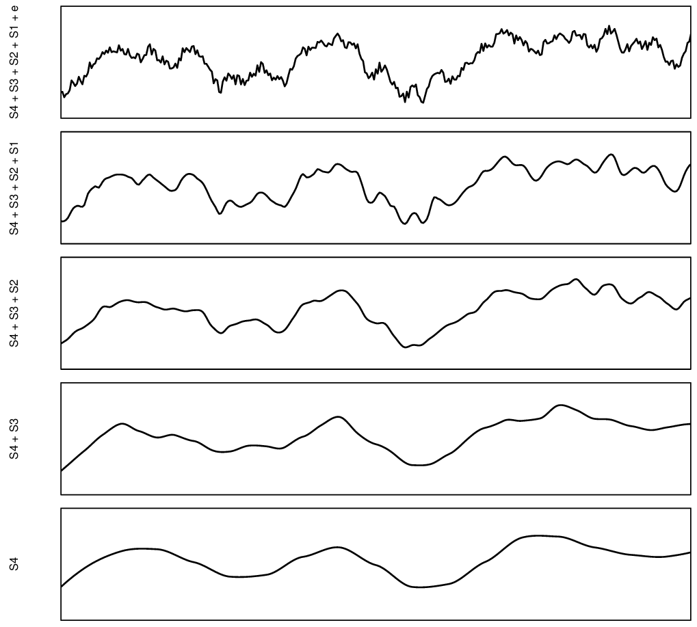
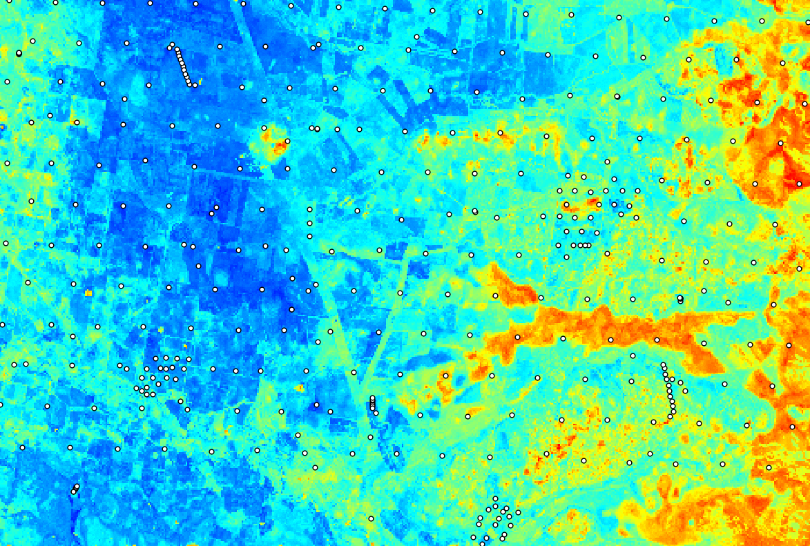

# Multi-scale spatial prediction models

```{r, results = "asis", echo = FALSE}
status("drafting")
```

```{r, include=FALSE, message=FALSE, results='hide'}
ls <- c("rgdal", "raster", "plotKML", "ranger", "mlr", "forestError", 
        "xgboost", "glmnet", "matrixStats", "landmap", "yardstick", "Cubist", 
        "hexbin", "parallelMap", "Metrics", "fastSave", "devtools")
new.packages <- ls[!(ls %in% installed.packages()[,"Package"])]
if(length(new.packages)) install.packages(new.packages)
lapply(ls, require, character.only = TRUE)
#load.pigz("eml_data.RData")
source("PSM_functions.R")
```

## Rationale for multiscale models

In the previous examples we have shown how to fit spatial and spatiotemporal models 
to generate predictions using multiple covariate layers. In practice spatial layers 
used for predictive mapping could come and different spatial scales i.e. they could 
be represent different part of spatial variation. There are at least two scales of 
spatial variation [@hengl2021african]:

- **Coarse scale** e.g. representing effects of planetary climate;
- **Fine scale** e.g. representing meso-relief and local conditions;

In fact, we can imagine that spatial variation can probably be decomposed into different 
scale components, as illustrated in plot below.

```{r space-time-cube, echo = FALSE, out.width = "100%", fig.cap = "Decomposition of a signal of spatial variation into four components plus noise. Based on McBratney (1998)."}

```

The idea of modeling soil spatial variation at different scales can be traced back to the work of @McBratney1998.
That also suggests that we could produce predictions models of different components 
of variation, then sum the components to produce ensemble prediction. The rationale 
for this, in the case of large datasets, is that we can (a) significantly reduce size 
of the data, (b) separate and better focus modeling based on the component of variation.

## Fitting and predicting with multiscale models

In the next example we use EML to make spatial predictions using data-set with 
two sets of covariates basically at different resolutions 250-m and 100-m. For 
this we use the Edgeroi data-set [@malone2009mapping] used commonly in the soil 
science to demonstrate 3D soil mapping of soil organic carbon (g/kg) based on 
samples taken from diagnostic soil horizons (multiple depth intervals):
  
```{r}
data(edgeroi)
edgeroi.sp <- edgeroi$sites
coordinates(edgeroi.sp) <- ~ LONGDA94 + LATGDA94
proj4string(edgeroi.sp) <- CRS("+proj=longlat +ellps=GRS80 +towgs84=0,0,0,0,0,0,0 +no_defs")
edgeroi.sp <- spTransform(edgeroi.sp, CRS("+init=epsg:28355"))
out.file = paste(getwd(), "output/edgeroi/edgeroi_training_points.gpkg", sep="/")
#if(!file.exists("out.file")){
#  writeOGR(edgeroi.sp, out.file, layer="edgeroi_training_points", driver = "GPKG")
#}
```

We can fit two independent EML's using the two sets of covariates and then 
produce final predictions by combining them. We will refer to the two models as 
coarse and fine-scale models. The fine-scale models will often be much larger 
datasets and require serious computing capacity.

## Coarse-scale model

First we use the 250-m resolution covariates:

```{r}
load("input/edgeroi.grids.rda")
gridded(edgeroi.grids) <- ~x+y
proj4string(edgeroi.grids) <- CRS("+init=epsg:28355")
ov2 <- over(edgeroi.sp, edgeroi.grids)
ov2$SOURCEID <- edgeroi.sp$SOURCEID
ov2$x = edgeroi.sp@coords[,1]
ov2$y = edgeroi.sp@coords[,2]
```

This is a 3D soil data set, so we also use the horizon `DEPTH` to explain distribution of SOC in soil: 

```{r}
source("PSM_functions.R")
h2 <- hor2xyd(edgeroi$horizons)
## regression matrix:
rm2 <- plyr::join_all(dfs = list(edgeroi$sites, h2, ov2))
formulaStringP2 <- ORCDRC ~ DEMSRT5+TWISRT5+EV1MOD5+EV2MOD5+EV3MOD5+DEPTH
rmP2 <- rm2[complete.cases(rm2[,all.vars(formulaStringP2)]),]
str(rmP2[,all.vars(formulaStringP2)])
```

We can now fit an EML directly by using the derived regression matrix:

```{r, cache=TRUE, message=FALSE, warning=FALSE}
if(!exists("m.oc")){
  m.oc = train.spLearner.matrix(rmP2, formulaStringP2, edgeroi.grids, 
                        parallel=FALSE, cov.model="nugget", cell.size=1000)
}
```

The **geoR** package here reports problems as the data set is 3D and hence there are spatial 
duplicates. We can ignore this problem and use the pre-defined cell size of 1-km 
for spatial blocking, although in theory one can also fit 3D variograms and then 
determine blocking parameter using training data. 

The results show that the EML model is significant:

```{r}
summary(m.oc@spModel$learner.model$super.model$learner.model)
```

We can now predict values at e.g. 5-cm depth by adding a dummy spatial layer with all fixed values:

```{r}
out.tif = "output/edgeroi/pred_oc_250m.tif"
edgeroi.grids$DEPTH <- 5
if(!exists("edgeroi.oc")){
  edgeroi.oc = predict(m.oc, edgeroi.grids[,m.oc@spModel$features])
}
if(!file.exists(out.tif)){
  writeGDAL(edgeroi.oc$pred["response"], out.tif, 
            options = c("COMPRESS=DEFLATE"))
  writeGDAL(edgeroi.oc$pred["model.error"], "output/edgeroi/pred_oc_250m_pe.tif", 
            options = c("COMPRESS=DEFLATE"))
}
```

which shows the following:

```{r map-oc250m, echo=FALSE, fig.width=10, out.width="100%", fig.cap="Predicted SOC content using 250-m covariates."}
par(mfrow=c(1,2), oma=c(0,0,0,1), mar=c(0,0,4,3))
plot(raster(edgeroi.oc$pred["response"]), col=R_pal[["rainbow_75"]][4:20],
  main="Predictions spLearner", axes=FALSE, box=FALSE)
  points(edgeroi.sp, pch="+")
plot(raster(edgeroi.oc$pred["model.error"]), col=rev(bpy.colors()),
  main="Prediction errors", axes=FALSE, box=FALSE)
  points(edgeroi.sp, pch="+")
```

The average prediction error in the map is somewhat higher than the average error from the model fitting:

```{r}
summary(edgeroi.oc$pred$model.error)
```

This is because we are predicting the top-soil SOC, which is exponentially higher at the soil surface and hence average model errors for top soil should be slightly larger than the mean error for the whole soil.

## Fine-scale model

We can now fit the fine-scale model independently from the coarse-scale model 
using the 100-m resolution covariates. In this case the 100-m covariates are 
based on Landsat 8 and gamma radiometrics images (see `?edgeroi` for more details): 

```{r, cache=TRUE}
edgeroi.grids100 = readRDS("input/edgeroi.grids.100m.rds")
#gridded(edgeroi.grids100) <- ~x+y
#proj4string(edgeroi.grids100) <- CRS("+init=epsg:28355")
ovF <- over(edgeroi.sp, edgeroi.grids100)
ovF$SOURCEID <- edgeroi.sp$SOURCEID
ovF$x = edgeroi.sp@coords[,1]
ovF$y = edgeroi.sp@coords[,2]
rmF <- plyr::join_all(dfs = list(edgeroi$sites, h2, ovF))
formulaStringPF <- ORCDRC ~ MVBSRT6+TI1LAN6+TI2LAN6+PCKGAD6+RUTGAD6+PCTGAD6+DEPTH
rmPF <- rmF[complete.cases(rmF[,all.vars(formulaStringPF)]),]
str(rmPF[,all.vars(formulaStringPF)])
```

We fit the 2nd fine-scale model:

```{r, cache=TRUE, message=FALSE, warning=FALSE}
if(!exists("m.ocF")){
  m.ocF = train.spLearner.matrix(rmPF, formulaStringPF, edgeroi.grids100, 
                        parallel=FALSE, cov.model="nugget", cell.size=1000)
}
summary(m.ocF@spModel$learner.model$super.model$learner.model)
```

which shows that the 100-m resolution covariates help make even more accurate 
predictions with R-square about 0.7. We can also make predictions at 5-cm depth 
by using (note: this takes almost 6x more time to compute predictions than for 
250-m resolution data):

```{r, cache=TRUE}
edgeroi.grids100$DEPTH <- 5
sel.grid = complete.cases(edgeroi.grids100@data[,m.ocF@spModel$features])
if(!exists("edgeroi.ocF")){
  edgeroi.ocF = predict(m.ocF, edgeroi.grids100[sel.grid, m.ocF@spModel$features])
}
out.tif = "output/edgeroi/pred_oc_100m.tif"
if(!file.exists(out.tif)){
  writeGDAL(edgeroi.ocF$pred["response"], out.tif, options = c("COMPRESS=DEFLATE"))
  writeGDAL(edgeroi.ocF$pred["model.error"], "output/edgeroi/pred_oc_100m_pe.tif", options = c("COMPRESS=DEFLATE"))
}
```

which shows the following:

```{r, map-oc100m, echo=FALSE, fig.width=10, out.width="100%", fig.cap="Predicted SOC content using 100-m covariates."}
par(mfrow=c(1,2), oma=c(0,0,0,1), mar=c(0,0,4,3))
plot(raster(edgeroi.ocF$pred["response"]), col=R_pal[["rainbow_75"]][4:20],
  main="Predictions spLearner", axes=FALSE, box=FALSE)
  points(edgeroi.sp, pch="+", cex=.8)
plot(raster(edgeroi.ocF$pred["model.error"]), col=rev(bpy.colors()),
  main="Prediction errors", axes=FALSE, box=FALSE)
  points(edgeroi.sp, pch="+", cex=.8)
```

## Merging multi-scale predictions

If we compare the coarse scale and fine scale predictions we see:

```{r two-scale, echo = FALSE, out.width = "100%", fig.cap = "Coarse-scale and fine-scale predictions of soil organic carbon at 5-cm depth for the Edgeroi study area."}

```

Overall there is a match between general patterns but there are also differences locally. This is to expect as the two models are fitted independently using completely different covariates. We can merge the two predictions and produce the final ensemble prediction by using the following principles:

- User prediction errors per pixel as weights so that more accurate predictions get higher weights,  
- Derive propagated error using the pooled variance based on individual predictions and errors,  

Before we run this operation, we need to downscale the maps to the same grid, best using Cubic-splines in GDAL:

```{r}
edgeroi.grids100@bbox
outD.file = "output/edgeroi/pred_oc_250m_100m.tif"
if(!file.exists(outD.file)){
  system(paste0('gdalwarp output/edgeroi/pred_oc_250m.tif ', outD.file,  
         ' -r \"cubicspline\" -te 741400 6646000 789000 6678100 -tr 100 100 -overwrite'))
  system(paste0('gdalwarp output/edgeroi/pred_oc_250m_pe.tif output/edgeroi/pred_oc_250m_100m_pe.tif',
         ' -r \"cubicspline\" -te 741400 6646000 789000 6678100 -tr 100 100 -overwrite'))
}
```

We can now read the downscaled predictions, and merge them using the prediction errors as weights (weighted average per pixel): 

```{r}
sel.pix = edgeroi.ocF$pred@grid.index
edgeroi.ocF$pred$responseC = readGDAL("output/edgeroi/pred_oc_250m_100m.tif")$band1[sel.pix]
edgeroi.ocF$pred$model.errorC = readGDAL("output/edgeroi/pred_oc_250m_100m_pe.tif")$band1[sel.pix]
X = comp.var(edgeroi.ocF$pred@data, r1="response", r2="responseC", v1="model.error", v2="model.errorC")
edgeroi.ocF$pred$responseF = X$response
out.tif = "output/edgeroi/pred_oc_100m_merged.tif"
if(!file.exists(out.tif)){
  writeGDAL(edgeroi.ocF$pred["responseF"], out.tif, options = c("COMPRESS=DEFLATE"))
}
```

The final map of predictions is a combination of the two independently produced predictions [@hengl2021african]:

```{r map-2scale, echo=TRUE, fig.width=8, out.width="100%", fig.cap="Merged predictions (coarse+fine scale) of SOC content at 100-m."}
plot(raster(edgeroi.ocF$pred["responseF"]), col=R_pal[["rainbow_75"]][4:20],
  main="Merged predictions spLearner", axes=FALSE, box=FALSE)
points(edgeroi.sp, pch="+", cex=.8)
```

To merge the prediction errors, we use the pooled variance formula [@rudmin2010calculating]:

```{r}
comp.var
edgeroi.ocF$pred$model.errorF = X$stdev
out.tif = "output/edgeroi/pred_oc_100m_merged_pe.tif"
if(!file.exists(out.tif)){
  writeGDAL(edgeroi.ocF$pred["model.errorF"], out.tif, options = c("COMPRESS=DEFLATE"))
}
```

So in summary, merging multi-scale predictions is a straight forward process, 
but it assumes that the reliable prediction errors are available for both coarse and fine scale predictions. 
The pooled variance might show higher errors where predictions between independent 
models differ significantly and this is correct. The 2-scale Ensemble Machine 
Learning method of Predictive Soil Mapping was used, for example, to produce 
predictions of [soil properties and nutrients of Africa at 30-m spatial resolution](https://www.isda-africa.com/isdasoil/) [@hengl2021african].
