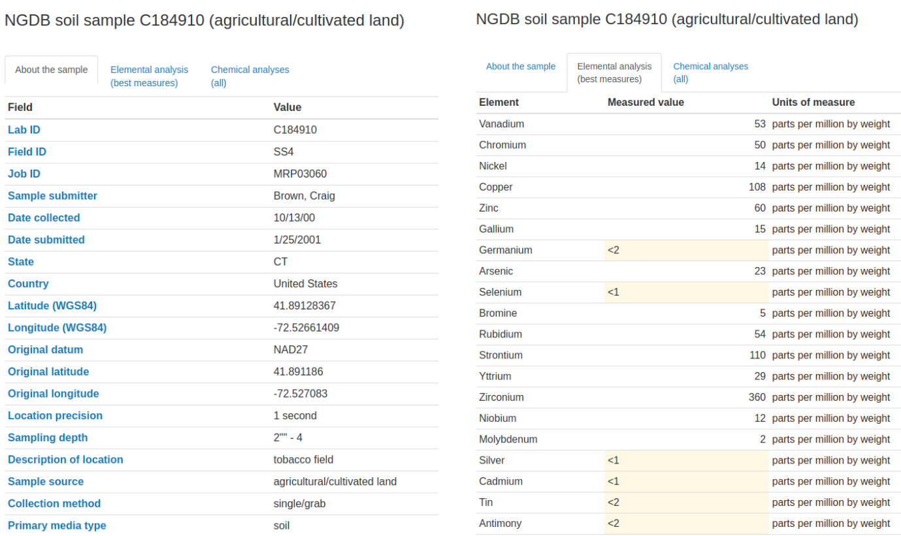
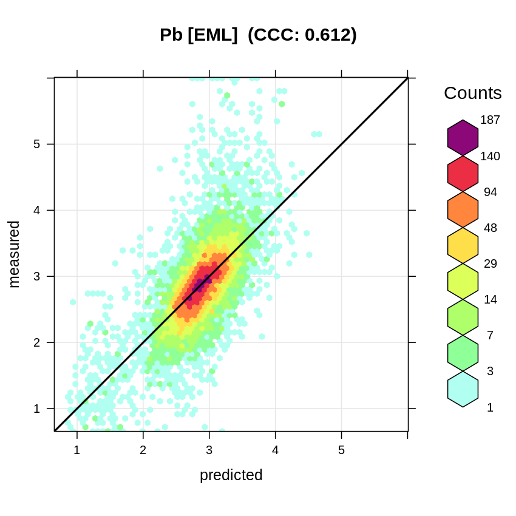
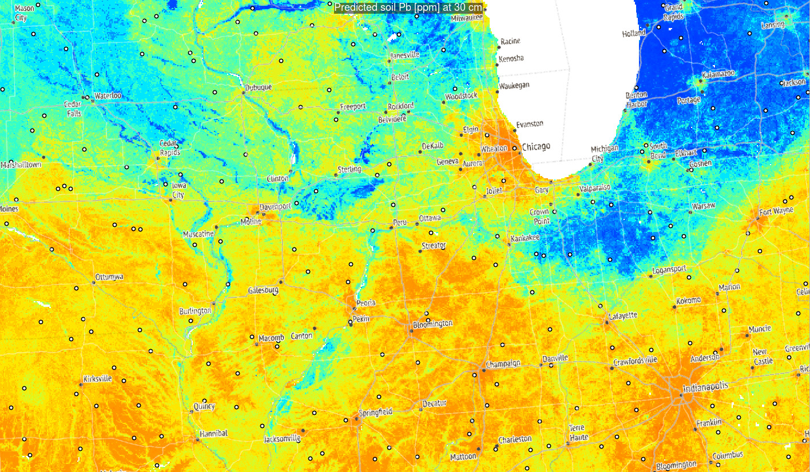
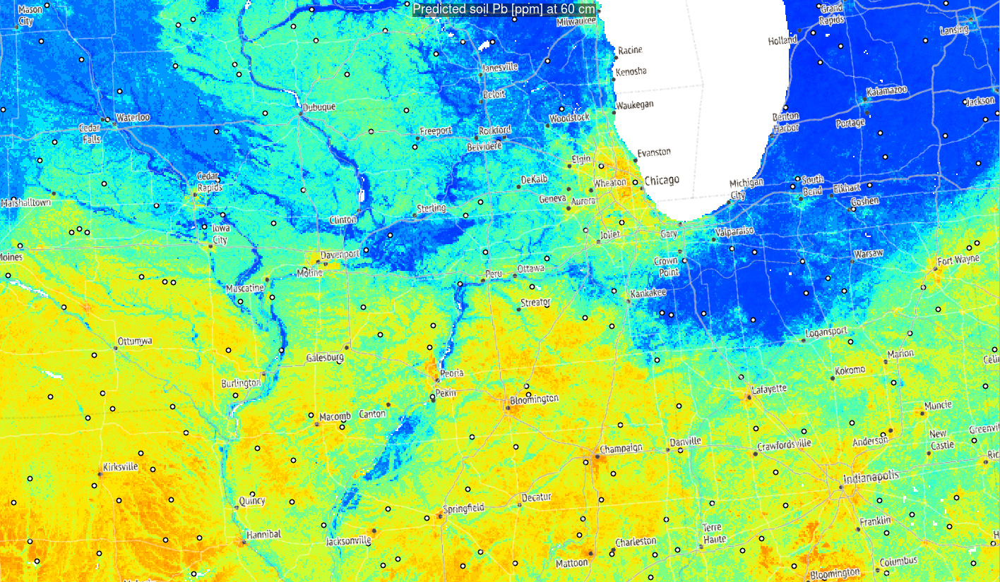

# Spatial interpolation in 3D using Ensemble ML

```{r, results = "asis", echo = FALSE}
status("drafting")
```

```{r, include=FALSE, message=FALSE, results='hide'}
ls <- c("rgdal", "raster", "plotKML", "ranger", "mlr", "forestError", "randomForestSRC",
        "xgboost", "glmnet", "matrixStats", "landmap", "yardstick", "Cubist", "ggfortify", 
        "hexbin", "parallelMap", "Metrics", "fastSave", "devtools", "openair")
new.packages <- ls[!(ls %in% installed.packages()[,"Package"])]
if(length(new.packages)) install.packages(new.packages)
lapply(ls, require, character.only = TRUE)
#load.pigz("eml_data.RData")
source("PSM_functions.R")
```

## Mapping concentrations of geochemical elements

Ensemble ML can also be used for mapping soil variables in 3D. Consider for example 
the Geochemical and minerological data set for USA48 [@smith2014geochemical]. This is a public data set 
produced and maintained by the [USA Geological Survey](https://mrdata.usgs.gov/ngdb/soil/) and contains laboratory measurements 
of chemical elements and minerals in soil at 4,857 sites (for three depths 0 to 5 cm, 
A horizon and C horizon; Fig. \@ref(fig:ds801-example)).

We have previously imported and overlaid the sampling points vs large stack of 
covariate layers using e.g.:

```{r, eval=FALSE}
## Training data ----
ngs.m <- read.csv("./training_data/ds_801_all.csv")
ngs.m$olc_id = olctools::encode_olc(ngs.m$latitude, ngs.m$longitude, 11)
## Spatial overlay ----
sel.pnts = !duplicated(ngs.m$olc_id)
summary(sel.pnts)
ngs.m.pnts = ngs.m[which(sel.pnts), c("olc_id", "longitude", "latitude")]
coordinates(ngs.m.pnts) <- ~ longitude + latitude
proj4string(ngs.m.pnts) <- "+init=epsg:4326"
ngs.xy = spTransform(ngs.m.pnts, crs(mask))
tif.lst = list.files("./1km", glob2rx("*.tif$"), full.names = TRUE)
## 262 layers
ov.tmp = parallel::mclapply(1:length(tif.lst), function(j){ terra::extract(terra::rast(tif.lst[j]), terra::vect(ngs.xy)) }, mc.cores = 80)
ov.tmp = dplyr::bind_cols(lapply(ov.tmp, function(i){i[,2]}))
names(ov.tmp) = tools::file_path_sans_ext(basename(tif.lst))
ov.tmp$olc_id = ngs.xy$olc_id
reg.matrix = plyr::join(ngs.m, ov.tmp)
saveRDS.gz(reg.matrix, "./input/ds801_geochem1km.rds")
```


We can load the regression matrix which contains all target variables and covariates:

```{r}
ds801 = readRDS("./input/ds801_geochem1km.rds")
dim(ds801)
```

which has a total of 4818 unique locations:

```{r}
str(levels(as.factor(ds801$olc_id)))
```

The individual records can be browsed directly via <https://mrdata.usgs.gov/ngdb/soil/>, 
for example a single record includes:

```{r ds801-example, echo = FALSE, out.width = "100%", fig.cap = "Example of a geochemical sample with observations and measurements and coordiates of site."}

```

Covariates prepared to help interpolation of the geochemicals include:

- Distance to cities [@nelson2019suite];  
- [MODIS LST](https://doi.org/10.5281/zenodo.1420114) (monthly daytime and nighttime);  
- [MODIS EVI](https://lpdaac.usgs.gov/products/mod13q1v006/) (long-term monthly values);  
- [Lights at night images](https://eogdata.mines.edu/products/dmsp/);  
- [Snow occurrence probability](https://climate.esa.int/en/odp/#/project/snow);  
- Soil property and class maps for USA48 [@ramcharan2018soil];  
- Terrain / hydrological indices;  

We can focus on predict concentration of lead (Pb). Pb seems to change 
with depth and this is seems to be consistent for different land cover classes:

```{r cor-depth, echo=TRUE, fig.width=8, out.width="100%", fig.cap="Distribution of Pb as a function of land cover classes."}
openair::scatterPlot(ds801[ds801$pb_ppm<140,], x = "hzn_depth", y = "pb_ppm", method = "hexbin", col = "increment", log.x=TRUE, log.y=TRUE, xlab="Depth", ylab="Pb [ppm]", z.lim=c(0,100), type="landcover1")
```


Because we are aiming at producing predictions of geochemical elements for different 
depths in soil, we can also use depth of the soil sample as one of the covariates. 
This makes the prediction system 3D and the model can thus be used to predict at 
any new 3D location ($X, Y, d$). To fit a RF model for this data we can use:

```{r}
ds801$log.pb = log1p(ds801$pb_ppm)
pr.vars = c(readRDS("./input/pb.pr.vars.rds"), "hzn_depth")
sel.pb = complete.cases(ds801[,c("log.pb", pr.vars)])
mrf = ranger::ranger(y=ds801$log.pb[sel.pb], x=ds801[sel.pb, pr.vars], 
            num.trees = 85, importance = 'impurity')
mrf
```

which results in R-square of about 0.67. Because many training samples have exactly 
the same coordinates (same site, three depths), we assume that this model is 
over-fitting i.e. that the out-of-bag accuracy is [probably over-optimistic](https://opengeohub.github.io/spatial-sampling-ml/). 
Instead we can fit an Ensemble model where we block points within 30 by 30-km blocks:

```{r, cache=TRUE, warning=FALSE, message=FALSE}
if(!exists("eml.pb")){
  lrn.rf = mlr::makeLearner("regr.ranger", num.trees=85, importance="impurity",
                            num.threads = parallel::detectCores())
  lrns.pb <- list(lrn.rf, mlr::makeLearner("regr.xgboost"), mlr::makeLearner("regr.cvglmnet"))
  tsk0.pb <- mlr::makeRegrTask(data = ds801[sel.pb, c("log.pb", pr.vars)], 
                               target = "log.pb", blocking = as.factor(ds801$ID[sel.pb]))
  init.pb <- mlr::makeStackedLearner(lrns.pb, method="stack.cv", super.learner="regr.lm", 
                                      resampling=mlr::makeResampleDesc(method="CV", blocking.cv=TRUE))
  parallelMap::parallelStartSocket(parallel::detectCores())
  eml.pb = train(init.pb, tsk0.pb)
  parallelMap::parallelStop()
}
```

```{r}
summary(eml.pb$learner.model$super.model$learner.model)
```

which shows somewhat lower R-square of 0.44, this time that whole sites have 
been taken out and hence this seems to be somewhat more realistic estimate of the 
mapping accuracy [@roberts2017cross]. The accuracy plot shows that the model has 
some problems with predicting higher values, but overall matches the observed values:

```{r, message=FALSE, echo=TRUE}
t.pb = quantile(ds801$log.pb, c(0.001, 0.01, 0.999), na.rm=TRUE)
plot_hexbin(varn="log.pb", breaks=c(t.pb[1], seq(t.pb[2], t.pb[3], length=25)), 
      meas=eml.pb$learner.model$super.model$learner.model$model$log.pb, 
      pred=eml.pb$learner.model$super.model$learner.model$fitted.values,
      main="Pb [EML]")
```

```{r ac-pb1, echo=FALSE, fig.width=6, fig.cap="Accuracy plot for Pb concentration in soil fitted using Ensemble ML.", out.width="90%"}

```

Variables most important for explaining distribution of the target variable (based on the variable importance)
seem to be soil depth (`hnz_depth`), soil type maps, annual day time temperature and travel time to cities:

```{r varimp-pb, echo=TRUE, fig.width=8, out.width="90%", fig.cap="Variable importance for 3D prediction model for Pb concentrations."}
library(ggplot2)
xl.pb <- as.data.frame(mlr::getFeatureImportance(eml.pb[["learner.model"]][["base.models"]][[1]])$res)
xl.pb$relative_importance = 100*xl.pb$importance/sum(xl.pb$importance)
xl.pb = xl.pb[order(xl.pb$relative_importance, decreasing = T),]
xl.pb$variable = paste0(c(1:nrow(xl.pb)), ". ", xl.pb$variable)
ggplot(data = xl.pb[1:20,], aes(x = reorder(variable, relative_importance), y = relative_importance)) +
  geom_bar(fill = "steelblue",
           stat = "identity") +
  coord_flip() +
  labs(title = "Variable importance",
       x = NULL,
       y = NULL) +
  theme_bw() + theme(text = element_text(size=15))
```

If we plot the travel time to cities vs Pb concentrations, we can clearly see that 
Pb is negatively correlated with travel time to cities (following a log-log linear relationship):

```{r cor-cities, echo=TRUE, fig.width=8, out.width="100%", fig.cap="Distribution of Pb as a function of travel time to cities for different depths."}
openair::scatterPlot(ds801[ds801$pb_ppm<140,], x = "travel_time_to_cities_1_usa48", y = "pb_ppm", method = "hexbin", col = "increment", log.x=TRUE, log.y=TRUE, xlab="Travel time to cities 1", ylab="Pb [ppm]", type="hzn_depth")
```

## Predictions in 3D

To produce predictions we can focus on area around Chicago conglomeration. We can 
load the covariate layers by using:

```{r}
g1km = readRDS("./input/chicago_grid1km.rds")
```

This contains all layers we used for training. We can generate predictions by 
adding a depth column, then write predictions to GeoTIFFs:

```{r}
for(k in c(5, 30, 60)){
  out.tif = paste0("./output/pb_ppm_", k, "cm_1km.tif")
  if(!file.exists(out.tif)){
    g1km$hzn_depth = k
    sel.na = complete.cases(g1km)
    newdata = g1km[sel.na, eml.pb$features]
    pred = predict(eml.pb, newdata=newdata)
    g1km.sp = SpatialPixelsDataFrame(as.matrix(g1km[sel.na,c("x","y")]), 
                data=pred$data, proj4string=CRS("EPSG:5070"))
    g1km.sp$pred = expm1(g1km.sp$response)
    rgdal::writeGDAL(g1km.sp["pred"], out.tif, type="Int16", mvFlag=-32768, options=c("COMPRESS=DEFLATE"))
    #gc()
  }
}
```

This finally gives the following pattern:

```{r pred-pb1, echo=FALSE, fig.width=6, fig.cap="Predictions of Pb concentration for different soil depths based on Ensemble ML. Points indicate training points used to build the predictive mapping model. Red color indicates high values. Values of Pb clearly drop with soil depth.", out.width="90%"}
knitr::include_graphics("./img/Pb_predictions_d1.jpg")


```

Based on these results, it can be said that in general:

1. Distribution of Pb across USA seem to be controlled by a mixture of factors 
   including climatic factors, soil-terrain units and anthropogenic factors (travel distance to cities);  
2. Overall big urban areas show significantly higher concentrations for some heavy 
   metals and this relationship if log-log linear;  
3. Soil depth for some geochemical elements comes as the overall most important 
   covariate hence mapping soil variables in 3D is fully justified;

## Modeling multiple geochemicals using a single ML model

The package **randomForestSRC** [@Ishwaran2021] provides functionality to run so-called 
[“Multivariate Outcomes”](https://www.randomforestsrc.org/articles/getstarted.html#multivariate-outcomes) which means that one can fit a model with multivariate outcomes. 
In the case of geochemical data, usually multitude of geochemicals (50+) are analyzed in lab, so that 
it seems more practical to fit a single model to predict p+ target variables (outcomes) all at once. 

In the case of `ds801` dataset we can first specify number of target variables that we would like to map:

```{r}
tvs = c("as_ppm", "al_pct", "cd_ppm", "cr_ppm", "cu_ppm", "fe_pct",
        "mo_ppm", "ni_ppm", "se_ppm", "th_ppm", "zn_ppm", "pb_ppm")
## number of missing values per variable:
sapply(tvs, function(i){sum(is.na(ds801[,i]))})
```

These variables are obviously highly cross-correlated and their multiliearity could be reduced:

```{r corPlot, echo=FALSE, fig.width=7, out.width="100%", fig.cap="Correlation matrics for a selection of geochemicals. Number indicates correlation coefficient (0 to 100%). All variables seem to be positively correlated."}
ds801.x <- scale(log1p(ds801[,tvs]))
openair::corPlot(as.data.frame(ds801.x))
```

Here especially `zn`, `cu`, `fe`, `al` and `ni` seem to be highly cross-correlated. 
Converting them to Principal Components is a logical step to reduce overlap in data. 
Before transferring the original values to Principal Components we can also filter out 
all missing values by replacing them with a mean value (for scaled variable this is 0):

```{r}
ds801.x[is.na(ds801.x)] <- 0
ds801.xd <- as.data.frame(ds801.x)
pcs.ds801 <- stats::prcomp(x = ds801.xd)
```

```{r biplot, echo=FALSE, fig.width=6, out.width="90%", fig.cap="Results of PCA in a biplot."}
ggplot2::autoplot(pcs.ds801, size=1, asp=1, colour="darkgrey", shape=3, loadings = TRUE, loadings.label = TRUE)
```

We also recommend converting all log-normal or percent variables using `log1p` and/or logit transformation 
to: (1) produce close-to-normal distribution and (2) avoid producting predictions beyond the physical range of data 
(e.g. negative values or values >100%).

First 6 components explain majority of variance in data, but it appears that to be on a safe-side, 
we can model up to PC11:

```{r}
summary(pcs.ds801)
```

As a rule of thumb, we advise to focus on components that explain >95% of variance in the data; 
to be certain one can also use >99% as the threshold.

Note the steps we have taken so far include: (1) we first transform the target variables to achieve close to normal-distribution, 
(2) we scale all numbers to have 0 = mean and 1 = standard deviation, (3) we replace missing value with the 
mean value (0 in this case), (4) we derive Principle Components with all data so nothing is lost.

Next, we can fit a model using the randomForestSRC package and all PCs expect for the last PC (which is 
usually pure noise):

```{r}
nComp = 11; Ntree = 85
xdta = ds801[,pr.vars]
ydta = pcs.ds801$x[,1:nComp]
tfm = get.mv.formula(colnames(ydta))
m.s1 = randomForestSRC::rfsrc(tfm, data.frame(ydta, xdta), 
                              importance=TRUE, ntree = Ntree)
print(m.s1, outcome.target = "PC1")
```

This basically fits a multivariate RF of form `rfsrc(Multivar(y1, y2, ..., yd) ~ . , my.data, ...)`. 
The resulting model show that the models explain significant part of variance. As expected the significance of the model 
is usually the highest for the higher level components (PC1, PC2), then it gradually drops. 

We can access the variable importance of each individual model by using:

```{r varimp-pc1, echo=TRUE, fig.width=8, out.width="90%", fig.cap="Variable importance for 3D prediction model for PC1."}
vmp <- as.data.frame(get.mv.vimp(m.s1))["PC1"]
vmp$relative_importance = 100*vmp$PC1/sum(vmp$PC1)
vmp = vmp[order(vmp$relative_importance, decreasing = TRUE),]
vmp$variable = paste0(c(1:nrow(vmp)), ". ", row.names(vmp))
ggplot(data = vmp[1:20,], aes(x = reorder(variable, relative_importance), y = relative_importance)) +
  geom_bar(fill = "steelblue",
           stat = "identity") +
  coord_flip() +
  labs(title = "Variable importance",
       x = NULL,
       y = NULL) +
  theme_bw() + theme(text = element_text(size=15))
```

To generate predictions for different depths and for different PCs, we can run loop 
the `predict.rfsrc` function:

```{r}
for(j in 1:11){
 for(k in c(5, 30, 60)){
  out.tif = paste0("./output/pc", j, "_", k, "cm_1km.tif")
  if(!file.exists(out.tif)){
    g1km$hzn_depth = k
    sel.na = complete.cases(g1km)
    newdata = g1km[sel.na, pr.vars]
    pred = predict(m.s1, m.target = paste0("PC", j), newdata=newdata)
    g1km.sp = SpatialPixelsDataFrame(as.matrix(g1km[sel.na,c("x","y")]), 
                data=data.frame(pred$regrOutput[[paste0("PC", j)]][[1]]), 
                proj4string=CRS("EPSG:5070"))
    g1km.sp$pred = g1km.sp@data[,1]*100
    rgdal::writeGDAL(g1km.sp["pred"], out.tif, type="Int16", mvFlag=-32768, options=c("COMPRESS=DEFLATE"))
    #gc()
  }
 }
}
```

This gives predictions (in the scaled space) for each of the original target variables and for all depths. 
Note that, because the randomForestSRC package [uses by default all cores](https://www.randomforestsrc.org/articles/parallel.html) to run model training and prediction, 
there is no need to specify any further parallelization i.e. it is fine to run processing in a loop.

After we generate predictions, we can (1) first [back-transform values to original scale](https://stats.stackexchange.com/questions/229092/how-to-reverse-pca-and-reconstruct-original-variables-from-several-principal-com) using the PCA model eigenvectors, (2) scale-back from log-transformation. 
For example the predictions for top-soil, we first load all predicted PC's:

```{r}
ls.5cm = list.files('./output', pattern=glob2rx("^pc*_5cm_1km.tif$"), full.names = TRUE)
pred.tops = raster::stack(ls.5cm)
pred.tops = as(pred.tops, "SpatialGridDataFrame")
```

next, we back-transform values to original scale by using:

```{r}
Xhat = as.matrix(pred.tops@data[,paste0("pc", 1:nComp, "_5cm_1km")]/100) %*% t(pcs.ds801$rotation[,1:nComp])
## scale-back to the original mean / stdev:
Xhat.s = sweep(Xhat %*% diag(attr(ds801.x, 'scaled:scale')), 2, attr(ds801.x, 'scaled:center'), "+")
Xhat.s = as.data.frame(expm1( Xhat.s ))
names(Xhat.s) = tvs
```

We can plot two predictions of `Pb` (using EML produced in the previous example; and using PCA analysis) next to each other:

```{r pca-pred, echo=TRUE, fig.width=8, out.width="100%", fig.cap="Predicted Pb concentration using ensemble ML (left) vs using the decomposition-composition PCA method (right)."}
pred.tops$Pb_5cm_1km.PCA = log1p(Xhat.s[,"pb_ppm"])
pred.tops$Pb_5cm_1km.EML = log1p(readGDAL("./output/pb_ppm_5cm_1km.tif")$band1)
spplot(pred.tops[c("Pb_5cm_1km.EML", "Pb_5cm_1km.PCA")])
```

This shows that the predictions are quite similar, except the PCA-method somewhat smooths out some very 
high values. 

By combining PCA analysis and predictive mapping (we refer to this method as the **Decomposition-composition PCA method**) 
one integrates modeling of multiple cross-correlated variables and multicolinearity reduction. 
As a rule of thumb one can model only PCs that explain up to 99% of variance in data, this way modeling 
effort can be significantly reduced (e.g. for 50+ target variables one could model all target variables 
only a dozen of PCs). A disadvantage of the Decomposition-composition PCA method is that interpretation of 
scaled values is somewhat more complex, certainly more abstract.

## Advantages and limitations of running 3D predictive mapping

In summary 3D soil mapping is relatively straight forward to implement especially 
for mapping soil variables from soil profiles (multiple samples per soil layer). 
Before modeling the target variable with depth, it is a good idea to plot 
relationship between target variable and depth under different settings 
(as in Fig. \@ref(fig:cor-depth)). 3D soil mapping based on Machine Learning is 
now increasingly common [@hengl2019predictive; @sothe2022large].

A limitation for 3D predictive mapping is the size of data i.e. data volumes 
increasing proportionally to number of slices we need to predict (in this case three). 
Also, we show that points with exactly the same coordinates might result in e.g. 
Random Forest overfitting emphasizing some covariate layers that are possibly 
less important, hence it is again important to use the blocking parameter that 
separates training and validation points.

Soil depth is for many soil variables most important explanatory variables, but 
in the cases it does not correlate with the target variable, there is probably 
also no need for 3D soil mapping. In the case depth is not significantly 
correlated, one could simply first aggregate all values to fixed block depth and 
convert modeling from 3D to 2D.
