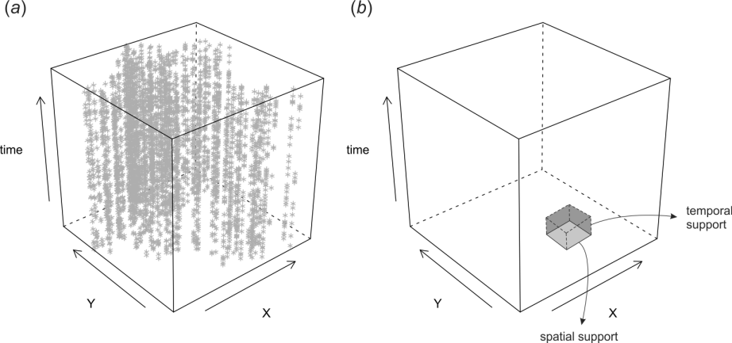
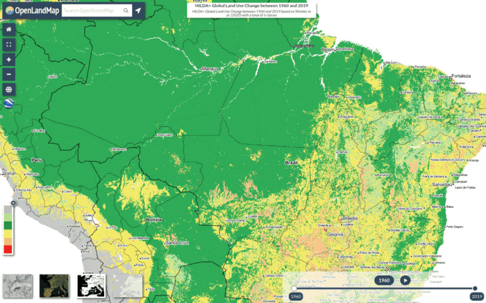

# Introduction to spatial and spatiotemporal data

```{r, results = "asis", echo = FALSE}
status("drafting")
```

```{r, include=FALSE, message=FALSE, results='hide'}
ls <- c("rgdal", "raster", "plotKML", "ranger", "mlr", "forestError", 
        "xgboost", "glmnet", "matrixStats", "landmap", "yardstick", "Cubist", 
        "hexbin", "parallelMap", "Metrics", "fastSave", "devtools")
new.packages <- ls[!(ls %in% installed.packages()[,"Package"])]
if(length(new.packages)) install.packages(new.packages)
lapply(ls, require, character.only = TRUE)
#load.pigz("eml_data.RData")
source("PSM_functions.R")
```

## Spatial data and spatial interpolation

Spatial and/or geospatial data is any data that is spatially referenced (in the 
case of geographical data referenced to Earth surface) i.e. $X$ and $Y$ coordinates 
are known. With the implementation of the GPS and Earth Observation technology, 
almost everything is becoming spatial data and hence tools such as Geographical 
Information Systems (GIS) and spatial analysis tools to process, analyze and 
visualize geospatial data are [becoming essential](https://towardsdatascience.com/the-impact-of-geospatial-features-on-machine-learning-3a71c99f080a).

**Spatial interpolation** and/or **Spatial Prediction** is a process of estimating values 
of the target variable over the whole area of interest by using some input training 
point data, algorithm and values of the covariates at new locations [@Mitas1999Wiley]. 
Interpolation results in images or maps, which can then be used for decision making or similar. 
There is a difference between _interpolation_ and _prediction_: _prediction_ 
can imply both interpolation and extrapolation. We will more commonly use the 
term _spatial prediction_ in this tutorial, even though the term _spatial interpolation_ 
has been more widely accepted [@Mitas1999Wiley]. In geostatistics, e.g. in the 
case of **ordinary kriging**, interpolation corresponds to cases where the 
location being estimated is surrounded by the sampling locations and is within 
the spatial auto-correlation range [@Diggle2007Springer; @brown2015model]. Prediction outside of the practical range 
(i.e. where prediction error exceeds the global variance) is referred to as 
**spatial extrapolation**. In other words, extrapolation is prediction at locations 
where we do not have enough statistical evidence (based on the statistical model) 
to make significant predictions.

## Spatial interpolation using Ensemble Machine Learning

**Ensemble Machine Learning** (Ensemble ML) is an approach to modeling where, instead of using a 
single best learner, we use multiple **strong learners** and then combine their 
predictive capabilities into a single union. This can both lead to higher 
accuracy and robustness [@seni2010ensemble], but also helps with deriving 
model-free estimate of prediction errors through nonparametric techniques such as 
bootstrapping [@zhang2012ensemble]. This way we can help decrease some methodological disadvantages of 
individual learners as shown in the previous example with synthetic data.

Ensemble ML can be used to fit models and generate predictions using points data 
the same way ordinary kriging is used to generate interpolations. Ensemble ML 
for predictive mapping in 2D and 3D is discussed in detail in the first chapter 
of the tutorial. Spatiotemporal interpolation using EML (2D+T, 3D+T) is at the 
order of magnitude more computational [@gasch2015spatio] but it follows the same logic.

Ensemble ML based on stacking is implemented in the mlr package [@bischl2016mlr] 
and can be initiated via the `makeStackedLearner` function e.g.:

```{r, eval=FALSE}
m = mlr::makeStackedLearner(base.learners = lrns, 
              super.learner = "regr.ml", method = "stack.cv")
```

here the base learner predictions will be computed by 5-fold cross-validation 
(repeated re-fitting) and then used to determine the meta-learner. This algorithm 
is known as the _[“Super Learner”](https://machinelearningmastery.com/super-learner-ensemble-in-python/)_ algorithm [@Polley2010]. 

In the case of spatial prediction, we also want to _block_ training points based on 
spatial proximity to prevent from producing bias predictions. For this we should 
know the range of spatial dependence for the model residuals or similar i.e. 
something that can be derived by fitting a variogram, then limit the minimum 
spatial distance between training and validation points to avoid overfitting or 
similar (for more info refer to the [Spatial Sampling tutorial](https://opengeohub.github.io/spatial-sampling-ml/)).

To automate fitting of an Ensemble Machine Learning models for the purpose of 
spatial interpolation / prediction, one can now use the [landmap](https://github.com/Envirometrix/landmap) package that combines:

- derivation of geographical distances,  
- conversion of grids to principal components,  
- automated filling of gaps in gridded data,  
- automated fitting of variogram and determination of spatial auto-correlation structure,  
- spatial overlay,  
- model training using spatial Cross-Validation [@lovelace2019geocomputation],  
- model stacking i.e. fitting of the final EML,  

The concept of automating spatial interpolation until the level that almost no 
human interaction is required is referred to as **“automated mapping”** or automated 
spatial interpolation [@pebesma2011intamap].

## Spatiotemporal data

Spatiotemporal data is practically any data that is referenced in both space and 
time. This implies that the following *coordinates* are known:
  
- geographic location (longitude and latitude or projected $X,Y$ coordinates);  
- spatial location accuracy or size of the block / volume in the case of bulking of samples;  
- height above the ground surface (elevation);  
- start and end time of measurement (year, month, day, hour, minute etc.);  

Consider for example daily temperature measured at some meteorological station. 
This would have the following coordinates:
  
```{r}
temp = 22
lat = 44.56123
lon = 19.27734
delta.xy = 30
begin.time = "2013-09-02 00:00:00 CEST"
end.time = "2013-09-03 00:00:00 CEST"
```

which means that the measurement is fully spatiotemporally referenced with 
both $X,Y$ location defined, `delta.xy` location accuracy known, and begin and 
end time of measurement specified (in this case temporal support is 1 day).

Analysis of spatiotemporal data is somewhat different from pure spatial
analysis. Time is of course NOT _just another_ spatial dimension i.e. it has 
specific properties and different statistical assumptions and methods apply to 
spatiotemporal data. For an introduction to spatiotemporal data in R please 
refer to the **spacetime** package tutorial [@pebesma2012spacetime].

Conceptually speaking, spatiotemporal datasets and corresponding 
databases can be matched with the two major groups of features [@erwig1999spatio]: (1) 
**moving or dynamic objects** (discrete or vector geometries), and (2) 
dynamic **regions** (fields or continuous features). Distinct objects (entities) 
such as people, animals, vehicles and similar are best represented using 
vectors and **trajectories** (movement through time), and fields are commonly  
represented using **gridded structures**. In the case of working with 
fields, we basically map either:
  
-   dynamic changes in quantity or density of some material or chemical element,  
-   energy flux or any similar physical measurements,  
-   dynamic changes in probability of occurrence of some feature or object,  

Spatiotemporal data can be best visualized 2D+T plots **space-time cubes**. One
example of a spacetime cube is the following plot in Fig. \@ref(fig:space-time-cube) [@hengl2012spatio;@hengl2015plotkml].

```{r space-time-cube, echo = FALSE, out.width = "100%", fig.cap = "Space-time cube visualized in R: (a) cloud plot showing location of meteorological stations in Croatia, (b) illustration of spatial and temporal support in the space-time cube."}

```
  
The plot above shows distribution of meteorological stations over Croatia, and 
then repeated measurements through time. This dataset is further used in the 
use-case examples to produce spatiotemporal predictions of daily temperatures.

## Time-series analysis

Field of statistics dealing with modeling changes of variables through time, 
including predicting values beyond the training data (forecasting) is 
**time-series analysis**. Some systematic guides on how to run time-series 
analysis in R can be found [here](http://r-statistics.co/Time-Series-Analysis-With-R.html).

How a variable varies through time (time-series curves) can often be drastically different 
from how it changes in space (spatial patterns). In general, one can say that, for many 
environmental variables, variation of values through time can be separated into 
**components** such as:
  
- Long-term component (**trend**) determined by long-term geological and
extraterrestrial processes,
- Seasonal monthly and/or daily component (**seasonality**) determined by Earth rotation and
incoming sun radiation,
- **Variation** component which can be due to chaotic behavior and/or
local factors (hence *autocorrelated*), and
- **Pure noise** i.e. measurement errors and similar,

```{r decomp-time, echo = FALSE, out.width = "100%", fig.cap = "Illustration of decomposition of time-series into: (1) trend, (2) seasonality, and (3) random."}
knitr::include_graphics("./img/Fig_decomposition_timeseries.jpeg")
```


Consider for example the case of the land surface temperature. The long-term 
component is determined by variations in Earth's orbit and/or Sun's 
energy output resulting in gradual drops and rises of global mean 
temperature ([glacials and interglacials](https://en.wikipedia.org/wiki/Ice_age)). 
Fig. \@ref(fig:global-temp) shows example of a global temperature reconstruction from proxy data of @Marcott1198.

```{r global-temp, echo = FALSE, out.width = "100%", fig.cap = "Global temperature reconstruction. This shows how global temperature varies on a long-term term scale. Graph by: Klaus Bitterman."}
knitr::include_graphics("./img/Fig_global_mean_temp_longterm_trend.png")
```

Seasonal i.e. monthly and daily components of variation of land surface temperature 
are also quite systematic. They are basically determined by Earth's rotation 
and angles of Sun in relation to Earth's surface. This is a relatively stable 
pattern that looks like sinusoidal curves or similar. The plot below shows variation 
of values of soil moisture and soil temperature at one meteo station in USA 
across multiple years [@gasch2015spatio].

```{r cookfarm-plot, echo = FALSE, out.width = "100%", fig.cap = "Sensor values from five depths (0.3, 0.6, 0.9, 1.2, and 1.5 m) at one station at Cook Agronomy Farm from January 2011–January 2014. The black line indicates locally fitted splines."}
knitr::include_graphics("./img/Fig_cookfarm_plots_seasonality.png")
```

The data set in Fig. \@ref(fig:cookfarm-plot) is further discussed in the case 
studies to demonstrate 3D+T spatiotemporal modeling [@gasch2015spatio]. 
As we will see later, the seasonal daily and monthly part of variation 
is systematic and can be modeling using latitude, altitude and time/day of the year. 

## Visualizing spatiotemporal data

Spatial data is usually visualized using static or interactive maps (see e.g. [mapview](https://r-spatial.github.io/mapview/) and/or [tmap package](https://cran.r-project.org/web/packages/tmap/vignettes/tmap-getstarted.html)).
Spatiotemporal data (2D+T) is more complex to visualize than 2D data, while 3D+T data 
can even require special software [@hengl2015plotkml] before 
users can make any seamless interpretation.

There are three possible groups of ways to visualize spatiotemporal 
data:
  
1. Using **static images** showing trend parameters together with 
time-series plots at selected representative point locations.  
2. Using **time-slices** or series of visualizations of the same 
spatial domain but changing in time (time-lapses).  
3. Using **animations** or **interactive plots with time-sliders**
  allowing users to choose *speed* and *direction* of animation.  

For an introduction to visualizing spatiotemporal and time-series data 
refer to @lamigueiro2014displaying. More complex visualization of 
spatiotemporal / dynamic geographic features is possible by using the 
<https://geemap.org/> package (a Python package for interactive mapping with Google Earth Engine, ipyleaflet, and ipywidgets). 

OpenLandMap.org also has multiple temporal datasets and users can interactive with 
the time-dimension by using time-slider implemented in [OpenLayers and Geoserver](http://osgl.grf.bg.ac.rs/books/gvvk-en/) [@KilibardaProtic2019].

```{r hilda, echo = FALSE, out.width = "100%", fig.cap = "Visualization of [land cover change using animation](https://medium.com/nerd-for-tech/restoration-culture-what-is-land-degradation-how-to-measure-it-and-what-can-you-do-to-reverse-341e448994da) in www.OpenLandMap.org."}
if(knitr:::is_latex_output()){
  knitr::asis_output('\\url{https://miro.medium.com/max/700/0*fqWNU4XNbjHE3Uv_}')
} else {
  
}
```


## Spatiotemporal interpolation
  
Spatiotemporal interpolation and/or prediction implies that point
samples are used to interpolate within the spacetime cube. This
obviously assumes that enough point measurements are available, and which are spread in
both space and time. We will show in this tutorial how Machine Learning can 
be used to interpolate values within the spacetime cube using real case-studies. 
Spatiotemporal interpolation using various kriging methods is implemented in 
the [gstat package](https://cran.r-project.org/web/packages/gstat/vignettes/spatio-temporal-kriging.pdf) [@Bivand2013Springer], but is not addressed in this tutorial.

For success of spatiotemporal interpolation (in terms of prediction accuracy), 
the key is to recognize systematic component of variation in spacetime, which 
is usually possible if we can find relationship between the target variable and 
some EO data that is available as a time-series and covers the same spacetime cube 
of interest. Once we establish a significant relation between **dynamic target** and 
**dynamic covariates**, we can use the fitted model to predict anywhere in spacetime cube.

For more in-depth discussion on spatiotemporal data in R please refer to
@wikle2019spatio. For in-depth discussion on spatial and spatiotemporal
blocking for purpose of modeling building and cross-validation refer to
@roberts2017cross. 

## Modeling seasonal components

Seasonality is the characteristic of the target variable to follow cyclical 
patterns such as in trigonometric functions. Such repeating patterns can happen 
at different **time-scales**:
  
- inter-annually,  
- monthly or based on a season (spring, summer, autumn, winter),  
- daily,  
- hourly i.e. day-time and night-time patterns,  

The monthly and daily seasonal component of variation is determined by Earth's rotation
and Sun's angle. @kilibarda2014spatio have shown that the seasonal
component e.g. geometric Earth surface minimum and maximum daily temperature 
can be modeled, universally anywhere on globe, by using the following formula:
  
```{r}
temp.from.geom <- function(fi, day, a=30.419375, 
                           b=-15.539232, elev=0, t.grad=0.6) {
  costeta = cos( (day-18 )*pi/182.5 + 2^(1-sign(fi) ) *pi) 
  cosfi = cos(fi*pi/180 )
  A = cosfi
  B = (1-costeta ) * abs(sin(fi*pi/180 ) )
  x = a*A + b*B - t.grad * elev / 100
  return(x)
}
```

where `day` is the day of year, `fi` is the latitude, the number 18 represents 
the coldest day in the northern and warmest day in the southern hemisphere, 
`elev` is the elevation in meter, 0.6 is the vertical temperature gradient per 
100-m, and `sign` denotes the *signum* function that extracts the sign of a real number.

This formula accounts for different seasons at southern and northern 
hemisphere and can be basically applied on gridded surfaces to compute expected 
temperature at a given day. A simple example of min daily temperature is:
  
```{r}
temp.from.geom(fi=52, day=120)
```

If we plot this function for five consecutive years, we get something similar to the 
spline-fitted functions in the previous plot:
  
```{r, seasonal-plot, fig.width=8, out.width="100%", fig.cap="Geometric temperature function plot for a given latitude."}
days = seq(1:(5*365))
plot(temp.from.geom(fi=52, day=days))
```


## Predictive mapping using spatial and spatiotemporal ML in R

Standard spatiotemporal ML for predictive mapping typically includes the 
following steps [@hengl2018random; @hengl2019predictive]:

1. Prepare training (points) data and data cube with all covariates
ideally as an analysis-ready datacube.
2. Overlay points and create a regression-matrix.  
3. Fine-tune initial model, reduce complexity
and produce production-ready prediction model.  
4. Run mapping accuracy assessment and determine prediction uncertainty
including the per pixel uncertainty.  
5. Generate predictions and save as maps. 
6. Visualize predictions using web-GIS solutions.

```{r pem-scheme, echo = FALSE, out.width = "100%", fig.cap = "General Machine Learning framework recommended for predictive mapping of vegetation / ecological / soil variables. Assuming full automation of modeling, [2nd-round samples](https://opengeohub.github.io/spatial-sampling-ml/) can be used to gradually improve mapping accuracy."}
knitr::include_graphics("./img/Fig_general_scheme_PEM.png")
```


## Extrapolation and over-fitting problems of ML methods
  
Machine Learning has _defacto_ become next-generation applied predictive modeling 
framework. ML techniques such as **Random Forest** (RF) have proven to 
over-perform vs more simple linear statistical methods, especially where
the datasets are large, complex and target variable follows complex
relationship with covariates [@hengl2018random]. Random Forest comes at a cost 
however. There are four main practical disadvantages of RF:
  
- Depending on data and assumptions about data, it can over-fit values
without an analyst even noticing it.  
- It predicts well only within the feature space with enough training
data. **Extrapolation** i.e. prediction outside the training space can
lead to poor performance [@meyerPebesma2020].  
- It can be computationally expensive with computational load increasing
exponentially with the number of covariates.  
- It requires quality training data and is highly sensitive to blunders and
typos in the data.

Read more about extrapolation problems of Random Forest in [this post](https://medium.com/nerd-for-tech/extrapolation-is-tough-for-trees-tree-based-learners-combining-learners-of-different-type-makes-659187a6f58d).

In the following section we will demonstrate that indeed RF can overfit 
data and can have serious problems with predicting in the extrapolation 
space. Consider for example the following small synthetic dataset assuming 
simple linear relationship (see [original post by Dylan Beaudette](https://twitter.com/DylanBeaudette/status/1410666900581851138)):
  
```{r}
set.seed(200)
n = 100
x <- 1:n
y <- x + rnorm(n = 50, mean = 15, sd = 15)
```

If we fit a simple **Ordinary Least Square** model to this data we get:
  
```{r}
m0 <- lm(y ~ x)
summary(m0)
```

we see that the model explains about 85% of variation in the data and that the 
RMSE estimated by the model (residual standard error) matches very well the 
noise component we have inserted on purpose using the `rnorm` function. 

If we fit a Random Forest model to this data we get:
  
```{r}
library(randomForest)
rf = randomForest::randomForest(data.frame(x=x), y, nodesize = 5, keep.inbag = TRUE)
rf
```

Next, we can estimate the prediction errors using the method of @lu2021unified, 
which is available via the `forestError` package:
  
```{r}
library(forestError)
rmse <- function(a, b) {  sqrt(mean((a - b)^2)) }
dat <- data.frame(x,y)
newdata <- data.frame(
  x = -100:200
)
newdata$y.lm <- predict(m0, newdata = newdata)
## prediction error from forestError:
quantiles = c((1-.682)/2, 1-(1-.682)/2)
pr.rf = forestError::quantForestError(rf, X.train=data.frame(x=x), 
                                      X.test=data.frame(x = -100:200), 
                                      Y.train=y, alpha = (1-(quantiles[2]-quantiles[1])))
newdata$y.rf <- predict(rf, newdata = newdata)
rmse.lm <- round(rmse(y, predict(m0)), 1)
rmse.rf <- round(rmse(y, predict(rf)), 1)
rmse.lm; rmse.rf
```

This shows that RF estimates higher RMSE than linear model. However, if
we visualize the two models against each other we see that indeed RF
algorithm seems to over-fit this specific data:

```{r synthetic-lm, echo=TRUE, fig.width=6, out.width="100%", fig.cap="Difference in model fits for sythetic data: lm vs RF. In this case we know that RF (blue line) is overfitting and under-estimating the prediction error in the extrapolation space. Dotted line shows respective 1 std. prediction interval for RF."}
leg.txt <- sprintf("%s (%s)", c('lm', 'RF'), c(rmse.lm, rmse.rf))
par(mar = c(0, 0, 0, 0), fg = 'black', bg = 'white')
plot(y ~ x, xlim = c(-25, 125), ylim = c(-50, 150), type = 'n', axes = FALSE)
grid()
points(y ~ x, cex = 1, pch = 16, las = 1)
lines(y.lm ~ x, data = newdata, col = 2, lwd = 2)
lines(y.rf ~ x, data = newdata, col = 4, lwd = 2)
lines(newdata$x, pr.rf$estimates$lower_0.318, lty=2,col=4)
lines(newdata$x, pr.rf$estimates$upper_0.318, lty=2,col=4)
legend('bottom', legend = leg.txt, lwd = 2, lty = 1, col = c(2, 4, 3), horiz = TRUE, title = 'RMSE')
```

RF basically tries to fit relationship even to the **pure noise** component of variation 
(we know it is pure noise because we have generated it using the `rnorm` function). 
This is obvious over-fitting as we do not want to model something which is purely random.

Extrapolation would not maybe be so much of a problem in the example above if 
the prediction intervals from the `forestError` package expressed more 
realistically that the predictions deviate from the _linear structure_ in the 
data. Assuming that, after the prediction, one would eventually collect 
ground-truth data for the RF model above, these would probably show that the 
prediction error / prediction intervals are completely off. Most traditional 
statisticians would consider these too-narrow and over-optimistic and the 
fitted line over-fit, and hence any further down the pipeline over-optimistic 
prediction uncertainty can result in decision makers being over-confident, 
leading to wrong decisions, and consequently making users losing any confidence in RF.
For an in-depth discussion on extrapolation problems and **Area of Applicability** 
of Machine Learning models please refer to @meyerPebesma2020.

A possible solution to the problem above is to, instead of using only one 
learners, we use multiple learners and then apply robust cross-validation that 
prevents the target model from over-fitting. This can be implemented efficiently, 
for example, by using the `mlr` package [@bischl2016mlr]. We can run an Ensemble 
Model by applying the following four steps. First, we define the task of interest 
and a combination of learners i.e. so-called **base learners**:
  
```{r}
library(mlr)
library(kernlab)
library(mboost)
library(landmap)
SL.library = c("regr.ranger", "regr.glm", "regr.gamboost", "regr.ksvm")
lrns <- lapply(SL.library, mlr::makeLearner)
tsk <- mlr::makeRegrTask(data = dat, target = "y")
```

In this case we use basically four very different models: RF (`ranger`),
linear model (`glm`), Gradient boosting (`gamboost`) and Support Vector
Machine (`kvsm`). Second, we train the Ensemble model by using the stacking approach:
  
```{r, warning=FALSE, message=FALSE}
init.m <- mlr::makeStackedLearner(lrns, method = "stack.cv", super.learner = "regr.lm", resampling=mlr::makeResampleDesc(method = "CV"))
eml = train(init.m, tsk)
summary(eml$learner.model$super.model$learner.model)
```

The results show that `ranger` and `ksvm` basically under-perform and are in
fact not significant for this specific data i.e. could be probably omitted from
modeling.

Note that, for **stacking** of multiple learners we use a separate model 
(a meta-learner) which is in this case a simple linear model. We use a
simple model because we assume that the non-linear relationships have
already been modeled via complex models such as `ranger`, `gamboost`
and/or `ksvm`.

Next, we need to estimate mapping accuracy and **prediction errors** for
Ensemble predictions. This is not trivial as there are no simple derived formulas. 
We need to use a non-parametric approach basically and this can be very computational. 
A computationally interesting approach is to first estimate the (global) mapping 
accuracy, then adjust the prediction variance from multiple base learners:

```{r, warning=FALSE, message=FALSE}
newdata$y.eml = predict(eml, newdata = newdata)$data$response
m.train = eml$learner.model$super.model$learner.model$model
m.terms = eml$learner.model$super.model$learner.model$terms
eml.MSE0 = matrixStats::rowSds(as.matrix(m.train[,all.vars(m.terms)[-1]]), na.rm=TRUE)^2
eml.MSE = deviance(eml$learner.model$super.model$learner.model)/df.residual(eml$learner.model$super.model$learner.model)
## correction factor / mass-preservation of MSE
eml.cf = eml.MSE/mean(eml.MSE0, na.rm = TRUE)
eml.cf
```

This shows that variance of the learners is about 10 times smaller than
the actual CV variance. Again, this proves that many learners try to fit
data very closely so that variance of different base learners is often 
smoothed out.

Next, we can predict values and prediction errors at all new locations:
  
```{r, warning=FALSE, message=FALSE}
pred = mlr::getStackedBaseLearnerPredictions(eml, newdata=data.frame(x = -100:200))
rf.sd = sqrt(matrixStats::rowSds(as.matrix(as.data.frame(pred)), na.rm=TRUE)^2 * eml.cf)
rmse.eml <- round(sqrt(eml.MSE), 1)
```

and the plot the results of fitting linear model vs EML:

```{r synthetic-eml, echo=TRUE, fig.width=6, out.width="100%", fig.cap="Difference in model fits for sythetic data: lm vs Ensemble ML."}
leg.txt <- sprintf("%s (%s)", c('lm', 'EML'), c(rmse.lm, rmse.eml))
par(mar = c(0, 0, 0, 0), fg = 'black', bg = 'white')
plot(y ~ x, xlim = c(-25, 125), ylim = c(-50, 150), type = 'n', axes = FALSE)
grid()
points(y ~ x, cex = 1, pch = 16, las = 1)
lines(y.lm ~ x, data = newdata, col = 2, lwd = 2)
lines(y.eml ~ x, data = newdata, col = 4, lwd = 2)
lines(newdata$x, newdata$y.eml+rmse.eml+rf.sd, lty=2, col=4)
lines(newdata$x, newdata$y.eml-(rmse.eml+rf.sd), lty=2, col=4)
legend('bottom', legend = leg.txt, lwd = 2, lty = 1, col = c(2, 4, 3), horiz = TRUE, title = 'RMSE')
```

From the plot above, we see that the prediction error intervals in the 
extrapolation space are now wider (compare with Fig. \@ref(fig:synthetic-lm)), and this reflects much better 
what we would expect than if we have only used the `forestError` package.

In summary: it appears that combining linear and non-linear tree-based
models in an Ensemble ML framework helps both: decrease over-fitting and produce 
more realistic predictions of uncertainty / prediction intervals. The Ensemble ML
framework correctly identifies linear models as being more important than 
random forest or similar. Hopefully, this provides enough evidence to convince you 
that Ensemble ML is potentially interesting for use as a generic solution for 
spatial and spatiotemporal interpolation and extrapolation.
