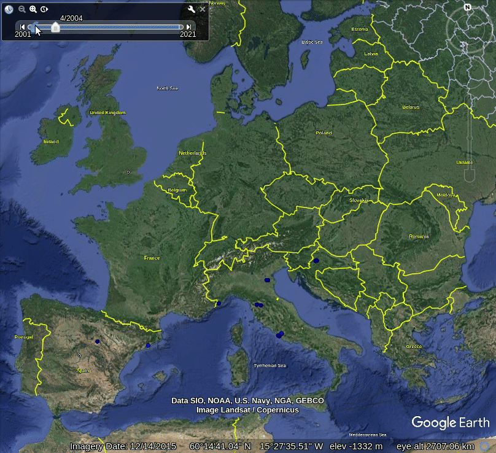
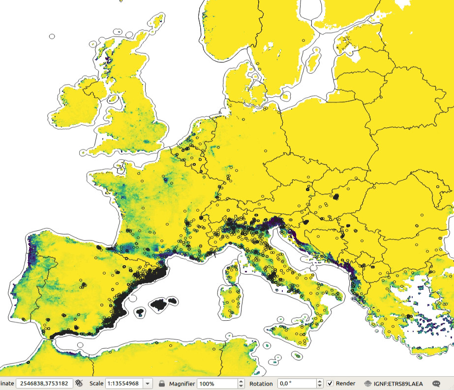
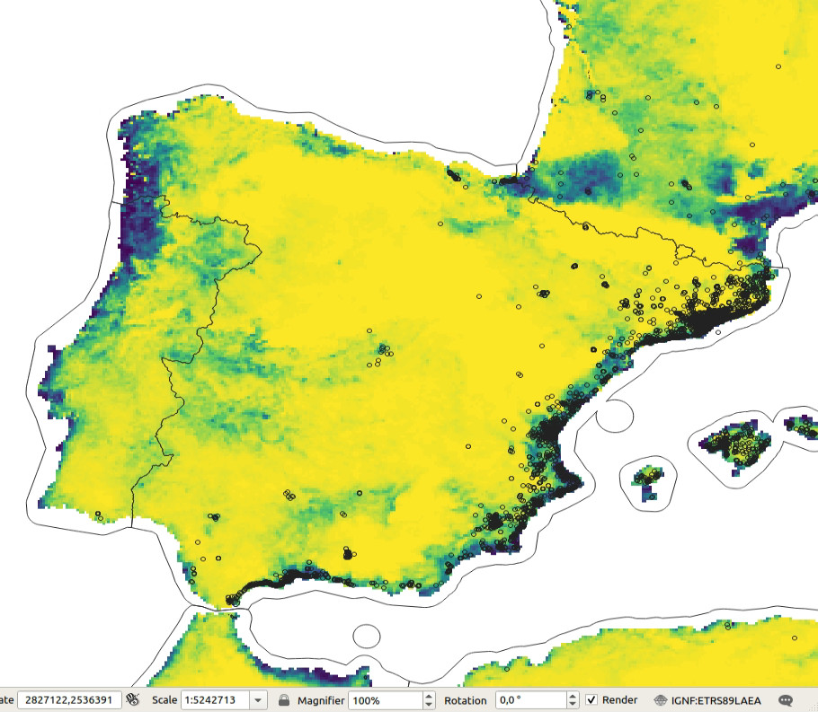
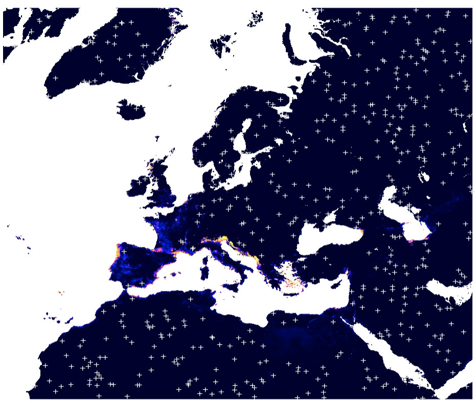

# Spatiotemporal Machine Learning for Species Distribution Modeling

```{r, results = "asis", echo = FALSE}
status("drafting")
```

```{r, include=FALSE, message=FALSE, results='hide'}
ls <- c("rgdal", "raster", "plotKML", "ranger", "mlr", "rgbif", "terra",
        "randomForestSRC", "glmnet", "matrixStats", "landmap", "yardstick", "maxlike", 
        "hexbin", "parallelMap", "Metrics", "fastSave", "devtools")
new.packages <- ls[!(ls %in% installed.packages()[,"Package"])]
if(length(new.packages)) install.packages(new.packages)
lapply(ls, require, character.only = TRUE)
#load.pigz("eml_data.RData")
source("mood_functions.R")
```

## Species Distribution Modeling

[Species Distribution Modeling](https://rspatial.org/raster/sdm/) (SDM) and/or Mapping aims 
at explaining and mapping distribution of species as a function of ecological conditions 
and/or human influence. Typical steps in SDM include [@hijmans2019spatial]:

1. Prepare locations of occurrence of a species or species density;  
2. Prepare environmental predictor variables (climate, terrain, surface water);  
3. Fit a SDM model that can be used either to predict natural habitat / Niche and/or occurrence probability;  
4. Predict habitat / occurrence probability across the region of interest (and perhaps for a future or past climate).  

Modeling species distribution is different from mapping quantitative soil properties 
and/or land surface temperature. Species data comes with specific properties that include [@martinez2018species,@fois2018using]:

- Typically occurrence-only data is available: biologists / ecologists often only record where some species was observed;  
- Species and their dynamics is complex; some species such as migratory birds change location seasonaly, some are more static;  
- Modeling distribution of species such as birds or similar animals and insects in spacetime context is highly complex;

In this chapter we provide a scalable framework for predicting either **probability of 
occurrence** and/or **species density** (number of individuals per area) using Ensemble 
ML and spatiotemporal data (time-series of images). A review of ML methods for SDM 
is available also in @zhang2017review.

In order to be able to interpolate species distribution, probability of occurrence 
and/or density of species in space-time using Ensemble ML, we can not simply use occurrence-only data. 
Instead, we need to provide enough training data on both occurrence and absence of 
the specific species. If absence training points are not available, we can use various 
method do derive most likely locations where certain species do NOT occur i.e. are 
highly unlikely to occur due to ecological limitations such as minimum winter temperature 
minimum rainfall or similar. These are referred to as the **pseudo-absence** training points. 
Pseudo-absence points can be generated in several ways [@Iturbide2015]. 
In this tutorial we will show how to generate pseudo-absence data using the [maxlike 
package](https://github.com/rbchan/maxlike); alternatively one could also use the 
[maxent algorithm](https://github.com/johnbaums/rmaxent) or similar.

## Tiger Mosquito over Europe

The tiger mosquito ([Aedes albopictus](https://www.ecdc.europa.eu/en/disease-vectors/facts/mosquito-factsheets/aedes-albopictus)) is a vector species for many different viruses 
including those responsible for dengue fever, Zika and chikungunya. The natural habitat 
of this species was limited in the past, however, in the recent time this species has spread 
to many countries through the transport of goods and international travel e.g. shipping 
routes or similar [@benedict2007spread].

We can obtain occurrences of the _Aedes albopictus_ by either using the `rgbif::` 
function, or by downloding the CSV file from the [GBIF website](https://www.gbif.org/species/1651430). 
A local copy of the occurences for Europe can be loaded using:

```{r}

```

```{r pseudo-absences, echo=FALSE, fig.width=6, fig.cap="Spatiotemporal visualization of the GBIF occurrence records of the Tiger mosquito.", out.width="90%"}

```

## Generating pseudo-absence data

To generate pseudo-absence data we can use the maxlike package. First, we need 
to prepare enough ecological information that can help us map habitat of the species 
using all records for Europe. In the local folder we can find:

```{r}
eco.tifs = list.files("./input/mood4km/static", glob2rx("*.tif$"), full.names=TRUE)
basename(eco.tifs)
```

i.e. [CHELSA Climate Bioclim layers](https://chelsa-climate.org/bioclim/) mean 
annual air temperature, annual precipitation amount and similar, [MODIS Long-term nighttime Land Surface 
Temperatures](https://doi.org/10.5281/zenodo.1420114) for months 1, 3, 6 and 9, 
[snow probability images for winter months](https://doi.org/10.5281/zenodo.5774953) and DTM elevation model from Copernicus. 
We can load the stack of rasters to R and use principal components to reduce 
overlap between different layers:

```{r, eval=FALSE}
#gc()
g4km = raster::stack(eco.tifs)
g4km = as(g4km, "SpatialGridDataFrame")
cc.4km = complete.cases(g4km@data)
g4km = as(g4km, "SpatialPixelsDataFrame")
g4km = g4km[cc.4km,]
#summary(cc.4km)
## 2.2M pixels
#plot(g4km[14])
g4km.spc = landmap::spc(g4km)
```

Next, we can fit a `maxlike` model for occurrence probability using presence only data, 
and predict values at all locations:

```{r, eval=FALSE}
#gc()
max.fm <- stats::as.formula(paste("~", paste(names(g4km.spc@predicted[1:12]), collapse="+")))
max.ml <- maxlike::maxlike(formula=max.fm, rasters=raster::stack(g4km.spc@predicted[1:12]), points=occ.sp@coords, method="BFGS", savedata=TRUE)
#ment.ml <- dismo::maxent(raster::stack(g4km.spc@predicted[1:12]), occ.sp@coords)
## bug in "maxlike" (https://github.com/rbchan/maxlike/issues/1); need to replace this 'by hand':
max.ml$call$formula <- max.fm
## TH: this operation can be time consuming and is not recommended for large grids
max.ml.p <- predict(max.ml)
max.ml.p <- methods::as(max.ml.p, "SpatialGridDataFrame")
plot(max.ml.p)
```

```{r pseudo-absences, echo=FALSE, fig.width=6, fig.cap="Predicted probability of occurence for Tiger mosquito based on the maxent analysis.", out.width="90%"}


```

This shows that the Tiger mosquito seems to prefer coastal areas and is mainly limited 
by winter temperatures.

Next, we can generate a reasonable number of pseudo-absences (they should not exceed 
actual number of occurrence points) by using:

This gives finally:

```{r pseudo-absences, echo=FALSE, fig.width=6, fig.cap="Simulated pseudo-absences based on the maxent analysis (predictions in the background).", out.width="80%"}

```

