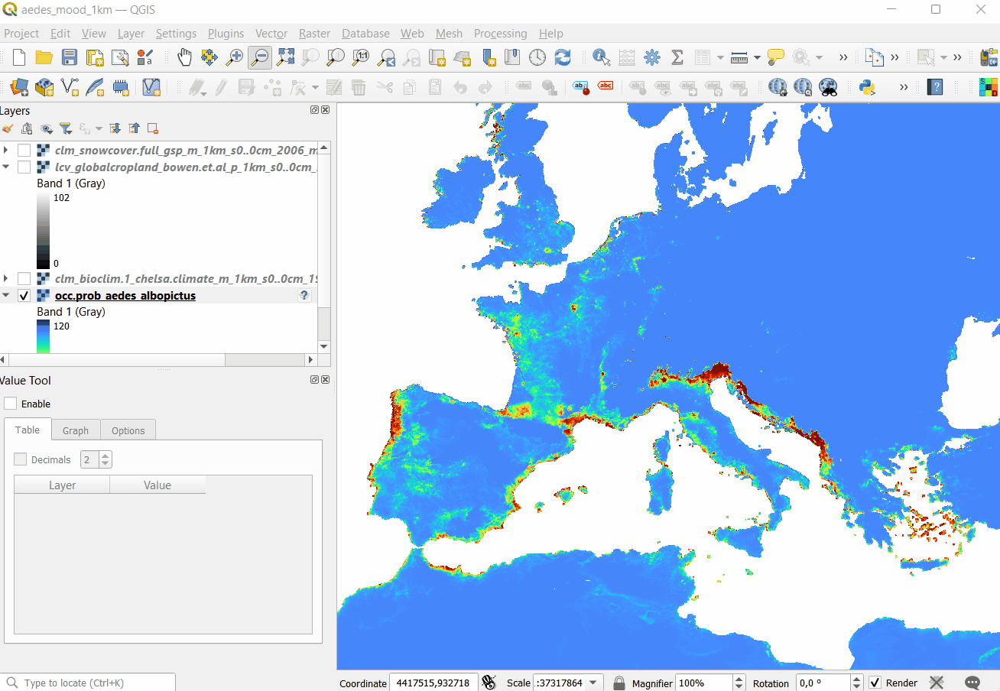
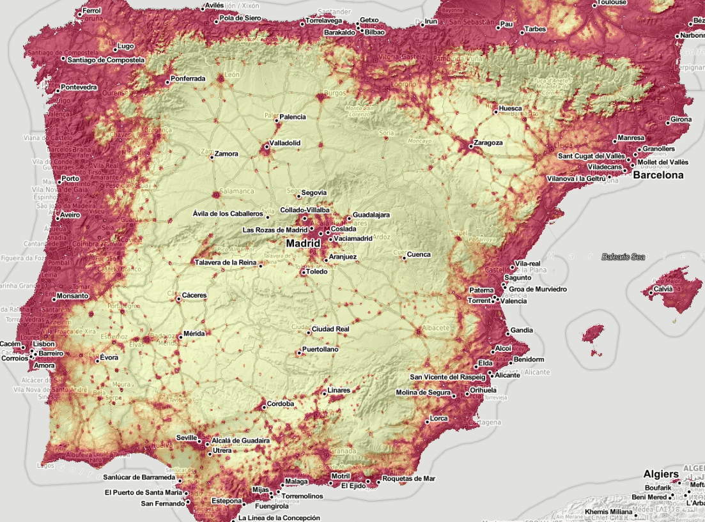
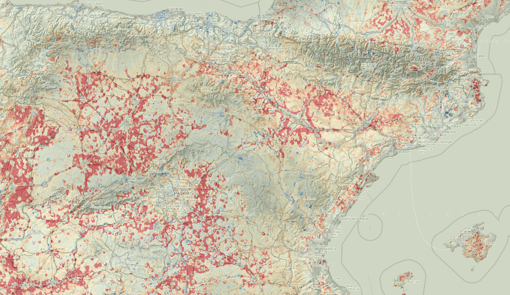

# Spatiotemporal Machine Learning for Species Distribution Modeling

```{r, results = "asis", echo = FALSE}
status("drafting")
```

```{r, include=FALSE, message=FALSE, results='hide'}
ls <- c("rgdal", "raster", "plotKML", "ranger", "mlr", "rgbif", "terra",
        "randomForestSRC", "glmnet", "matrixStats", "landmap", "yardstick", "maxlike", 
        "hexbin", "parallelMap", "Metrics", "fastSave", "devtools")
new.packages <- ls[!(ls %in% installed.packages()[,"Package"])]
if(length(new.packages)) install.packages(new.packages)
lapply(ls, require, character.only = TRUE)
source("mood_functions.R")
```

## Species Distribution Modeling

[Species Distribution Modeling](https://rspatial.org/raster/sdm/) (SDM) and/or Mapping aims 
at explaining and mapping distribution of species as a function of ecological, environmental conditions 
and/or human influence. Typical steps in SDM include [@hijmans2019spatial]:

1. Prepare locations of occurrence of a species or species density;  
2. Prepare environmental predictor variables (climate, terrain, surface water);  
3. Fit a SDM model that can be used either to predict natural habitat / Niche and/or occurrence probability;  
4. Predict habitat / occurrence probability across the region of interest (and perhaps for a future or past climate).  

Modeling species distribution is different from mapping quantitative soil properties 
and/or land surface temperature described in previous chapters. Species training data often comes 
with specific properties that include [@martinez2018species; @fois2018using]:

- Dealing with occurrence-only records: biologists / ecologists often only record where some species was observed;  
- Species and their dynamics is often complex: some species such as migratory birds change location seasonaly;  
- Modeling distribution of species such as birds or similar animals and insects 
in spacetime context is highly complex as various levels of chaotic behavior apply;

In recent years there has been an increasing interest in using Machine Learning for 
species distribution modeling, especially to model disease outbreaks.
A review of ML methods for SDM is available also in @zhang2017review.
In this chapter we describe a scalable framework for predicting species occurrences 
based on the Ensemble Machine Learning described in the [previous chapter](#spatiotemporal-ml).
The target variables of interest in the case of SDM are usually (a) **probability of occurrence** 
and/or (b) **species density** (number of individuals per area) and/or (c) habitat 
suitability indices. As covariates for SDM we use time-series of 
Earth Observation images and similar climatic and terrain-based images.

Extending spatiotemporal Ensemble ML to modeling species distribution is not trivial.
In order to be able to interpolate species distribution, probability of occurrence 
and/or density of species in space-time using Ensemble ML, we can not simply 
import and model occurrence-only data as these miss any quantities or states. 
We need to provide instead run several steps to make data suited for ML. 
For example, if absence training points are not available, we can use various 
method do derive most likely locations where certain species do NOT occur i.e. are 
highly unlikely to occur due to ecological limitations such as minimum winter temperature 
minimum rainfall or similar. These are referred to as the **pseudo-absence** training points. 
Hence, we will first show how to generate pseudo-absence data using the [maxlike 
package](https://github.com/rbchan/maxlike), then after enough of occurrence and 
absence records are available, we apply standard ML steps. 

## Tiger Mosquito over Europe

The tiger mosquito ([Aedes albopictus](https://www.ecdc.europa.eu/en/disease-vectors/facts/mosquito-factsheets/aedes-albopictus)) is a vector species for many different viruses 
including those responsible for dengue fever, Zika and chikungunya. The natural habitat 
of this species was limited in the past, however, in the recent time, this species has spread 
to many countries through the transport of goods and international travel e.g. shipping 
routes or similar [@benedict2007spread; @da2021will]. The R package **[dynamAedes](https://cran.r-project.org/web/packages/dynamAedes/vignettes/dynamAedes_tutorial.html)** 
contains stochastic, time-discrete and spatially-explicit population dynamical models for _Aedes sp._ 
invasive species [@da2021dynamaedes].

We can obtain occurrences of the _Aedes albopictus_ by either using the `rgbif::occ_data` 
function, or by downloading the CSV file from the [GBIF website](https://www.gbif.org/species/1651430). 
A local copy of the occurrences for Europe can be loaded by using:

```{r}
## occ = rgbif::occ_data(taxonKey=1651430, hasCoordinate = TRUE, year = '2000,2022')
occ = readRDS("./input/gbif_aedes_albopictus_mood.rds")
str(occ)
```

To visualize the mosquito point data over Europe we can use e.g.:

```{r, eval=FALSE}
library(spacetime)
library(plotKML)
sp_ST <- STIDF(SpatialPoints(occ[,c("decimalLongitude", "decimalLatitude")], proj4string = "EPSG:4326"), 
               occ$Date, data.frame(individualCount=occ$individualCount))
data(SAGA_pal)
## plot in Google Earth:
plotKML(sp_ST, colour_scale=SAGA_pal[[1]])
```

```{r google-vis, echo=FALSE, fig.width=6, fig.cap="Spatiotemporal visualization of the GBIF occurrence records of the Tiger mosquito.", out.width="90%"}
knitr::include_graphics("./img/tiger_mosquito_europe_2000_2021.gif")
```

This shows that mosquito seems to be concentrated in the southern Europe, 
primarily along coast-line, although some adults have been spotted also in the 
Northern Europe. Note also that the mosquito seems to be continuously spreading 
across Europe, however, we are not sure if this is also just because there are 
more records in GBIF coming from the last 5 years.

## Generating pseudo-absence data

Pseudo-absence points can be generated in several ways [@Iturbide2015].  
To generate pseudo-absence data we can use the [maxlike](https://github.com/rbchan/maxlike) package. First, we need 
to prepare enough ecological information that can help us map habitat of the species 
using all records for Europe. In the local folder we can find:

```{r}
eco.tifs = list.files("./input/mood4km/static", glob2rx("*.tif$"), full.names=TRUE)
basename(eco.tifs)
```

i.e. [CHELSA Climate Bioclim layers](https://chelsa-climate.org/bioclim/) mean 
annual air temperature, annual precipitation amount and similar, [MODIS Long-term nighttime Land Surface 
Temperatures](https://doi.org/10.5281/zenodo.1420114) for months 1, 3, 6 and 9, 
[snow probability images for winter months](https://doi.org/10.5281/zenodo.5774953) and DTM elevation model from Copernicus. 
We can load the stack of rasters into R and use principal components to reduce 
overlap between different layers:

```{r, eval=FALSE}
#gc()
g4km = raster::stack(eco.tifs)
g4km = as(g4km, "SpatialGridDataFrame")
cc.4km = complete.cases(g4km@data)
g4km = as(g4km, "SpatialPixelsDataFrame")
g4km = g4km[cc.4km,]
#summary(cc.4km)
## 2.2M pixels
#plot(g4km[14])
g4km.spc = landmap::spc(g4km)
```

Next, we can fit a `maxlike` model for occurrence probability using presence only data, 
and predict values at all locations:

```{r, eval=FALSE}
#gc()
max.fm <- stats::as.formula(paste("~", paste(names(g4km.spc@predicted[1:12]), collapse="+")))
max.ml <- maxlike::maxlike(formula=max.fm, rasters=raster::stack(g4km.spc@predicted[1:12]), points=occ.sp@coords, method="BFGS", savedata=TRUE)
#ment.ml <- dismo::maxent(raster::stack(g4km.spc@predicted[1:12]), occ.sp@coords)
## bug in "maxlike" (https://github.com/rbchan/maxlike/issues/1); need to replace this 'by hand':
max.ml$call$formula <- max.fm
## TH: this operation can be time consuming and is not recommended for large grids
max.ml.p <- predict(max.ml)
max.ml.p <- methods::as(max.ml.p, "SpatialGridDataFrame")
plot(max.ml.p)
```

The resulting maps produced using maxlike are shown below.

```{r pseudo-absences, echo=FALSE, fig.width=6, fig.cap="Predicted probability of occurence for Tiger mosquito based on the maxent analysis. Darker-green areas indicated close to 100% probability of occurrence.", out.width="90%"}
knitr::include_graphics("./img/Fig_predicted_maxlike_tiger_mosquito.jpg")
knitr::include_graphics("./img/Fig_predicted_maxlike_tiger_mosquito_Spain.jpg")
```

The maxlike occurrence probability map indicates that the Tiger 
mosquito seems to prefer coastal areas and is probably limited by the winter temperatures. 
The minimum temperature for survival of the mosquito adults is about 3–4 C degrees, 
for mosquito eggs minimum temperature is lower but still should be above -4 degrees [@da2021will].
Note for habitat suitability analysis one could also use the [maxent algorithm](https://github.com/johnbaums/rmaxent) 
or do analysis in both maxlike and maxent and then produce an ensemble estimate.

Next, we can generate a reasonable number of pseudo-absences (as a rule of thumb, 
number of the generated pseudo-absences should not exceed 10 to 20% of the actual 
number of occurrence points):

```{r, eval=FALSE}
max.ml.p = rgdal::writeGDAL("./output/occ.prob_aedes_albopictus.tif")
## insert 0 values for all occurrences before the date:
max.ml.p$absence = ifelse(max.ml.p$band1==100, 1, NA)
dens.var <- spatstat.geom::as.im(sp::as.image.SpatialGridDataFrame(max.ml.p["absence"]))
pnts.new <- rpoint(600, f=dens.var)
```

A single realization of 600 simulated pseudo-absences is shown below:

```{r pnts-eu, echo=FALSE, fig.width=6, fig.cap="Simulated pseudo-absences based on the maxent analysis (predictions in the background).", out.width="80%"}
knitr::include_graphics("./img/Fig_pseudo_absences_mood.jpg")
```

Note we only use pixels that have 0 probability of occurrence based on the maxlike results.
This way we prevent from introducing any bias into further modeling.
Once we have generated pseudo-absences, we can bind all `1` and `0` records together 
to produce a regression and/or classification matrix, and which can then be used to 
fit ML models.

In the case of the GBIF data two possible target variables could be used:

- Individual counts i.e. number of adults observed at location;  
- Occurrence / absence states i.e. 0/1 values;  

We focus further on modeling the 0/1 states and predicting probabilities. This 
puts this ML exercises into the category of ML for classification.

## Modeling distribution of mosquitos through time

Next we can overlay training points (occurrences / adult counts and pseudo-absences) 
in spacetime to produce a spatiotemporal regression-matrix. The total list of 
layers for Europe (MOOD Horizon 2020 project) available as [Cloud-Optimized GeoTIFFs](https://av.tib.eu/media/55228) 
is documented in:

```{r}
cov.lst = read.csv("./input/mood_layers1km.csv")
str(cov.lst)
```

```{r qgis-cogs, echo=FALSE, fig.width=6, fig.cap="Opening Cloud-Optimized GeoTIFF layers in QGIS. The total size of layers exceeds 30GB so it is more efficient to access data using the COG-architecture and S3 services.", out.width="90%"}

```

The spacetime overlay process can be computational hence we have already pre-computed 
the regression / classification matrix:

```{r}
source("mood_functions.R")
rm.all = readRDS("./input/regmatrix_aedes_1km.rds")
dim(rm.all)
```

This is now a relatively large matrix with basically diversity of Earth Observation 
and climatic time-series of images. We can define the model as classification problem 
where occurrence/absence values (0/1) are two states of the target variable:

```{r}
rm.all$occurrence = as.factor(ifelse(rm.all$individualCount>0, 1, 0))
summary(rm.all$occurrence)
```

and which we model as a function of number of static and dynamic covariate layers:

```{r}
sel.stat = c(gsub("4km", "1km", tools::file_path_sans_ext(basename(eco.tifs))), 
             "dtm_twi_merit.dem_m_1km_s0..0cm_2017_mood_v1",
             "dtm_floodmap.500y_jrc.hazardmapping_m_1km_s0..0cm_1500..2016_mood_v1.0",
             "dtm_slope_merit.dem_m_1km_s0..0cm_2017_mood_v1",
             paste0("adm_travel.time.to.cities.cl", 1:10, "_cgiar_m_1km_s0..0cm_2000..2020_mood_v1"),
             paste0("adm_travel.time.to.ports.cl", 1:5, "_cgiar_m_1km_s0..0cm_2000..2020_mood_v1"))
pr.vars = c(sel.stat,  c("CRP", "FOR", "HFP", "LST", "N02", "N08", "NLT", "PPD", "PRE", "SNW", "T02", "T08"))
fm.fs = stats::as.formula(paste("occurrence ~ ", paste(pr.vars, collapse="+")))
str(all.vars(fm.fs))
```

Next, we fit an Ensemble ML model to predict spatiotemporal distribution of species 
for 2000–2021 period by following the basic steps: 

1. Fine-tune hyperparameters per base learner (using a smaller subset);  
2. Fit the stacked learner using optimized parameters;  
3. Generate predictions for the time-series of interest;  

The steps can be run using functions we created and which extend the mlr package:

```{r}
library(dplyr)
fs.rm0 = rm.all %>% dplyr::sample_n(5000)
f = "./output/aedes/"
tnd.ml = tune_learners(data = fs.rm0, formula = fm.fs, 
                      blocking = factor(fs.rm0$ID), out.dir=f)
t.m = train_sp_eml(data = rm.all, tune_result = tnd.ml, 
                   blocking = as.factor(rm.all$ID), out.dir = f)
summary(t.m$learner.model$super.model$learner.model)
```

which shows the model is significant with errors in probability space ranging from -0.08 to 0.12.
The most important variables based on the variable importance functionality of the random forest seem to be:

```{r}
xl <- as.data.frame(mlr::getFeatureImportance(t.m[["learner.model"]][["base.models"]][[1]])$res)
xl$relative_importance = round(100*xl$importance/sum(xl$importance), 1)
xl = xl[order(xl$relative_importance, decreasing = T),]
xl$variable = paste0(c(1:length(t.m$features)), ". ", xl$variable)
xl[1:8,]
```

- Night lights (NLT) based on @li2020harmonized;  
- Travel time to cities and ports based on @nelson2019suite;  
- Population density (PPD) based on [Gridded Population of the World (GPW), v4](https://doi.org/10.7927/H49C6VHW);  
- Night time images based on [MOD11A2](https://doi.org/10.5281/zenodo.1420114);  
- Human Footprint dataset based on @mu2022global;  

## Generating the trend maps

After we have produced predictions for Europe for mosquito occurrence we can also 
stack them and visualize them as animation:

```{r qgis-vis, echo=FALSE, fig.width=6, fig.cap="Spatiotemporal visualization of the predicted occurrence probability for the Tiger mosquito with a Zoom in on Spain.", out.width="90%"}

```

we can also derive beta coefficient per pixel using the [greenbrown package](https://greenbrown.r-forge.r-project.org/) to see 
if some parts of Europe are showing higher increase in mosquito density. Example with predictions for Spain:

```{r, eval=FALSE}
library(plotKML); library(raster)
es.tifs = list.files("./output/spain1km", glob2rx("aedes.albopictus_M_*.tif"), full.names = TRUE)
spain1km = raster::brick(raster::stack(es.tifs))
#spplot(spain1km[[c(1,22)]], col.regions=SAGA_pal[[10]])
```

```{r, eval=FALSE}
#install.packages("greenbrown", repos="http://R-Forge.R-project.org")
library(greenbrown)
trendmap <- TrendRaster(spain1km, start=c(2000, 1), freq=1, breaks=1) 
## can be computationally intensive
plot(trendmap[["SlopeSEG1"]], 
     col=rev(SAGA_pal[["SG_COLORS_GREEN_GREY_RED"]]), 
     zlim=c(-1.5,1.5), main="Slope SEG1")
```

Alternatively, we can also derive beta coefficient using parallelization and `lm` function. 
This basically fits model for every time-series of pixels and returns a vector.

```{r, eval=FALSE}
xs = as(spain1km, "SpatialGridDataFrame")
in.years = as.numeric(substr(sapply(basename(es.tifs), function(i){strsplit(i, "_")[[1]][3]}), 1, 4))
cl <- parallel::makeCluster(parallel::detectCores())
parallel::clusterExport(cl, c("in.years"))
## select ONLY pixels that change in time
sd.pix = which(!parallel::parApply(cl, xs@data, 1, sd, na.rm=TRUE)==0)
## derive beta per pixel:
## Because probs are binary variable we use logit transformation
betas = unlist(parallel::parApply(cl, xs@data[sd.pix,], 1, function(i) { 
  try( round( coef(lm(y~x, data.frame(x=in.years, 
    y=boot::logit(ifelse(as.vector(i)<=0, 0.1, ifelse(as.vector(i)>=100, 99.9, as.vector(i)))/100))))[2] *1000 ) 
    ) }))
## write to GeoTIF
spain.trend = xs[1]
spain.trend@data[,1] = 0
spain.trend@data[sd.pix,1] = as.numeric(betas)
rgdal::writeGDAL(spain.trend[1], "./output/spain_trend_aedes_1km.tif", type="Int16", 
          mvFlag=-32768, options=c("COMPRESS=DEFLATE"))
parallel::stopCluster(cl)
```

```{r betas-map, echo=FALSE, fig.width=6, fig.cap="Trend map for mosquito distribution through time. Red color indicates increase in occurrence probability, blue color decrease.", out.width="90%"}

```


## Summary

In this chapter we demonstrate how to use occurrence-only records to map distribution of target species in spacetime.
We again use Ensemble Machine Learning on training data overlaid in spacetime vs time-series 
of Night Light, vegetation, climatic images (years 2000–2021). The training data is 
limited to occurrence-only records and these are neither based on probability sampling 
nor a consistent in time. Probably more suited training data set would have been if for example 
meteorological stations across EU have recorded daily records of mosquito occurrence (0/1).
Having a systematic records at dense and well distributed locations across Europe would be 
the perfect data set for this exercise, but even with using limited GBIF records we are 
able to produce relatively accurate maps of probability of occurrence.

Note that in the case study above, we could have also used time i.e. Year of observation 
as a covariate. If we would add Year as covariate to this training point data, then predictions 
would have probably shown that probability of occurrence is increasing significantly in the recent years. 
This does not necessarily has to match reality on the ground. Just because there 
are more records of the mosquito species for more recent years, that does not mean 
that the mosquito has appeared in recent years. In fact, if we would use Year as a covariate 
with this data, we would most likely introduce a bias in predictions [@syfert2013effects].

GBIF data is of course of limited use for SDM and comes with often misssing meta-information 
and has, of course, huge gaps [@syfert2013effects; @Marcer2022]. This does not means that also the 
analysis in this tutorial is flawed or should not be considered as trust-worthy; 
it only means that running any spatial analysis on GBIF data should be done with 
care and aiming at correct interpretation.

The simple alternative to derive (kernel) density maps of mosquitos for Europe 
would be to use the `sparr::spattemp.density` function:

```{r, eval=FALSE}
st.f = occ[,c("decimalLongitude","decimalLatitude","Date","individualCount")]
st.f$individualCount = as.numeric(ifelse(is.na(st.f$individualCount), 1, st.f$individualCount))
coordinates(st.f) <- c("decimalLongitude", "decimalLatitude")
proj4string(st.f) <- CRS("+init=epsg:4326")
grid1d = readGDAL("./input/mask_5km.tif")
grid1d = as(grid1d, "SpatialPixelsDataFrame")
te = as.vector(grid1d@bbox)
#plot(grid1d)
mg_owin <- spatstat.geom::as.owin(data.frame(x = grid1d@coords[,1], y = grid1d@coords[,2], window = TRUE))
st.f_sp <- spTransform(st.f, grid1d@proj4string)
pp = ppp(x=st.f_sp@coords[,1], y=st.f_sp@coords[,2], marks=as.numeric(substr(st.f_sp$Date, 1, 4)), window = mg_owin)
## Warning messages:
#1: 41072 points were rejected as lying outside the specified window 
#2: data contain duplicated points
pp$n
## 13893
str(pp$marks)
## spacetime density ----
eu.stgrid = sparr::spattemp.density(pp, tt = pp$marks, tlim = c(2000,2022), sres=1569, verbose = TRUE)
## Calculating trivariate smooth...Done.
## Edge-correcting...Done.
## Conditioning on time...Done.
#plot(eu.stgrid, 2018)
dmap <- maptools::as.SpatialGridDataFrame.im(eu.stgrid$z[["2012"]])
summary(dmap$v*1e12)
plot(dmap)
```

The problem of usiong `sparr::spattemp.density` is that (a) it can be used 
only with occurrence only records, (b) it assumes that ALL or systematically 
sampled occurrences of the phenomena are available. 
If this is not the case, the function `sparr::spattemp.density` would also probably produce a biased 
estimate of the distribution of mosquitos through time.

Ensemble Machine Learning we used to generate predictions helps produce unbiased estimate of 
mosquito occurrences over Europe for a time-series of years. The disadvantages of using 
spatiotemporal ML are:

- We are correlating the Earth Observation data with mosquito density, but mosquitos 
are dynamic and can not be sensed / seen from space, at least not at 1km resolution; 
we have to rely on correlation with environmental factors and this can explain only smaller part of variation;  
- We assume that the GBIF training points are representative for various environmental 
conditions, while in practice less training data is available for physically distant 
areas e.g. mountains (hence these training data can be considered to be **censored**);
- Predictions produced in this example come with relatively high errors in extrapolation 
areas, so the predictions should be used together with the uncertainty maps;

## Acknowledgments

This project has received funding from the European Union's Horizon 2020 Research and innovation programme under [grant agreement No 874850](https://cordis.europa.eu/project/id/874850).
